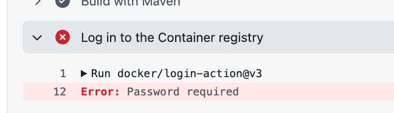

# Error

## Password required

To fix the following error,

Go to `Settings` > `Action` > `Workflow permissions`, then change to `Read and write permissions`.

If your organization setting does not allow changing `Workflow permissions`

1. Create a PAT at: https://github.com/settings/tokens/new
1. Go to `Settings` > `Secrets and variables` > `Actions` then click `New repository secret` button, then register it as `DEPLOY_GHCR_SECRET` name.
1. Run the pipeline once again
