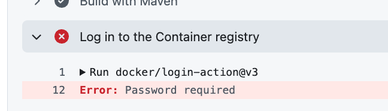
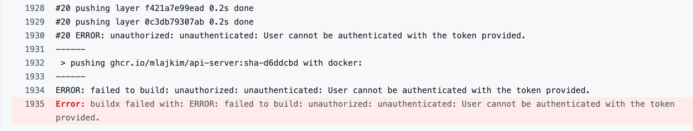

# Error

Handles the following error:

<!-- TOC depthFrom:2 depthTo:2 -->

- [Password required](#password-required)
- [unauthenticated: User cannot be authenticated with the token provided.](#unauthenticated-user-cannot-be-authenticated-with-the-token-provided)

<!-- /TOC -->

## Password required

To fix the following error,



Go to `Settings` > `Action` > `Workflow permissions`, then change to `Read and write permissions`.

If your organization setting does not allow changing `Workflow permissions`

1. Create a PAT at: https://github.com/settings/tokens/new
1. Go to `Settings` > `Secrets and variables` > `Actions` then click `New repository secret` button, then register it as `DEPLOY_GHCR_SECRET` name.
1. Run the pipeline once again

## unauthenticated: User cannot be authenticated with the token provided.



```yaml
- name: Log in to GHCR
  if: github.event_name != 'pull_request'
  uses: docker/login-action@v3
  with:
    registry: ${{ env.REGISTRY }}
    username: ${{ github.actor }}
    password: ${{ secrets.DEPLOY_GHCR_SECRET || secrets.GITHUB_TOKEN }}
```

=>

```yaml
- name: Log in to GHCR
  uses: docker/login-action@v3
  with:
    registry: ${{ env.REGISTRY }}
    username: ${{ github.actor }}
    password: ${{ secrets.DEPLOY_GHCR_SECRET || secrets.GITHUB_TOKEN }}
```
