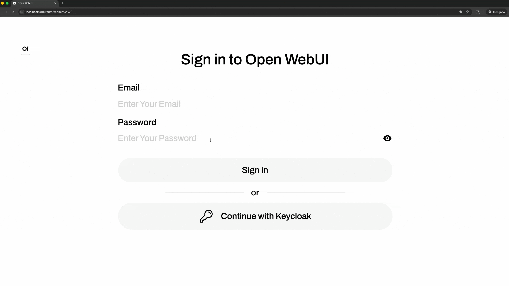
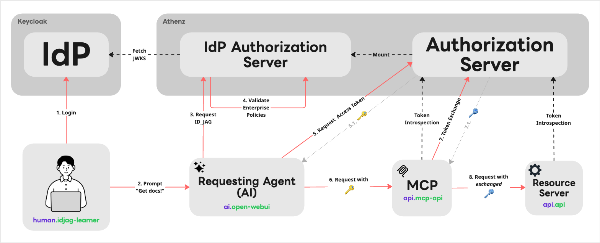
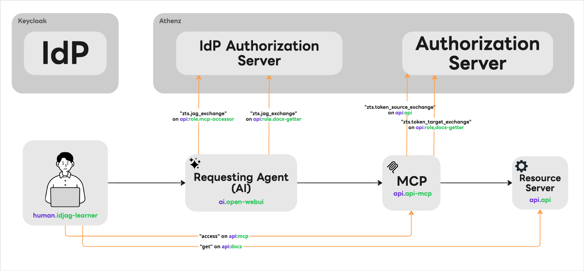

# ID-JAG The Hard Way

*Bootstrap ID-JAG Architecture the hard way in the AI Agent Era. No scripts.*

This tutorial **ID-JAG The Hard Way** walks you through building an ID-JAG-based AI agent authorization architecture from scratch. It is not for someone looking for a fully automated demo or a one-command installer. The **ID-JAG The Hard Way** is optimized for learning, which means taking the long route to understand the identities, tokens, policies, and trust boundaries required to let an AI agent access protected APIs on behalf of a signed-in human user in [ID-JAG specification](https://techblog.lycorp.co.jp/en/20260417a).

## What You Will Get

By the end of this tutorial, you will have a fully functional local flow (like the demo below) where:

1. **You** send a real prompt to an AI agent.
1. The **AI agent** calls a real protected MCP server on your behalf.
1. The **Resource Server** authorizes the request using real tokens and least-privilege policies for each transaction.

## Architecture

The following diagram shows the full local architecture:

This lab includes the following components:

| Component                                | Technology                                     | Role                                                                                |
|------------------------------------------|------------------------------------------------|-------------------------------------------------------------------------------------|
| User                                     | Browser                                        | The signed-in human user who delegates work to the AI agent.                        |
| AI Client / Agent                        | Open WebUI, Ollama, Gemma 4, AI Client Gateway | The local AI agent environment that invokes tools on behalf of the user.            |
| External IdP                             | Keycloak                                       | Authenticates the user and issues the original identity assertion.                  |
| IdP Authorization Server / ID-JAG Issuer | Athenz `KeycloakTokenExchangePlugin`           | Validates the Keycloak-issued assertion and issues the ID-JAG assertion.            |
| Resource Authorization Server / PDP      | Athenz                                         | Evaluates enterprise authorization policy and issues least-privilege access tokens. |
| MCP Server                               | Protected MCP server                           | Receives the agent request and enforces token-based access.                         |
| Resource Server                          | Sample API server                              | The final protected API called through the delegated authorization flow.            |

## Permission Architecture

The following graph shows the required least permissions for each component:

## Special Thanks

The name and concept of this tutorial series is inspired by [kelseyhightower/kubernetes-the-hard-way](https://github.com/kelseyhightower/kubernetes-the-hard-way).

## 🚀 Ready to dive in?

