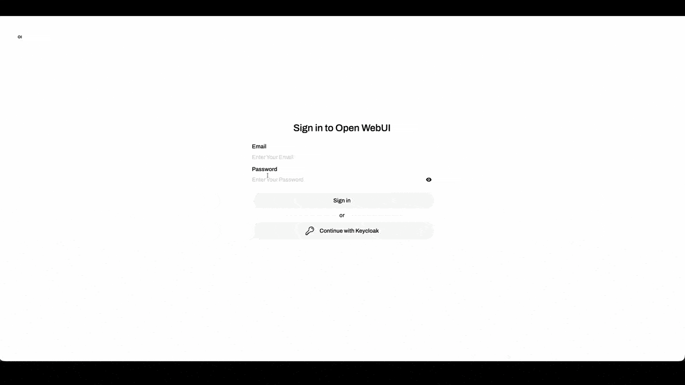

# ID-JAG The Hard Way

*Bootstrap ID-JAG Architecture the hard way. No scripts.*

This tutorial walks you through building an ID-JAG-based AI agent authorization architecture from scratch. It is not for someone looking for a fully automated demo or a one-command installer. ID-JAG The Hard Way is optimized for learning, which means taking the long route to understand the identities, tokens, policies, and trust boundaries required to let an AI agent access protected APIs on behalf of a signed-in human user.

> [!NOTE]
> The results of this tutorial should not be considered production ready. The goal is to learn the architecture, not to ship a hardened production platform.

By the end of this tutorial, you will run a real local flow where a human user (*yourself*) sends a prompt to an AI agent, the agent calls a protected MCP server, and the request is authorized by a protected resource server using real tokens and policies with least privilege for each transaction.

## Special Thanks

The name and concept of this tutorial series is inspired by [kelseyhightower/kubernetes-the-hard-way](https://github.com/kelseyhightower/kubernetes-the-hard-way).

## Copyright

This work is licensed under the Apache License, Version 2.0. See [LICENSE](./LICENSE) for details.

## Tutorials

Are you ready to dive in? Start from here: [Start the tutorial](tutorials/01-prerequisites.md).
