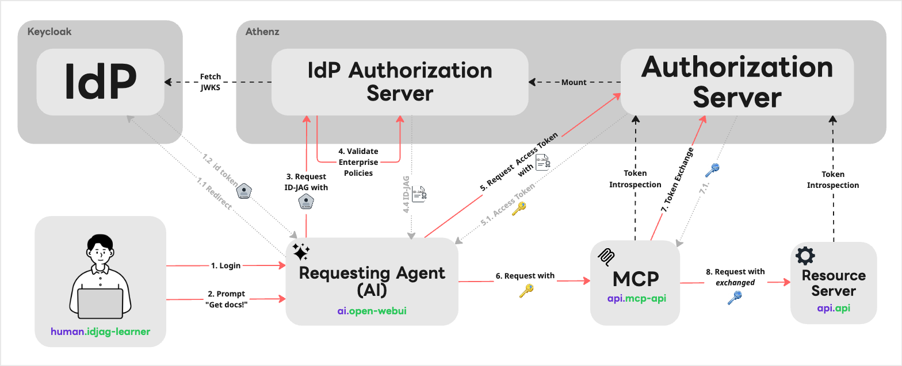

# ID-JAG The Hard Way

*Bootstrap ID-JAG Architecture the hard way in the AI Agent Era. No scripts.*

This tutorial **ID-JAG The Hard Way** walks you through building an ID-JAG-based AI agent authorization architecture from scratch. It is not for someone looking for a fully automated demo or a one-command installer. The **ID-JAG The Hard Way** is optimized for learning, which means taking the long route to understand the identities, tokens, policies, and trust boundaries required to let an AI agent access protected APIs on behalf of a signed-in human user in [ID-JAG specification](https://techblog.lycorp.co.jp/en/20260417a).

## What You Will Get

By the end of this tutorial, you will have a fully functional local flow (like the demo below) where:

1. **You** send a real prompt to an AI agent.
1. The **AI agent** calls a real protected MCP server on your behalf.
1. The **Resource Server** authorizes the request using real tokens and least-privilege policies for each transaction.

## Architecture

The following diagram shows the full local architecture:

Where:

1. The user logs into the system via the Keycloak IdP.
2. The user inputs a prompt, initiating a task with the AI agent.
3. The AI agent requests an ID_JAG token from the Athenz IdP Authorization Server.
4. Athenz evaluates and validates the enterprise policies to ensure the requested delegation is permitted.
5. The AI agent requests an access token from the Athenz Authorization Server.
6. The AI agent sends a request, equipped with the token, to the Model Context Protocol (MCP) server.
7. The MCP server performs a token exchange with the Authorization Server.
8. The MCP server sends a request with the exchanged token to the final Resource Server.

## Permission Architecture

The following graph shows the required least permissions for each component:

## Philosophy

The philosophy behind this repository is explained in detail here: [ID-JAG The Hard Way: Learning AI agent authorization through failure - LY Tech Blog](https://techblog.lycorp.co.jp/en/20260526a)

## Special Thanks

The name and concept of this tutorial series is inspired by [kelseyhightower/kubernetes-the-hard-way](https://github.com/kelseyhightower/kubernetes-the-hard-way).

## 🚀 Ready to dive in?

