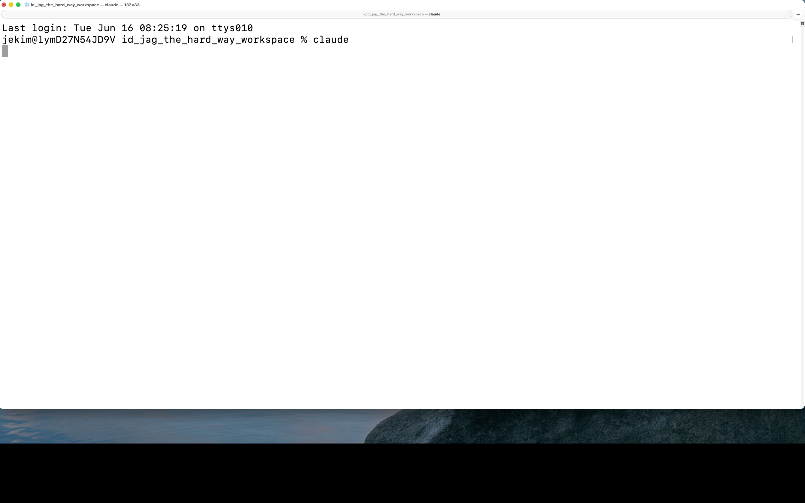
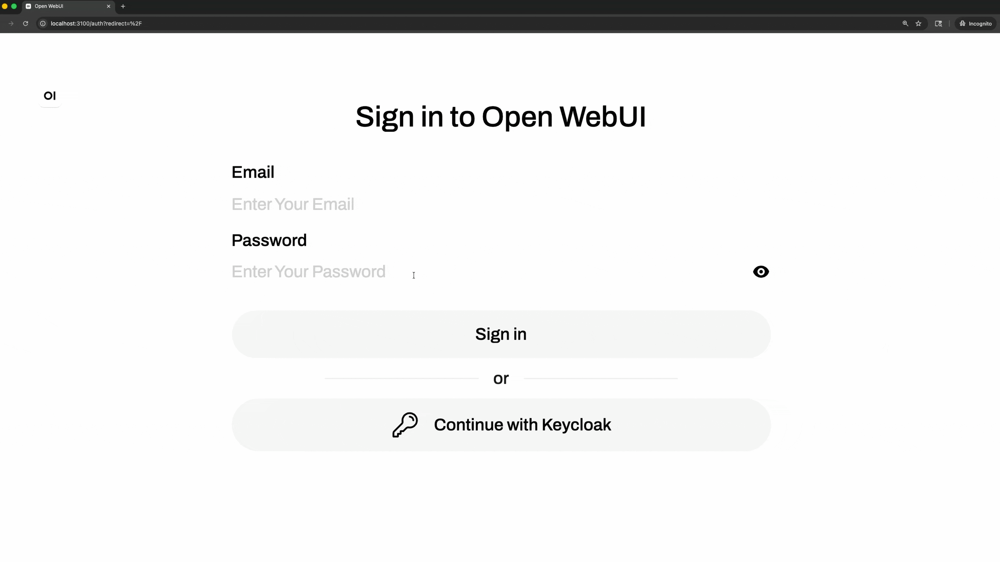
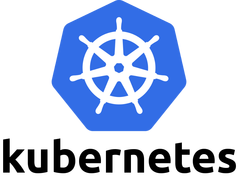
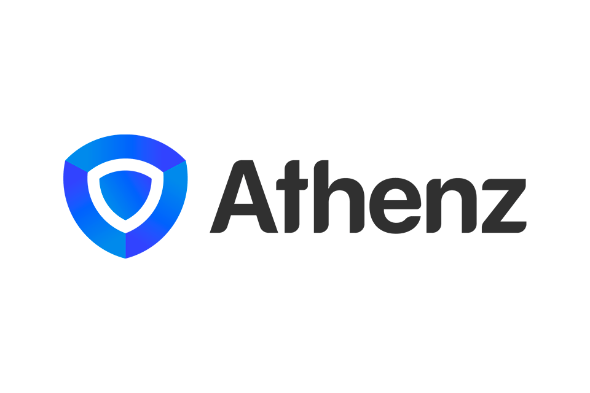
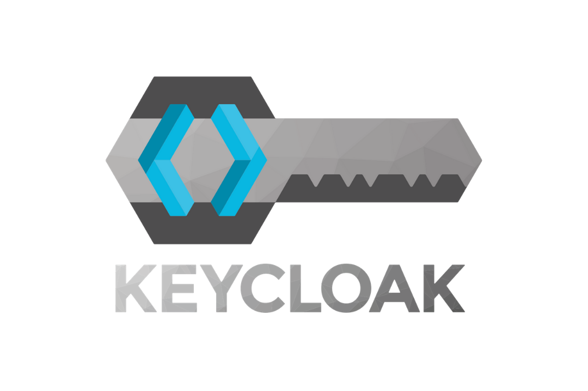
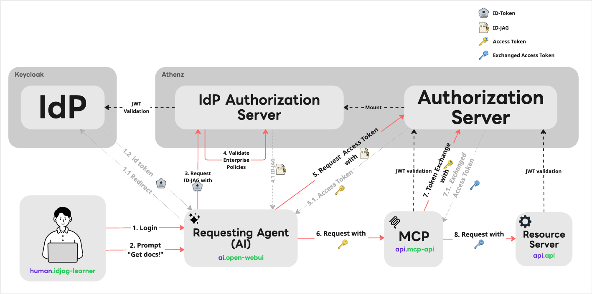
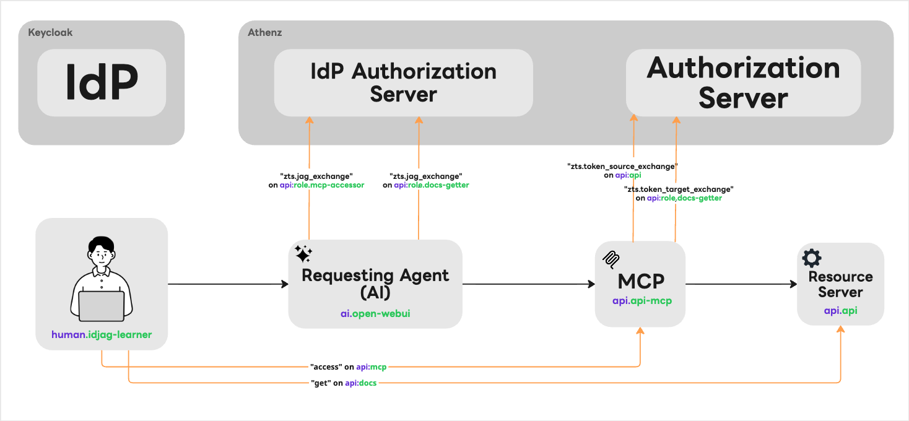

# ID-JAG The Hard Way

*Bootstrap ID-JAG Architecture the hard way in the AI Agent Era. No scripts.*

This tutorial walks you through building an ID-JAG-based AI agent authorization architecture from scratch. It is not for someone looking for a fully automated demo or a one-command installer. It is optimized for learning — taking the long route to understand the identities, tokens, policies, and trust boundaries required to let an AI agent access protected APIs on behalf of a signed-in human user, as defined in the [ID-JAG specification](https://techblog.lycorp.co.jp/en/20260417a).

IDTHW is deliberately multi-surface: the same authorization pattern is exercised through AI clients, Kubernetes workloads, Athenz policy and token services, and an OIDC identity provider instead of a single mock path.

## What You Will Build

By the end of this tutorial, you will have a fully functional local flow:

The same authorization path can also be driven through the Open WebUI flow:

In both flows:

1. **You** send a real prompt to an AI agent.
1. The **AI agent** calls a real protected MCP server on your behalf.
1. The **Resource Server** authorizes the request using real tokens and least-privilege policies for each transaction.

## Technical Spec

IDTHW is a tutorial plus a runnable local stack. Each layer below exists so the same delegated authorization model can be tested across multiple clients, services, and trust boundaries.

<table>
  <tr>
    <td align="center" width="25%"></td>
    <td align="center" width="25%"></td>
    <td align="center" width="25%"></td>
    <td align="center" width="25%"></td>
  </tr>
  <tr>
    <td><strong>AI clients</strong> Claude, Open WebUI, and MCP-capable clients drive tool calls.</td>
    <td><strong>Runtime</strong> Kubernetes hosts the API, MCP, gateway, and authorization components.</td>
    <td><strong>Authorization</strong> Athenz ZMS/ZTS evaluates policy, issues ID-JAG, and mints scoped access tokens.</td>
    <td><strong>Identity</strong> Keycloak provides the signed-in human identity through OIDC.</td>
  </tr>
</table>

## Full Architecture

Here is a diagram of the full architecture:

1. The user logs into the system via the Keycloak IdP.
2. The user inputs a prompt, initiating a task with the AI agent.
3. The AI agent requests an ID-JAG token from the Athenz IdP Authorization Server.
4. Athenz evaluates and validates the enterprise policies to ensure the requested delegation is permitted.
5. The AI agent requests an access token from the Athenz Authorization Server.
6. The AI agent sends a request, equipped with the token, to the Model Context Protocol (MCP) server.
7. The MCP server performs a token exchange with the Authorization Server.
8. The MCP server sends a request with the exchanged token to the final Resource Server.

## Permission Architecture

The following graph shows the required least permissions for each component:

## Philosophy

The philosophy behind this repository is explained in detail:

[ID-JAG The Hard Way: Learning AI agent authorization through failure - LY Tech Blog](https://techblog.lycorp.co.jp/en/20260526a)

## Special Thanks

The name and concept of this tutorial series is inspired by [kelseyhightower/kubernetes-the-hard-way](https://github.com/kelseyhightower/kubernetes-the-hard-way).

## Recognitions

ID-JAG The Hard Way is listed on the [OAuth.net Cross-App Access (XAA) page](https://oauth.net/cross-app-access/) as a test tool for learning ID-JAG

## ⭐ Community Growth

ID-JAG The Hard Way grows across both the root repository and the Athenz community fork. The star and fork counts below are updated from GitHub data.

| Repository                                                                       | Stars                                                                                                                                                                                                   | Forks                                                                                                                                                                                              |
|----------------------------------------------------------------------------------|---------------------------------------------------------------------------------------------------------------------------------------------------------------------------------------------------------|----------------------------------------------------------------------------------------------------------------------------------------------------------------------------------------------------|
| [Root repository](https://github.com/mlajkim/id-jag-the-hard-way)                |                     |                     |
| [Athenz community fork](https://github.com/athenz-community/id-jag-the-hard-way) |  |  |

If this tutorial helped you, a ⭐ on either repository means a lot — it helps others find it too!

Have questions or ran into a problem? [Open an issue](https://github.com/mlajkim/id-jag-the-hard-way/issues).

If not:

