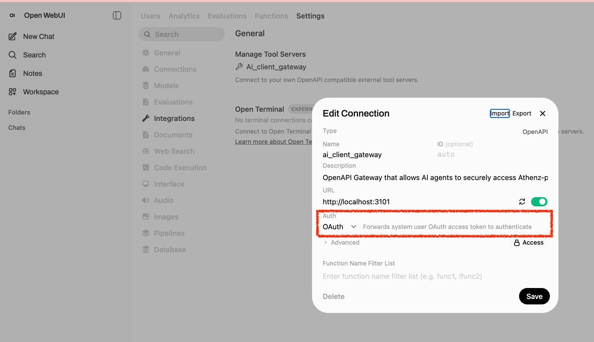

```sh
git clone git@github.com:athenz-community/openai-athenz-client-gateway.git ai_client_gateway
make -C ai_client_gateway local
```

Please note that your openai setting has to select `Oauth` for `Auth`:




Or you can do:

```sh
make -C ai_client_gateway local PROXY_TARGET=http://localhost:8102

```

## Description

- Name: `ai_client_gateway`
- Description: `OpenAPI Gateway that allows AI agents to securely access Athenz-protected Kubernetes Documentation APIs. It transparently handles Keycloak authentication and Athenz token (ID-JAG, AT) exchanges internally. AI agents can use these tools directly without needing to manage complex authorization states or tokens.`
- URL: `http://localhost:3101`
