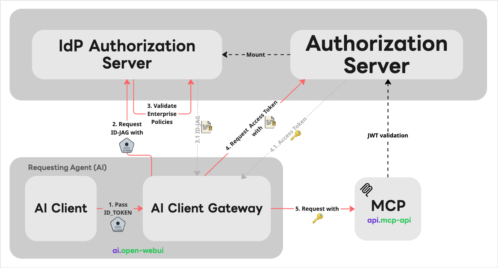

# AI Client Gateway

`AI Client Gateway` is a component used by the **id-jag-the-hard-way**.

## Core Authentication Flow

1. `AI Client Gateway` receives a request containing an `id_token`
1. `AI Client Gateway` uses its securely stored `X.509 certificate` and `private key` to exchange the incoming `id_token` for an `ID_JAG token`, against `IdP Authorization Server`
1. `IdP Authorization Server` checks enterprise policies, and return `ID_JAG token`
1. `AI Client Gateway` uses the `ID_JAG token` to fetch `Access Token` against `Authroization Server`.
1. `AI Client Gateway` uses the `Access Token` to talk to MCP resource server.

## Architectural Advantages

This design introduces several key security and integration benefits:

- Seamless ID_JAG Integration: It enables modern ID_JAG token flows even if the underlying AI Client Gateway lacks native support for them.
- Enhanced Token Security: By handling the token exchange independently, the Access Token is never directly exposed to or handled by the AI client, drastically reducing the attack surface.
- Zero Credential Exposure: Highly sensitive credentials—specifically the X.509 certificates and private keys—remain completely isolated from the AI Client Gateway, ensuring a much stronger, zero-trust security posture.

## Out of Scope (By Design)

To maintain a clean separation of concerns, this component intentionally does not handle the following:
- Routing Decisions: It does not determine the destination of the request. The AI agent retains full control over routing logic.
- Hardcoding Scopes: It remains strictly scope-agnostic. While it can dynamically pass down scopes requested by the MCP server, it never hardcodes specific scopes into its own logic.

# Notice

This document itself is depending on the main repository **id-jag-the-hard-way**. If you want to learn about this project, please refer to the main [README.md](../README.md)
