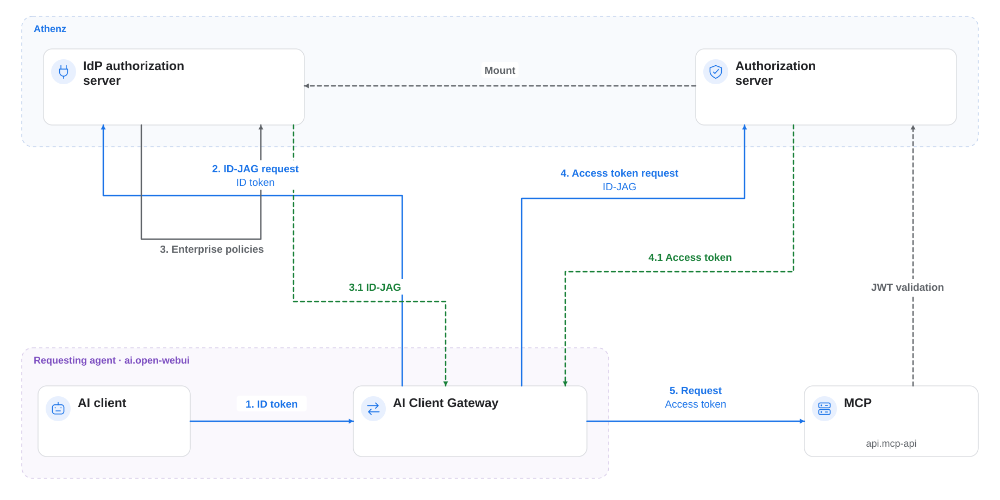

# AI Client Gateway

AI Client Gateway connects AI clients to protected MCP services in [ID-JAG The Hard Way](../../README.md). It obtains Athenz access tokens on behalf of a signed-in user and forwards requests to a configured upstream service.

## Core Authentication Flow

1. The gateway resolves the user's Keycloak ID token from a gateway session or the Open WebUI `oauth_id_token` cookie.
2. It reads the required scopes from the upstream OpenAPI metadata for the requested operation.
3. It authenticates to Athenz ZTS with its mounted X.509 certificate and private key, then requests an ID-JAG using the user's ID token.
4. ZTS validates the ID token and checks whether the user and gateway are authorized for the requested scopes.
5. The gateway exchanges the ID-JAG for an access token and forwards the request to `UPSTREAM_BASE_URL` with that token.

The [main architecture diagram](../../README.md#full-architecture) shows the downstream flow: MCP Runtime Proxy validates the token, and the MCP server exchanges it for an API-specific token.

## Access-token audience

Set `ATHENZ_ACCESS_TOKEN_AUDIENCE=mcp` when the gateway forwards to the tutorial's MCP service. Its OpenAPI metadata requests `mcp:role.mcp-accessor` plus the API role for the selected operation. ZTS requires an explicit audience when these scopes span domains. The resulting token has audience `mcp` and retains the qualified API scope for the MCP server's subsequent exchange to audience `api`.

This setting applies only to the ID-JAG-to-access-token request. The ID-JAG audience remains the authorization server URL. Leaving the setting unset preserves the existing single-domain behavior, where ZTS derives the access-token audience from the scope.

## Identity and Credential Handling

The user's ID token identifies the person requesting access. The gateway's certificate identifies the client requesting delegation. Both participate in the authorization decision.

The AI client does not need to obtain Athenz access tokens itself. The gateway handles those tokens and reads its certificate and private key from mounted files. These credentials are available to the gateway process.

## Routing and Scopes

`UPSTREAM_BASE_URL` determines where the gateway forwards requests. The upstream OpenAPI document supplies the operation-to-scope mappings through `x-athenz-required-scope`; MCP tool names are matched to OpenAPI operation IDs.

The gateway requests scopes based on that metadata. ZTS decides which scopes it can grant, and the downstream proxy and API validate the issued tokens.

Follow the [AI Client Gateway tutorial](../../tutorials/14-ai-client-gateway.md) to deploy and configure it.
