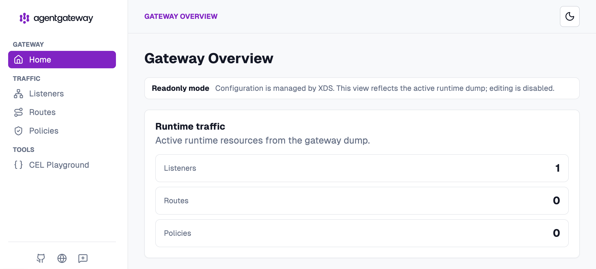

# Install agentgateway on Kubernetes

The goal of this FAQ is to install the agentgateway control plane and an agentgateway proxy in the `agent-gateway` namespace, then access the proxy and Admin UI through port-forwarding.

<!-- TOC depthFrom:2 depthTo:3 -->

- [Step 1. Install the Kubernetes Gateway API CRDs](#step-1-install-the-kubernetes-gateway-api-crds)
- [Step 2. Load the images into Kind when using NexT](#step-2-load-the-images-into-kind-when-using-next)
- [Step 3. Install the agentgateway control plane](#step-3-install-the-agentgateway-control-plane)
- [Step 4. Verify the control plane](#step-4-verify-the-control-plane)
- [Step 5. Deploy the agentgateway proxy](#step-5-deploy-the-agentgateway-proxy)
- [Step 6. Verify the proxy](#step-6-verify-the-proxy)
- [Step 7. Verify Admin UI](#step-7-verify-admin-ui)

<!-- /TOC -->

<details>
<summary>Verification status — 🟡 Pending human verification</summary>

| # | Date | Status                                              |
|---|------|-----------------------------------------------------|
| 1 | TBD  | 🟡 Pending — human has not confirmed this procedure |

</details>

# Prerequisites

- Complete the ID-JAG The Hard Way tutorial.

# Steps

## Step 1. Install the Kubernetes Gateway API CRDs

> [!NOTE]
> Check out the latest version of GWAPI_VERSION here at [kuberentes/gateway-api @ Github](https://github.com/kubernetes-sigs/gateway-api/releases)

Install the standard Kubernetes Gateway API CRDs used by agentgateway `v1.4.1`:

```sh
export GWAPI_VERSION=1.6.1

kubectl apply --server-side --force-conflicts \
  -f "https://github.com/kubernetes-sigs/gateway-api/releases/download/v${GWAPI_VERSION}/standard-install.yaml"
```

```sh
# kubectl apply --server-side --force-conflicts \
#   -f "https://github.com/kubernetes-sigs/gateway-api/releases/download/v${GWAPI_VERSION}/standard-install.yaml"
# customresourcedefinition.apiextensions.k8s.io/backendtlspolicies.gateway.networking.k8s.io serverside-applied
# customresourcedefinition.apiextensions.k8s.io/gatewayclasses.gateway.networking.k8s.io serverside-applied
# customresourcedefinition.apiextensions.k8s.io/gateways.gateway.networking.k8s.io serverside-applied
# customresourcedefinition.apiextensions.k8s.io/grpcroutes.gateway.networking.k8s.io serverside-applied
# customresourcedefinition.apiextensions.k8s.io/httproutes.gateway.networking.k8s.io serverside-applied
# customresourcedefinition.apiextensions.k8s.io/listenersets.gateway.networking.k8s.io serverside-applied
# customresourcedefinition.apiextensions.k8s.io/referencegrants.gateway.networking.k8s.io serverside-applied
# customresourcedefinition.apiextensions.k8s.io/tcproutes.gateway.networking.k8s.io serverside-applied
# customresourcedefinition.apiextensions.k8s.io/tlsroutes.gateway.networking.k8s.io serverside-applied
# customresourcedefinition.apiextensions.k8s.io/udproutes.gateway.networking.k8s.io serverside-applied
# validatingadmissionpolicy.admissionregistration.k8s.io/safe-upgrades.gateway.networking.k8s.io serverside-applied
# validatingadmissionpolicybinding.admissionregistration.k8s.io/safe-upgrades.gateway.networking.k8s.io serverside-applied
```

## Step 2. Load the images into Kind when using NexT

When using NexT or another network environment that presents an internally signed TLS certificate, containerd inside the Kind node might not trust the certificate for `cr.agentgateway.dev`. Pull both agentgateway images through Docker and load them into Kind before creating the pods:

```sh
docker pull cr.agentgateway.dev/controller:v1.4.1
docker pull cr.agentgateway.dev/agentgateway:v1.4.1

kind load docker-image \
  cr.agentgateway.dev/controller:v1.4.1 \
  cr.agentgateway.dev/agentgateway:v1.4.1
```

## Step 3. Install the agentgateway control plane

> [!NOTE]
> Check out the latest agentgateway version at [agentgateway/agentgateway @ GitHub](https://github.com/agentgateway/agentgateway/releases).

Install the agentgateway CRDs and control plane in the `agent-gateway` namespace:

```sh
helm upgrade --install agentgateway-crds \
  oci://cr.agentgateway.dev/charts/agentgateway-crds \
  --create-namespace \
  --namespace agent-gateway \
  --version v1.4.1

helm upgrade --install agentgateway \
  oci://cr.agentgateway.dev/charts/agentgateway \
  --namespace agent-gateway \
  --version v1.4.1 \
  --wait
```

## Step 4. Verify the control plane

Confirm that the controller pod is running and the `agentgateway` GatewayClass is accepted:

```sh
kubectl -n agent-gateway get pods
kubectl get gatewayclass agentgateway
```

```sh
# NAME                            READY   STATUS    RESTARTS   AGE
# agentgateway-6d687dd589-hx5vb   1/1     Running   0          25s
# NAME           CONTROLLER                      ACCEPTED   AGE
# agentgateway   agentgateway.dev/agentgateway   True       19s
```

The namespace should currently contain the `agentgateway` control-plane pod. The data-plane proxy is created in the next step.

## Step 5. Deploy the agentgateway proxy

Create a `Gateway` that uses the `agentgateway` GatewayClass:

```sh
kubectl apply -f - <<'EOF'
apiVersion: gateway.networking.k8s.io/v1
kind: Gateway
metadata:
  name: agentgateway-proxy
  namespace: agent-gateway
spec:
  gatewayClassName: agentgateway
  listeners:
    - name: http
      protocol: HTTP
      port: 80
      allowedRoutes:
        namespaces:
          from: All
EOF
```

```sh
# gateway.gateway.networking.k8s.io/agentgateway-proxy created
```

## Step 6. Verify the proxy

Wait for the data-plane proxy and inspect all resources in the namespace:

```sh
kubectl -n agent-gateway rollout status deployment/agentgateway-proxy
kubectl -n agent-gateway get gateway,deployment,pod,service
```

```sh
# NAME                                                   CLASS          ADDRESS   PROGRAMMED   AGE
# gateway.gateway.networking.k8s.io/agentgateway-proxy   agentgateway             True         25s

# NAME                                 READY   UP-TO-DATE   AVAILABLE   AGE
# deployment.apps/agentgateway         1/1     1            1           29s
# deployment.apps/agentgateway-proxy   1/1     1            1           25s

# NAME                                      READY   STATUS    RESTARTS   AGE
# pod/agentgateway-6d687dd589-hx5vb         1/1     Running   0          25m
# pod/agentgateway-proxy-6f5fb5cd64-bmkgb   1/1     Running   0          25s

# NAME                         TYPE           CLUSTER-IP      EXTERNAL-IP   PORT(S)                      AGE
# service/agentgateway         ClusterIP      10.96.219.226   <none>        9978/TCP,9093/TCP,9092/TCP   29s
# service/agentgateway-proxy   LoadBalancer   10.96.53.136    <pending>     80:32631/TCP                 25s
```

```sh
kubectl -n agent-gateway get gateway agentgateway-proxy
```

```sh
# NAME                 CLASS          ADDRESS   PROGRAMMED   AGE
# agentgateway-proxy   agentgateway             True         75s
```

## Step 7. Verify Admin UI

Open the Admin UI:

```sh
./tools/open.sh "http://localhost:$(./tools/port.sh agentgateway-admin)/ui/"
```



The local endpoints are:

| Purpose            | URL                                                      |
|--------------------|----------------------------------------------------------|
| Gateway listener   | `http://localhost:44440`                                 |
| Read-only Admin UI | [http://localhost:44441/ui/](http://localhost:44441/ui/) |

# Reference

- [Install agentgateway](https://agentgateway.dev/docs/kubernetes/latest/quickstart/install/)
- [Helm installation](https://agentgateway.dev/docs/kubernetes/latest/install/helm/)
- [Set up an agentgateway proxy](https://agentgateway.dev/docs/kubernetes/latest/setup/gateway/)
- [Admin UI](https://agentgateway.dev/docs/kubernetes/latest/observability/ui/)
- [MCP server quickstart](https://agentgateway.dev/docs/kubernetes/latest/quickstart/mcp/)
- [Kind: loading an image into your cluster](https://kind.sigs.k8s.io/docs/user/quick-start/#loading-an-image-into-your-cluster)
