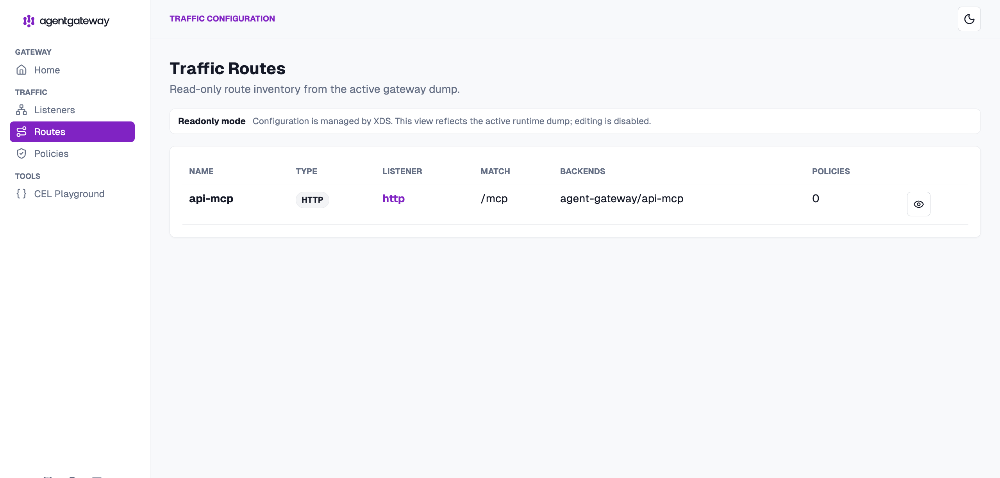

# Connect agentgateway to the API MCP Server

The goal of this FAQ is to register the protected API MCP Server as an agentgateway MCP backend, expose it at the agentgateway `/mcp` route, and verify that the caller's Athenz Access Token reaches the MCP Authorization Proxy.

<!-- TOC depthFrom:2 depthTo:3 -->

- [Step 1. Verify the API MCP Service](#step-1-verify-the-api-mcp-service)
- [Step 2. Register the API MCP Backend](#step-2-register-the-api-mcp-backend)
- [Step 3. Expose the API MCP Backend through agentgateway](#step-3-expose-the-api-mcp-backend-through-agentgateway)
- [Step 4. Verify the Kubernetes Resources](#step-4-verify-the-kubernetes-resources)
- [Step 5. Verify an Authorized MCP Request](#step-5-verify-an-authorized-mcp-request)
- [Step 6. Verify the Route in the Admin UI](#step-6-verify-the-route-in-the-admin-ui)

<!-- /TOC -->

<details>
<summary>Verification status — 🟡 Pending human verification</summary>

| # | Date | Status                                              |
|---|------|-----------------------------------------------------|
| 1 | TBD  | 🟡 Pending — human has not confirmed this procedure |

</details>

# Prerequisites

- Run the commands from the ID-JAG The Hard Way repository root.
- Complete the ID-JAG The Hard Way tutorial so that the protected `mcp` Service is running in the `api` namespace.
- Complete [Install agentgateway on Kubernetes](./01-install-agent-gateway.md).
- Keep `./tools/keep-k8s-port-forward.sh` running.

# Steps

## Step 1. Verify the API MCP Service

Confirm that the protected API MCP Service exists and has a ready endpoint:

```sh
kubectl -n api get service mcp
kubectl -n api get endpointslice \
  -l kubernetes.io/service-name=mcp
```

The Service must expose port `8081`. After the protection step in the main tutorial, that port sends traffic to the MCP Authorization Proxy before it reaches the MCP server.

## Step 2. Register the API MCP Backend

Create an `AgentgatewayBackend` in the same namespace as the agentgateway proxy. The target uses the API MCP Service's in-cluster DNS name and Streamable HTTP endpoint:

```sh
kubectl apply -f - <<'EOF'
apiVersion: agentgateway.dev/v1alpha1
kind: AgentgatewayBackend
metadata:
  name: api-mcp
  namespace: agent-gateway
spec:
  mcp:
    targets:
      - name: api-mcp
        static:
          host: mcp.api.svc.cluster.local
          port: 8081
          path: /mcp
          protocol: StreamableHTTP
EOF
```

```sh
# agentgatewaybackend.agentgateway.dev/api-mcp created
```

## Step 3. Expose the API MCP Backend through agentgateway

Attach an `HTTPRoute` to the `agentgateway-proxy` Gateway:

```sh
kubectl apply -f - <<'EOF'
apiVersion: gateway.networking.k8s.io/v1
kind: HTTPRoute
metadata:
  name: api-mcp
  namespace: agent-gateway
spec:
  parentRefs:
    - name: agentgateway-proxy
  rules:
    - matches:
        - path:
            type: PathPrefix
            value: /mcp
      backendRefs:
        - name: api-mcp
          group: agentgateway.dev
          kind: AgentgatewayBackend
EOF
```

```sh
# httproute.gateway.networking.k8s.io/api-mcp created
```

The client-facing MCP URL is now `http://localhost:44440/mcp`, or the equivalent port returned by `./tools/port.sh agentgateway`.

## Step 4. Verify the Kubernetes Resources

Confirm that agentgateway accepted the backend:

```sh
kubectl -n agent-gateway get agentgatewaybackend api-mcp
```

```sh
# NAME      ACCEPTED   AGE
# api-mcp   True       20s
```

Confirm that the route was accepted and its backend reference was resolved:

```sh
kubectl -n agent-gateway get httproute api-mcp \
  -o jsonpath='{range .status.parents[*].conditions[*]}{.type}={.status} ({.reason}){"\n"}{end}'
```

```sh
# Accepted=True (Accepted)
# ResolvedRefs=True (ResolvedRefs)
```

## Step 5. Verify an Authorized MCP Request

Fetch a fresh Access Token with the role needed to enter the MCP server and the role needed for later API tool calls:

```sh
_scope="api:role.mcp-accessor api:role.docs-getter"
./tools/athenz/fetch-access-token.sh \
  "./keys/idjag-learner.crt" \
  "./keys/idjag-learner.key" \
  "${_scope}" \
  "./keys/idjag-learner.jwt"
```

Initialize an MCP session through agentgateway:

```sh
_agentgateway_port=$(./tools/port.sh agentgateway)
_at=$(cat ./keys/idjag-learner.jwt)

curl --fail-with-body --silent --show-error \
  -H "Authorization: Bearer ${_at}" \
  -H "Accept: application/json, text/event-stream" \
  -H "Content-Type: application/json" \
  --data '{"jsonrpc":"2.0","id":1,"method":"initialize","params":{"protocolVersion":"2025-06-18","capabilities":{},"clientInfo":{"name":"curl","version":"1.0"}}}' \
  "http://localhost:${_agentgateway_port}/mcp" \
  | sed -n 's/^data: *//p' \
  | jq .
```


```sh
# {
#   "jsonrpc": "2.0",
#   "id": 1,
#   "result": {
#     "protocolVersion": "2025-06-18",
#     "capabilities": {
#       "tools": {
#         "listChanged": false
#       }
#     },
#     "serverInfo": {
#       "name": "id-jag-the-hard-way-mcp",
#       "title": "ID-JAG The Hard Way MCP",
#       "version": "0.1.0"
#     }
#   }
# }
```

Agentgateway returns this response as a Server-Sent Event. The `sed` command removes the `data:` prefix before `jq` parses the JSON payload. The result should contain an MCP `result` and identify `agentgateway` as the client-facing server.

Confirm that the protected upstream accepted the same request:

```sh
kubectl -n api logs deployment/mcp -c auth-proxy --tail=20
```

```sh
# ...
# [INFO] [MCP-Auth-Proxy] ✅ AUTHORIZED: 'access' on 'mcp' (Token: eyJraWQi...)
# [INFO] [MCP-Auth-Proxy] ➡️ Forwarding to downstream MCP Server for API Server
```

Agentgateway is now connected to the protected API MCP Server and preserves the caller's Athenz authorization boundary.

## Step 6. Verify the Route in the Admin UI

Open the agentgateway Traffic Routes page:

```sh
./tools/open.sh "http://localhost:$(./tools/port.sh agentgateway-admin)/ui/traffic/routes"
```

The `api-mcp` route should show the `http` listener, `/mcp` match, and `agent-gateway/api-mcp` backend as in this example:



# Reference

- [Agentgateway MCP server quickstart](https://agentgateway.dev/docs/kubernetes/latest/quickstart/mcp/)
- [AgentgatewayBackend API reference](https://agentgateway.dev/docs/kubernetes/latest/reference/api/)
- [Kubernetes HTTPRoute](https://gateway-api.sigs.k8s.io/api-types/httproute/)
- [Protect MCP Server](../../tutorials/12-protect-mcp-server.md)
