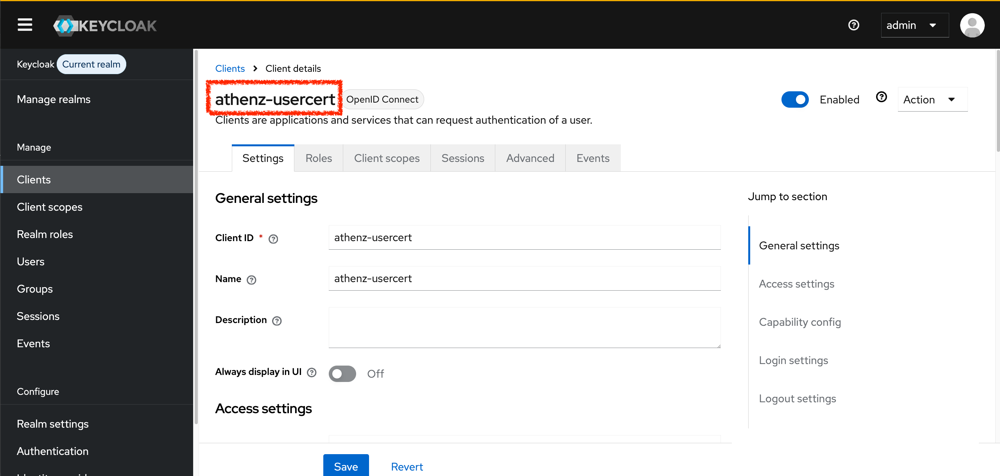

# Goal

The goal of this tutorial is to fetch an Athenz user certificate for `user.idjag-learner` through the local Keycloak IdP and ZTS deployments from this repo, with the following steps:

<!-- TOC depthFrom:2 depthTo:3 -->

- [Step 1. Create a Keycloak Client for User Certificates](#step-1-create-a-keycloak-client-for-user-certificates)
- [Step 2. Register the User Certificate Provider in Athenz](#step-2-register-the-user-certificate-provider-in-athenz)
- [Step 3. Configure ZTS](#step-3-configure-zts)
- [Step 4. Create the User Certificate Private Key](#step-4-create-the-user-certificate-private-key)
- [Step 5. Run `zts-usercert`](#step-5-run-zts-usercert)

<!-- /TOC -->

> [!NOTE]
> This creates an Athenz user principal such as `user.idjag-learner`. That is different from the earlier tutorial identity `human.idjag-learner`, which was modeled as an Athenz service.

# Prerequisites

- Complete the main tutorial through [ID-JAG](../tutorials/16-id-jag.md).
- Complete [Make Keycloak HTTPS for ZTS User Certificates](./make-keycloak-https.md).

# Steps

## Step 1. Create a Keycloak Client for User Certificates

Create a separate public Keycloak client for this test. Public is intentional for the local test because the provider only sends a client secret when one is configured through Athenz `PrivateKeyStore`.

This client represents the Athenz user-certificate login flow, not one individual user. You can use the same `athenz-usercert` client for many users because Keycloak still authenticates each person separately and ZTS verifies the user claim in the returned token.

Create or update the client with the shared Keycloak helper. The helper reads the Keycloak port, realm, admin user, and admin password from the tutorial config, so the only values you need to provide here are the client ID, the callback redirect URI, the browser origin, and the client type.

The redirect URI must match the local callback endpoint that `zts-usercert` or the raw HTTP fallback listens on. The CLI uses `127.0.0.1` for the callback host, so use that value here instead of `localhost`. The final `public` argument makes this a public OIDC client, which means Keycloak will not require a client secret during the local authorization-code exchange.

```sh
./tools/keycloak/create-client.sh \
  "athenz-usercert" \
  "http://127.0.0.1:9213/oauth2/callback" \
  "http://127.0.0.1:9213" \
  public
```

```sh
  # ·  Fetching Keycloak admin token...
  # ·  Looking up client athenz-usercert in realm master...
  # ·  Updating existing client athenz-usercert...
  # ✔  Client updated: athenz-usercert
  # ✔  Opened: http://localhost:34443/admin/master/console/#/master/clients/567425db-94c8-402d-8d01-0bfa94e94b11/settings
```



The helper sets the important client values for this flow:

- `publicClient: true`: no client secret is required for this local test.
- `standardFlowEnabled: true`: enables the OAuth authorization-code flow.
- `redirectUris`: allows Keycloak to redirect the browser back to `127.0.0.1:9213`.
- `webOrigins`: allows browser-based redirects from the local callback origin.

## Step 2. Register the User Certificate Provider in Athenz

Register `sys.auth.usercert` as a class-based instance provider. This is an Athenz provider identity, not a Keycloak client and not a per-human-user object. ZTS uses this provider name from `athenz.zts.user_cert_provider` when it decides which provider implementation is allowed to issue user certificates.

The config property name contains underscores, but the service name cannot. Use `usercert` for the Athenz service name and `sys.auth.usercert` for the provider value.

```sh
./tools/athenz/create-service.sh \
  "sys.auth" \
  "usercert"
```

This registers the Athenz service identity `sys.auth.usercert` in ZMS. No public key is needed for this class-based provider marker because it is not used as a normal service identity that authenticates with its own private key. The helper uses the local tutorial admin certificate against the local ZMS port-forward, then opens the Athenz services page for `sys.auth` so you can confirm `usercert` appears in the UI.

```sh
./tools/athenz/set-service-endpoint.sh \
  "sys.auth" \
  "usercert" \
  "class://com.yahoo.athenz.instance.provider.impl.UserCertificateProvider"
```

This changes the service endpoint from a network URL into a class endpoint. That tells Athenz this provider is implemented inside ZTS by `com.yahoo.athenz.instance.provider.impl.UserCertificateProvider`.

Verify the registered service:

```sh
./tools/athenz/show-service.sh "sys.auth" "usercert"
```

```sh
# ·  Showing service sys.auth.usercert...
# service:
#     - name: sys.auth.usercert
#       modified: 2026-07-01T23:19:32.295Z
#       providerEndpoint: class://com.yahoo.athenz.instance.provider.impl.UserCertificateProvider
#       publicKeys: []
```

## Step 3. Configure ZTS

Registering the provider service in ZMS is not enough. ZTS must also be told which user authority to use, which provider to use for `/usercert`, where Keycloak's token and JWKS endpoints are, which token audience to accept, and which token claim maps back to the requested Athenz user.

Edit the ZTS ConfigMap:

```sh
kubectl edit configmap athenz-zts-conf -n athenz
```

Inside `vim`:

1. Type `/zts.prop` and press **Enter** to jump to the properties section.
2. Press `o` to open a new line below in Insert mode.
3. Paste the following properties:

```properties
    athenz.zts.user_authority_class=com.yahoo.athenz.common.server.debug.DebugUserAuthority
    athenz.zts.user_cert_provider=sys.auth.usercert
    athenz.zts.user_cert_max_timeout=60
    athenz.zts.user_cert_default_timeout=30
    athenz.zts.user_cert.idp_token_endpoint=https://keycloak.idp:8443/realms/master/protocol/openid-connect/token
    athenz.zts.user_cert.idp_jwks_endpoint=https://keycloak.idp:8443/realms/master/protocol/openid-connect/certs
    athenz.zts.user_cert.idp_client_id=athenz-usercert
    athenz.zts.user_cert.idp_redirect_uri=http://127.0.0.1:9213/oauth2/callback
    athenz.zts.user_cert.idp_audience=account
    athenz.zts.user_cert.user_name_claim=preferred_username
```

*The four spaces above are **intended**.*

4. Press `Esc` to exit Insert mode.
5. Then type `/athenz.zts.authority_classes`
6. Press **Enter** to jump to the authority_classes section.
7. Hit `Shift` + `e`
8. Press `a`, then enter the following:
```sh
,com.yahoo.athenz.common.server.debug.DebugUserAuthority
```
9. Press `Esc` to exit Insert mode.
10. Enter `:wq` then **Enter**


The debug authority's domain is `user`, which matches the principal requested below: `user.idjag-learner`. Without a configured user authority, ZTS returns `400 User authority configuration is not set` before CSR parsing and before the Keycloak token exchange.

The `idp_audience` property is easy to miss. It is part of the upstream OSS User Certificate provider properties, and newer Athenz builds require it during provider initialization. With the plain Keycloak public client created above, Keycloak usually puts `account` in the first `aud` value of the access token. If you add a Keycloak audience protocol mapper for this client instead, set `athenz.zts.user_cert.idp_audience` to the audience value emitted by that mapper, such as `athenz-usercert`.

The upstream User Certificate provider also supports these optional properties:

```properties
    athenz.zts.user_cert.idp_config_endpoint=
    athenz.zts.user_cert.connect_timeout=10000
    athenz.zts.user_cert.read_timeout=15000
    athenz.zts.user_cert.idp_client_secret_app=
    athenz.zts.user_cert.idp_client_secret_keygroup=
    athenz.zts.user_cert.idp_client_secret_keyname=
```

You do not need the client-secret properties for the public local Keycloak client above. You also do not need `idp_config_endpoint` when `idp_token_endpoint` and `idp_jwks_endpoint` are set directly.

The upstream ZTS server config also has `athenz.zts.user_cert_signer_key_id_list` to restrict requested user-certificate signer key IDs. Leave it unset for this local flow unless you are testing multiple X.509 signers.

The IdP token and JWKS endpoints use the in-cluster Envoy HTTPS listener from [Make Keycloak HTTPS for ZTS User Certificates](./make-keycloak-https.md). The browser-facing authorization URL still uses a local port-forward, and the helper below opens `https://localhost:$(./tools/port.sh keycloak-https)`.

11. Press **Esc**, then type `:wq!` and press **Enter** to save.

```sh
# configmap/athenz-zts-conf edited
```

Restart ZTS so the new properties are mounted into the running server:

```sh
kubectl -n athenz rollout restart deployment/athenz-zts-server
kubectl -n athenz rollout status deployment/athenz-zts-server
```

```sh
# deployment.apps/athenz-zts-server restarted
# Waiting for deployment "athenz-zts-server" rollout to finish: 0 out of 1 new replicas have been updated...
# Waiting for deployment "athenz-zts-server" rollout to finish: 0 out of 1 new replicas have been updated...
# Waiting for deployment "athenz-zts-server" rollout to finish: 0 of 1 updated replicas are available...
# deployment "athenz-zts-server" successfully rolled out
```

Quickly verify the three required properties before rerunning the helper:

```sh
kubectl -n athenz get configmap athenz-zts-conf -o yaml | \
  grep -E 'athenz.zts.(authority_classes|user_authority_class|user_cert_provider|user_cert.idp_(token|jwks)_endpoint)'
```

Expected output should include all three:

```properties
athenz.zts.authority_classes=com.yahoo.athenz.auth.impl.PrincipalAuthority,com.yahoo.athenz.common.server.debug.DebugUserAuthority
athenz.zts.user_authority_class=com.yahoo.athenz.common.server.debug.DebugUserAuthority
athenz.zts.user_cert_provider=sys.auth.usercert
athenz.zts.user_cert.idp_token_endpoint=https://keycloak.idp:8443/realms/master/protocol/openid-connect/token
athenz.zts.user_cert.idp_jwks_endpoint=https://keycloak.idp:8443/realms/master/protocol/openid-connect/certs
```

## Step 4. Create the User Certificate Private Key

Generate a new private key for the real user certificate:

```sh
./tools/athenz/create-private-key.sh "./keys/user-idjag-learner"
```

```sh
  # ·  Generating RSA key pair for: ./keys/user-idjag-learner...
  # ✔  Keys generated: ./keys/user-idjag-learner.key, ./keys/user-idjag-learner.public.key
```

This creates `./keys/user-idjag-learner.key`, which `zts-usercert` uses to build the CSR, and `./keys/user-idjag-learner.public.key`, which is not registered in ZMS for this user-certificate flow.

## Step 5. Run `zts-usercert`

Use the `zts-usercert` binary from the running `athenz-cli` deployment. This avoids installing or building the CLI on your host.

The helper checks that `zts-usercert` exists in `deployment/athenz-cli`, updates the `athenz-usercert` Keycloak client to allow the exact callback URI, copies your local private key into that pod, runs the pod-local CLI there, and writes the fetched certificate back to your local `./keys` directory.

Run the flow through the helper:

```sh
./tools/athenz/fetch-user-cert.sh \
  "./keys/user-idjag-learner.key" \
  "user.idjag-learner" \
  "./keys/user-idjag-learner.crt"
```

```sh
  # ·  Checking zts-usercert in athenz-cli...
  # ·  Ensuring Keycloak client allows callback URI http://127.0.0.1:9213/oauth2/callback...
  # ·  Fetching Keycloak admin token...
  # ·  Looking up client athenz-usercert in realm master...
  # ·  Updating existing client athenz-usercert...
  # ✔  Client updated: athenz-usercert
  # ·  Copying private key into athenz-cli...
  # ·  Preparing browser URL handoff inside athenz-cli...
  # ·  Forwarding local callback port 9213 to athenz-cli...
  # ·  Running zts-usercert inside athenz-cli...
  # ·  Opening the Keycloak authorization URL from your host browser...
  # ✔  Opened: https://localhost:34444/realms/master/protocol/openid-connect/auth?client_id=athenz-usercert&code_challenge=XUdxT5dzm3PG4Ij6je0AgOlco5Q3L3U4BLWJMQangEw&code_challenge_method=S256&nonce=yZk2bkcIWKTKoSEjpsy6mz5l_87MDbz-&redirect_uri=http%3A%2F%2F127.0.0.1%3A9213%2Foauth2%2Fcallback&response_type=code&scope=openid&state=GU16KRrV-nGBHp2HajdbE4yR3QQhKd4s
```

The helper opens the Keycloak authorization URL in your workstation browser with `tools/open.sh`. After the callback completes, it copies the issued certificate from the `athenz-cli` pod to `./keys/user-idjag-learner.crt`.

Sign in to Keycloak as:

- Username: `idjag-learner`
- Password: `password`

Inspect the issued certificate:

```sh
openssl x509 \
  -in ./keys/user-idjag-learner.crt \
  -noout \
  -subject \
  -issuer \
  -dates \
  -ext extendedKeyUsage \
  -ext subjectAltName
```

```sh
# ubject=O=Athenz, OU=Athenz, CN=user.idjag-learner
# issuer=CN=Test CA Certificate
# notBefore=Jul  2 03:57:46 2026 GMT
# notAfter=Jul  2 04:27:46 2026 GMT
# No extensions in certificate
```

The subject should include `CN = user.idjag-learner`.

# Reference

- [Athenz PR 3239](https://github.com/AthenZ/athenz/pull/3239) added user certificate support in ZTS, including the `POST /usercert` endpoint, the `zts-usercert` CLI, and `UserCertificateProvider`.
- The provider requires the IdP token endpoint and JWKS endpoint to use `https://`. This FAQ uses the Keycloak HTTPS Envoy sidecar from [Make Keycloak HTTPS for ZTS User Certificates](./make-keycloak-https.md) to satisfy that requirement while keeping the tutorial's local HTTP Keycloak port available.
  - [UserCertificateProvider.java](https://github.com/AthenZ/athenz/blob/master/libs/java/instance_provider/src/main/java/com/yahoo/athenz/instance/provider/impl/UserCertificateProvider.java)
