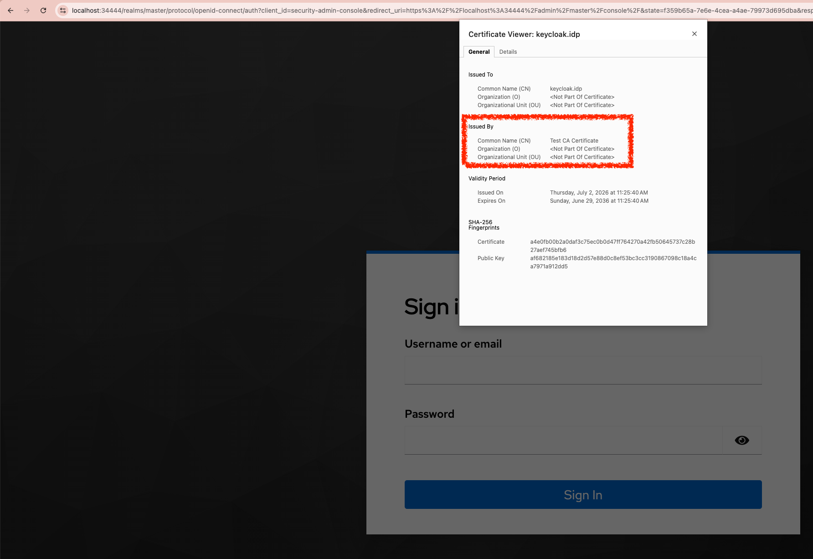

# Goal

The goal of this tutorial is to add HTTPS support to the local Keycloak deployment while keeping the existing HTTP port available, with the following steps:

<!-- TOC depthFrom:2 depthTo:3 -->

- [Step 1. Create the Keycloak TLS Certificate](#step-1-create-the-keycloak-tls-certificate)
- [Step 2. Create the Kubernetes TLS Secret](#step-2-create-the-kubernetes-tls-secret)
- [Step 3. Patch the Keycloak Deployment](#step-3-patch-the-keycloak-deployment)
- [Step 4. Create Envoy Config](#step-4-create-envoy-config)
- [Step 5. Patch the Keycloak Service](#step-5-patch-the-keycloak-service)
- [Step 6. Verify Both Endpoints](#step-6-verify-both-endpoints)
- [Step 7. Trust the CA for Browser HTTPS Access](#step-7-trust-the-ca-for-browser-https-access)
- [Step 8. Open Keycloak over Local HTTPS](#step-8-open-keycloak-over-local-https)

<!-- /TOC -->

After this tutorial, Keycloak remains reachable over HTTP at `http://localhost:34443` and also becomes reachable over HTTPS at `https://localhost:34444`.

# Prerequisites

- Complete the main tutorial through [Identity Provider](../tutorials/13-identity-provider.md).
- Keep `./tools/keep-k8s-port-forward.sh` running in another terminal.

# Steps

## Step 1. Create the Keycloak TLS Certificate

Create one server certificate for the Envoy sidecar. It is signed by the existing Athenz tutorial CA, so ZTS can trust it through the same local trust chain.

```sh
./tools/athenz/create-tls-cert.sh \
  "keycloak.idp" \
  "./keys/keycloak-idp" \
  "keycloak" \
  "localhost" \
  "keycloak.idp" \
  "keycloak.idp.svc" \
  "keycloak.idp.svc.cluster.local"
```

```sh
# ·  Creating TLS certificate for keycloak.idp...
# ·  Using Athenz CA: /path/to/id_jag_the_hard_way_workspace/athenz_dist/certs/ca.cert.pem
# ✔  Private key saved to: ./keys/keycloak-idp.private.pem
# ✔  CSR saved to: ./keys/keycloak-idp.csr.pem
# ✔  Certificate saved to: ./keys/keycloak-idp.cert.pem
```

Check the certificate SANs:

```sh
openssl x509 \
  -in ./keys/keycloak-idp.cert.pem \
  -noout \
  -subject \
  -issuer \
  -ext subjectAltName
```

```sh
# issuer=CN=Test CA Certificate
# X509v3 Subject Alternative Name:
#     DNS:keycloak, DNS:localhost, DNS:keycloak.idp, DNS:keycloak.idp.svc, DNS:keycloak.idp.svc.cluster.local
```

The SAN list must include `DNS:keycloak.idp` because ZTS will call that hostname. It also includes `DNS:localhost` so the local `34444` port-forward can be tested without a hostname mismatch.

## Step 2. Create the Kubernetes TLS Secret

Create or update the TLS secret in the `idp` namespace:

```sh
kubectl -n idp create secret tls keycloak-tls \
  --cert=./keys/keycloak-idp.cert.pem \
  --key=./keys/keycloak-idp.private.pem \
  --dry-run=client \
  -o yaml | kubectl apply -f -
```

```sh
# secret/keycloak-tls configured
```

## Step 3. Patch the Keycloak Deployment

Add the Envoy sidecar container.

```sh
kubectl patch deploy keycloak -n idp --patch "$(cat <<'EOF'
spec:
  template:
    spec:
      containers:
        - name: keycloak-envoy
          image: docker.io/envoyproxy/envoy:v1.34-latest
          imagePullPolicy: IfNotPresent
          args:
            - -c
            - /etc/envoy/envoy.yaml
            - --log-level
            - info
          ports:
            - name: https
              containerPort: 8443
              protocol: TCP
          readinessProbe:
            tcpSocket:
              port: 8443
            initialDelaySeconds: 3
            periodSeconds: 5
          resources:
            limits:
              memory: 128Mi
              cpu: 250m
            requests:
              memory: 32Mi
              cpu: 50m
EOF
)"
```

```sh
# deployment.apps/keycloak patched
```

Add the Envoy config and TLS secret volumes to the Keycloak pod template.

```sh
kubectl patch deploy keycloak -n idp --patch "$(cat <<'EOF'
spec:
  template:
    spec:
      volumes:
        - name: keycloak-envoy-config
          configMap:
            name: keycloak-envoy-config
        - name: keycloak-tls
          secret:
            secretName: keycloak-tls
EOF
)"
```

```sh
# deployment.apps/keycloak patched
```

## Step 4. Create Envoy Config

Create an Envoy config that terminates TLS on `8443` and forwards to the Keycloak container on `127.0.0.1:8080`.

```sh
cat <<'EOF' | kubectl apply -f -
apiVersion: v1
kind: ConfigMap
metadata:
  name: keycloak-envoy-config
  namespace: idp
data:
  envoy.yaml: |
    static_resources:
      listeners:
        - name: keycloak_https
          address:
            socket_address:
              address: 0.0.0.0
              port_value: 8443
          filter_chains:
            - transport_socket:
                name: envoy.transport_sockets.tls
                typed_config:
                  "@type": type.googleapis.com/envoy.extensions.transport_sockets.tls.v3.DownstreamTlsContext
                  common_tls_context:
                    tls_certificates:
                      - certificate_chain:
                          filename: /etc/keycloak/tls/tls.crt
                        private_key:
                          filename: /etc/keycloak/tls/tls.key
              filters:
                - name: envoy.filters.network.http_connection_manager
                  typed_config:
                    "@type": type.googleapis.com/envoy.extensions.filters.network.http_connection_manager.v3.HttpConnectionManager
                    stat_prefix: keycloak_https
                    route_config:
                      name: keycloak_route
                      virtual_hosts:
                        - name: keycloak
                          domains:
                            - "*"
                          routes:
                            - match:
                                prefix: "/"
                              route:
                                cluster: keycloak_http
                                timeout: 30s
                    http_filters:
                      - name: envoy.filters.http.lua
                        typed_config:
                          "@type": type.googleapis.com/envoy.extensions.filters.http.lua.v3.Lua
                          inline_code: |
                            function envoy_on_request(request_handle)
                              local headers = request_handle:headers()
                              local authority = headers:get(":authority") or headers:get("host") or "localhost"
                              local port = string.match(authority, ":(%d+)$") or "443"

                              headers:replace("x-forwarded-proto", "https")
                              headers:replace("x-forwarded-host", authority)
                              headers:replace("x-forwarded-port", port)
                            end
                      - name: envoy.filters.http.router
                        typed_config:
                          "@type": type.googleapis.com/envoy.extensions.filters.http.router.v3.Router
      clusters:
        - name: keycloak_http
          type: STATIC
          connect_timeout: 5s
          load_assignment:
            cluster_name: keycloak_http
            endpoints:
              - lb_endpoints:
                  - endpoint:
                      address:
                        socket_address:
                          address: 127.0.0.1
                          port_value: 8080
EOF
```

```sh
# configmap/keycloak-envoy-config created
```

Finally mount the Envoy config and TLS secret into the Envoy sidecar.

```sh
kubectl patch deploy keycloak -n idp --patch "$(cat <<'EOF'
spec:
  template:
    spec:
      containers:
        - name: keycloak-envoy
          volumeMounts:
            - name: keycloak-envoy-config
              mountPath: /etc/envoy
              readOnly: true
            - name: keycloak-tls
              mountPath: /etc/keycloak/tls
              readOnly: true
EOF
)"
```

```sh
# deployment.apps/keycloak patched
```

Tell Keycloak to keep its HTTP listener enabled and honor forwarded proxy headers from Envoy. This is what makes Keycloak generate browser URLs with `https://localhost:34444` when the request came through the local HTTPS port-forward.

```sh
kubectl patch deploy keycloak -n idp --patch "$(cat <<'EOF'
spec:
  template:
    spec:
      containers:
        - name: keycloak
          env:
            - name: KC_HTTP_ENABLED
              value: "true"
            - name: KC_PROXY_HEADERS
              value: xforwarded
            - name: KC_HOSTNAME_STRICT
              value: "false"
EOF
)"
```

```sh
# deployment.apps/keycloak patched
```

Wait for Keycloak to roll out with the Envoy sidecar configuration:

```sh
kubectl -n idp rollout status deployment/keycloak
```

```sh
# deployment "keycloak" successfully rolled out
```

## Step 5. Patch the Keycloak Service

Expose the Envoy HTTPS port on the existing Keycloak service.

```sh
kubectl patch service keycloak -n idp --patch "$(cat <<'EOF'
spec:
  ports:
    - name: http
      port: 8080
      protocol: TCP
      targetPort: 8080
    - name: https
      port: 8443
      protocol: TCP
      targetPort: 8443
EOF
)"
```

```sh
# service/keycloak patched
```

Check the service:

```sh
kubectl -n idp get service keycloak
```

```sh
# NAME       TYPE        CLUSTER-IP      EXTERNAL-IP   PORT(S)             AGE
# keycloak   ClusterIP   10.96.114.120   <none>        8080/TCP,8443/TCP   1d
```

If `./tools/keep-k8s-port-forward.sh` is running, it now also forwards the HTTPS listener to local port `34444` by default:

```sh
./tools/port.sh keycloak-https
```

```sh
# 34444
```

If the port-forwarder was already running before you added the Envoy sidecar, restart it after the Keycloak rollout. The script will start forwarding both Keycloak ports:

```sh
./tools/keep-k8s-port-forward.sh
```

## Step 6. Verify Both Endpoints

**HTTP (34443)** — verify from your workstation:

```sh
_keycloak_port=$(./tools/port.sh keycloak)
curl -sS \
  "http://localhost:${_keycloak_port}/realms/master/protocol/openid-connect/certs" \
  | jq .
```

**HTTPS (34444)** — verify from your workstation:

```sh
_keycloak_https_port=$(./tools/port.sh keycloak-https)
curl -sS \
  --cacert ./athenz_dist/certs/ca.cert.pem \
  "https://localhost:${_keycloak_https_port}/realms/master/protocol/openid-connect/certs" \
  | jq .
```

Both should return the Keycloak JWKS response:

```sh
# {
#   "keys": [
#     {
#       "kid": "IRkJbssr_TpZAE8uZtnB781U4IGWN3O13vrKyRjRBwc",
#       "kty": "RSA",
#       "alg": "RSA-OAEP",
# ...
```

**HTTPS (in-cluster via athenz-cli)** — use the `athenz-cli` pod because it already has the Athenz CA mounted at `/etc/ssl/certs/ca-certificates.crt`:

```sh
kubectl -n athenz exec deploy/athenz-cli -- \
  curl -sS \
    --cacert /etc/ssl/certs/ca-certificates.crt \
    https://keycloak.idp:8443/realms/master/protocol/openid-connect/certs \
  | jq .
```

Verify that the token endpoint is reachable over HTTPS. This should return an OAuth error because the request intentionally omits grant parameters — TLS succeeding and Keycloak answering is what matters:

```sh
kubectl -n athenz exec deploy/athenz-cli -- \
  curl -sS \
    --cacert /etc/ssl/certs/ca-certificates.crt \
    -X POST \
    https://keycloak.idp:8443/realms/master/protocol/openid-connect/token \
  | jq .
```

Expected output:

```sh
# {
#   "error": "invalid_request",
#   ...
# }
```

If this fails with a certificate hostname error, check that the certificate SAN includes `keycloak.idp`.

If this fails with a trust error, check that the Envoy certificate was signed by `./athenz_dist/certs/ca.cert.pem` and that the caller is using the Athenz CA bundle.

If this fails with connection refused, check the Keycloak pod containers:

```sh
kubectl -n idp get pod -l app=keycloak
kubectl -n idp logs deploy/keycloak -c keycloak-envoy --tail=100
```

## Step 7. Trust the CA for Browser HTTPS Access

`34444` uses a certificate signed by the Athenz tutorial CA, which browsers do not trust by default. To open `https://localhost:34444` without a warning, add the CA to your browser's trust store.

| Environment                | Trust action                                                                                                                         | Notes                                                                                                       |
|----------------------------|--------------------------------------------------------------------------------------------------------------------------------------|-------------------------------------------------------------------------------------------------------------|
| macOS Chrome, Safari, Edge | `sudo security add-trusted-cert -d -r trustRoot -k /Library/Keychains/System.keychain ./athenz_dist/certs/ca.cert.pem`               | Restart the browser after running the command.                                                              |
| macOS Firefox              | Import `./athenz_dist/certs/ca.cert.pem` under Settings > Privacy & Security > Certificates > View Certificates > Authorities.       | Use this if Firefox still shows `SEC_ERROR_UNKNOWN_ISSUER`.                                                 |
| Linux Debian/Ubuntu        | `sudo cp ./athenz_dist/certs/ca.cert.pem /usr/local/share/ca-certificates/athenz-tutorial-ca.crt` then `sudo update-ca-certificates` | Restart the browser after updating the system CA store. Firefox may still need a manual Authorities import. |
| Skip browser trust         | Click through the browser warning, or use `curl --cacert ./athenz_dist/certs/ca.cert.pem`.                                           | `34444` still works. ZTS and in-cluster callers use the CA bundle directly.                                 |

## Step 8. Open Keycloak over Local HTTPS

Open Keycloak through the HTTPS port-forward:

```sh
./tools/open.sh "https://localhost:$(./tools/port.sh keycloak-https)"
```

Sign in with the tutorial admin credentials:

```sh
username: admin
password: admin
```



# References

*None*
