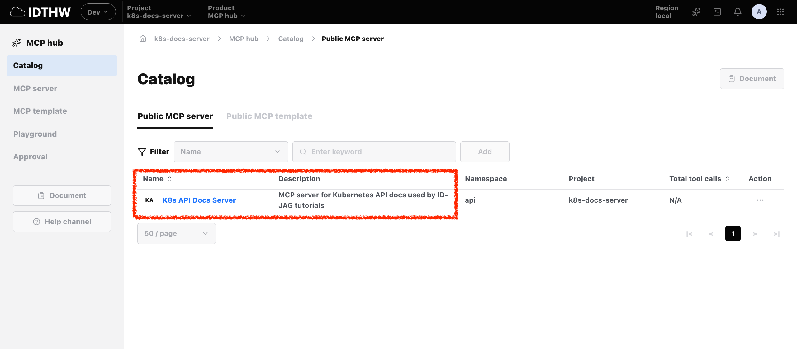

# Goal

The goal of this FAQ is to run MCP Hub locally.

<!-- TOC depthFrom:2 depthTo:3 -->

- [Step 1. Setup X.509 Cert for the UI](#step-1-setup-x509-cert-for-the-ui)
- [Step 2. Grant MCP Access to the UI](#step-2-grant-mcp-access-to-the-ui)
- [Step 3. Run MCP Hub](#step-3-run-mcp-hub)
- [Step 4. Import K8s API Docs Server](#step-4-import-k8s-api-docs-server)
- [Step 5. Verify Protected MCP Tools](#step-5-verify-protected-mcp-tools)

<!-- /TOC -->

# Prerequisites

- Have the local Kubernetes cluster configured for this repo.
- Have `kubectl` pointed at that cluster.
- Have Node.js and npm available.

# Steps

## Step 1. Setup X.509 Cert for the UI

The UI server needs its own Athenz service certificate so it can fetch an Access Token for protected MCP servers.

```sh
./tools/athenz/create-tld.sh "mcp-hub"
./tools/athenz/create-private-key.sh "./keys/mcp-hub-ui"
./tools/athenz/create-service.sh "mcp-hub" "hub-ui" "./keys/mcp-hub-ui.public.key"
./tools/athenz/enable-cert-provider.sh "mcp-hub" "hub-ui"
./tools/athenz/fetch-cert.sh "mcp-hub" "hub-ui" "./keys/mcp-hub-ui.key" "v1"
```

Copy the certificate and its key for the local development:

```sh
mkdir -p "mcp_hub/certs"
cp "./keys/mcp-hub-ui.key" "mcp_hub/certs/"
cp "./keys/mcp-hub-ui.crt" "mcp_hub/certs/"
cp ./athenz_dist/certs/ca.cert.pem ./mcp_hub/certs/ca.crt
ls -al mcp_hub/certs/
```

```sh
# total 16
# drwxr-xr-x@  4 mlajkim  staff   128 Jul  7 08:16 .
# drwxr-xr-x  21 mlajkim  staff   672 Jul  7 08:15 ..
# -rw-r--r--   1 mlajkim  staff  1834 Jul  7 08:16 ca.crt
# -rw-------   1 mlajkim  staff  1720 Jul  7 08:16 mcp-hub-ui.crt
# -rw-------   1 mlajkim  staff  1679 Jul  7 08:16 mcp-hub-ui.key
```

By default, MCP Hub reads these files:

- `mcp_hub/certs/mcp-hub-ui.crt`
- `mcp_hub/certs/mcp-hub-ui.key`
- `mcp_hub/certs/ca.crt`

## Step 2. Grant MCP Access to the UI

The API MCP authorization proxy requires `access` on `api:mcp`. Add the MCP Hub UI service principal to the role that is allowed to access the MCP server:

```sh
./tools/athenz/create-role.sh "api" "mcp-accessor"
./tools/athenz/add-policy.sh "api" "mcp-accessor" "access" "mcp"
./tools/athenz/add-role-member.sh "api" "mcp-accessor" "mcp-hub.hub-ui"
```

```sh
#   ·  Creating Role: api:role.mcp-accessor...
#   ✔  Role created: api:role.mcp-accessor
#   ·  Creating Policy: api:policy.mcp-accessor_access_mcp...
#   ✔  Policy created: api:policy.mcp-accessor_access_mcp
#   ·  Adding Member mcp-hub.hub-ui to Role: api:role.mcp-accessor...
#   ✔  mcp-hub.hub-ui  →  api:role.mcp-accessor
```

## Step 3. Run MCP Hub

Start MCP Hub after the certificate files exist. The local Makefile sets `MCP_HUB_ZTS_URL` from `./tools/port.sh zts`.

Set `MCP_HUB_MCP_ACCESS_SCOPE` because this FAQ imports the protected API MCP server. Without this environment variable, MCP Hub does not fetch an access token and calls MCP servers without an `Authorization` header.

```sh
env MCP_HUB_MCP_ACCESS_SCOPE="api:role.mcp-accessor" \
  make -C mcp_hub local PORT=3102 OPEN_UI=true
```

If you need custom paths, override these environment variables:

```sh
env \
  MCP_HUB_ZTS_URL="https://localhost:$(./tools/port.sh zts)/zts/v1" \
  MCP_HUB_MCP_ACCESS_SCOPE="api:role.mcp-accessor" \
  MCP_HUB_ATHENZ_CERT_PATH="./certs/mcp-hub-ui.crt" \
  MCP_HUB_ATHENZ_KEY_PATH="./certs/mcp-hub-ui.key" \
  MCP_HUB_ATHENZ_CA_PATH="./certs/ca.crt" \
  make -C mcp_hub local PORT=3102 OPEN_UI=true
```

## Step 4. Import K8s API Docs Server

MCP Hub discovers servers from Kubernetes labels and annotations. Add the MCP Hub metadata to the existing `mcp` deployment in the `api` namespace:

```sh
_core_mcp_proxy_port=$(./tools/port.sh mcp)

kubectl label deploy mcp -n api \
  app.kubernetes.io/part-of=mcp-hub \
  mcp.idthw.dev/project=k8s-docs-server \
  --overwrite

kubectl annotate deploy mcp -n api \
  mcp.idthw.dev/alias="K8s API Docs Server" \
  mcp.idthw.dev/description="MCP server for Kubernetes API docs used by ID-JAG tutorials" \
  mcp.idthw.dev/public-url="http://127.0.0.1:${_core_mcp_proxy_port}" \
  mcp.idthw.dev/upstream-url="http://mcp.api:8081/mcp" \
  mcp.idthw.dev/transport="streamable-http" \
  --overwrite
```

```sh
# deployment.apps/mcp labeled
# deployment.apps/mcp annotated
```

Refresh MCP Hub. The K8s API Docs Server should appear:



## Step 5. Verify Protected MCP Tools

Open the K8s API Docs Server tools page. The hub should now fetch the MCP access token with the `mcp-hub.hub-ui` certificate and load the tool list from the protected API MCP server.


