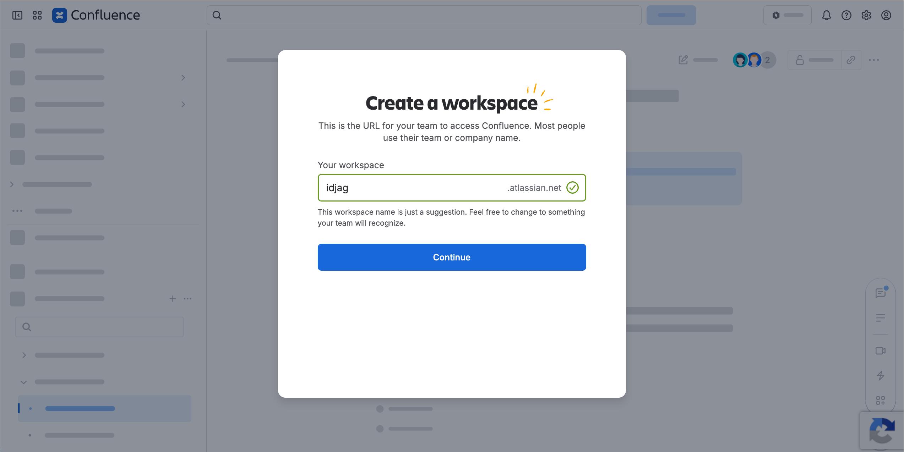
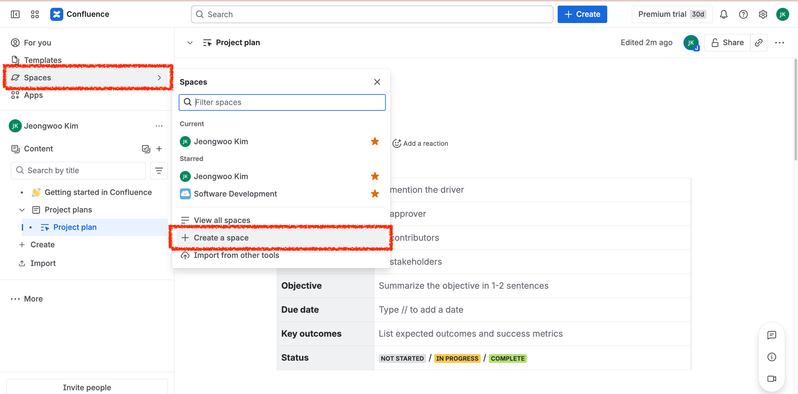
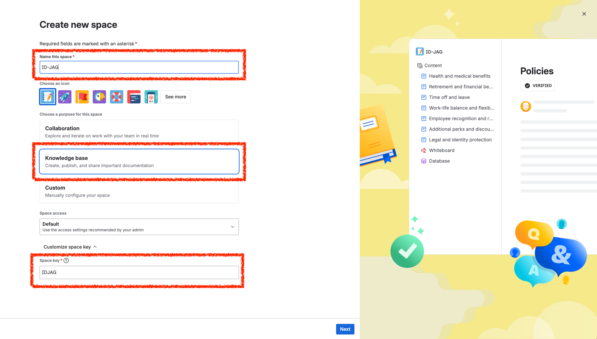
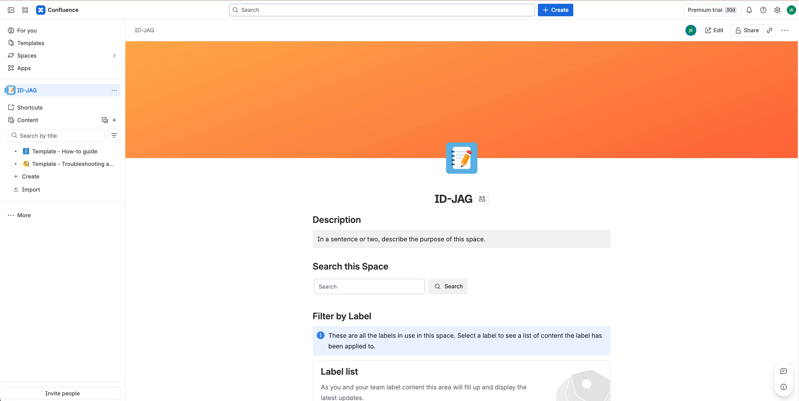
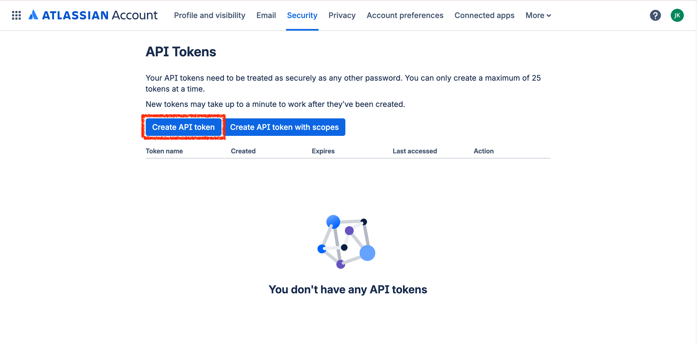
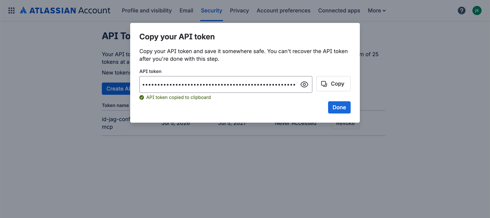
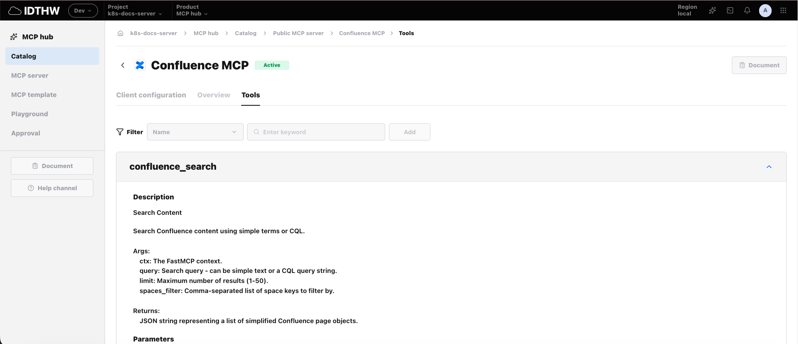
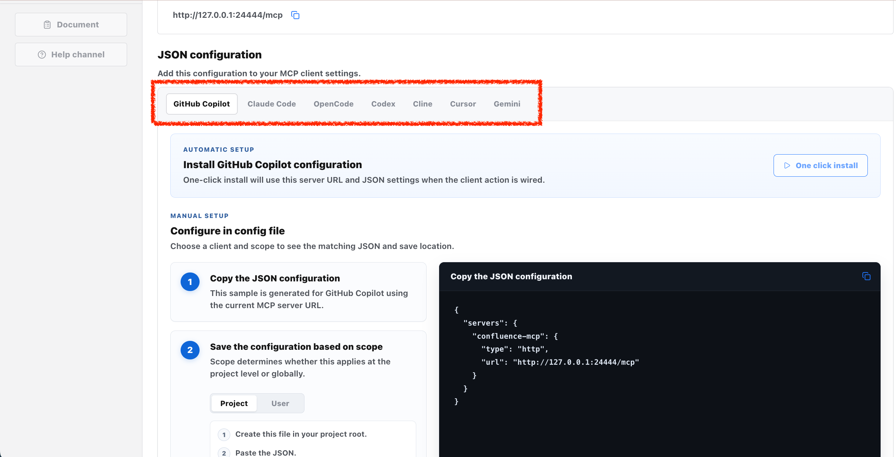
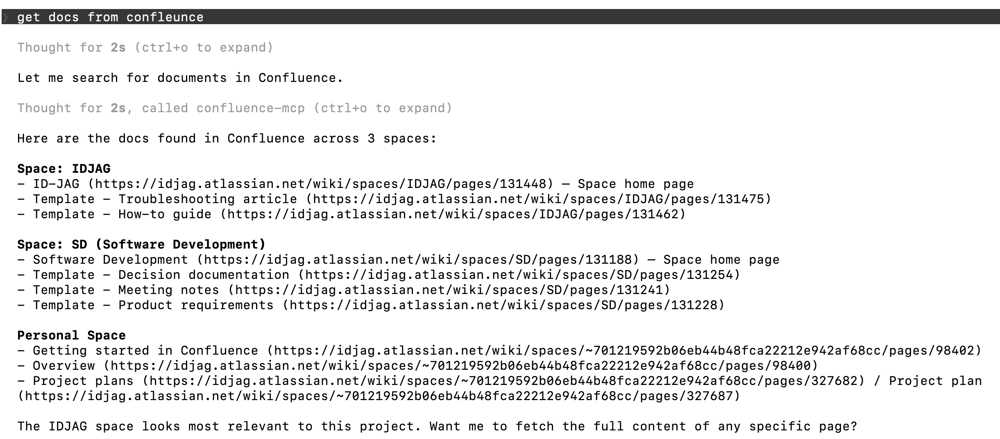

# Goal

The goal of this tutorial is to connect a vendor MCP server to MCP Hub, using Confluence Cloud and `mcp-atlassian` as the first real vendor example.

<!-- TOC depthFrom:2 depthTo:3 -->

- [Step 1. Create Confluence Cloud Workspace](#step-1-create-confluence-cloud-workspace)
- [Step 2. Create ID-JAG Space](#step-2-create-id-jag-space)
- [Step 3. Create Starter Pages](#step-3-create-starter-pages)
- [Step 4. Create API Token](#step-4-create-api-token)
- [Step 5. Deploy Vendor MCP Server](#step-5-deploy-vendor-mcp-server)
  - [Create MCP Hub Namespace](#create-mcp-hub-namespace)
  - [Deploy Confluence MCP](#deploy-confluence-mcp)
  - [Configure Confluence Toolsets](#configure-confluence-toolsets)
  - [Register MCP Hub Metadata](#register-mcp-hub-metadata)
- [Step 6. Get MCP Client Settings from MCP Hub](#step-6-get-mcp-client-settings-from-mcp-hub)
- [Step 7. Verify from the MCP Client](#step-7-verify-from-the-mcp-client)

<!-- /TOC -->

> [!NOTE]
> This tutorial intentionally uses an existing vendor MCP server instead of writing a new Confluence MCP server first. That keeps the demo focused on MCP Hub as the control point for MCP server discovery and future resource-policy metadata.

# Prerequisites

- Complete the main tutorial through [MCP Server for API](../tutorials/09-mcp-server-for-api.md).
- Have the local Kubernetes cluster available.
- Complete [Setup Core MCP Proxy](./setup-core-mcp-proxy.md).
- Have a Confluence Cloud site. The free plan is enough for a local multi-user demo.
- Make sure your Kubernetes cluster can pull `ghcr.io/sooperset/mcp-atlassian:latest`.

# Background

The vendor service owns its own upstream authorization model. For Confluence Cloud, Atlassian issues the API token or OAuth token that lets the MCP server call Confluence.

That upstream token is separate from the ID-JAG/Athenz access token used to reach your MCP boundary.

```text
AI client
  -> MCP Hub / AthenzProxy boundary
  -> vendor MCP server
  -> Confluence Cloud REST API
```

For the first demo, MCP Hub should be treated as the control point for:

- which MCP servers are approved
- where each MCP server endpoint is
- how users get MCP client configuration
- live tool discovery from each MCP server

The vendor MCP server still owns the actual Confluence API call.

# Steps

## Step 1. Create Confluence Cloud Workspace

Go to the Confluence page and login with whatever IdP or SAML SSO:

```text
https://www.atlassian.com/software/confluence
```

Create a workspace (Takes few minutes):




## Step 2. Create ID-JAG Space

Create a space:



Create a normal named space and use these exact settings:

```text
Name this space: ID-JAG
Purpose: Knowledge base
Space access: Default
Customize space key: IDJAG
```



Use `Knowledge base`, not `Collaboration`, because this demo is about managed documentation resources. Keep `Default` space access for the first setup, then tighten permissions later when testing multi-user access. The icon does not matter for MCP. Pick any icon.

After the space is created, the clean space URL should look like:

```text
https://idjag.atlassian.net/wiki/spaces/IDJAG
```



This gives MCP Hub a stable resource identity:

```text
confluence:space/IDJAG
confluence:space/IDJAG/page/<pageId>
```

## Step 3. Create Starter Pages

Create a few starter pages in this space with these exact titles:

```text
MCP Hub SSOT Vision
Confluence Vendor MCP Setup
AthenzProxy Design Notes
Resource Control Model
Tomorrow Demo Script
```

## Step 4. Create API Token

Go to the following page:

```text
https://id.atlassian.com/manage-profile/security/api-tokens
```

Create an Atlassian API token with id `id-jag-confluence-mcp`:



Get key:



## Step 5. Deploy Vendor MCP Server

### Create MCP Hub Namespace

Vendor MCP servers are managed by MCP Hub, so deploy this Confluence MCP server in the `mcp-hub` namespace:

```sh
kubectl create namespace mcp-hub --dry-run=client -o yaml | kubectl apply -f -
```

```sh
# namespace/mcp-hub created
```

Create a Kubernetes Secret for the Confluence credentials using the values obtained above. The helper will ask you for the API token value, so go ahead and paste it when prompted:

```sh
./tools/confluence/create-admin-key-secret.sh
```

The helper prompts for the namespace, secret name, API token name, Confluence URL, username, and API token. The default API token name is `id-jag-confluence-mcp`. If you exported the `CONFLUENCE_*` values above, it uses them as defaults. Prompts with defaults use this shape: `Enter for default: xxx`.

### Deploy Confluence MCP

Deploy the vendor MCP server into the `mcp-hub` namespace. The upstream MCP server still serves the standard `/mcp` path on container port `9000`.

```sh
kubectl apply -f - <<'EOF'
apiVersion: apps/v1
kind: Deployment
metadata:
  name: confluence-mcp
  namespace: mcp-hub
  labels:
    app: confluence-mcp
spec:
  replicas: 1
  selector:
    matchLabels:
      app: confluence-mcp
  template:
    metadata:
      labels:
        app: confluence-mcp
    spec:
      containers:
        - name: confluence-mcp
          image: ghcr.io/sooperset/mcp-atlassian:latest
          args:
            - "--transport"
            - "streamable-http"
            - "--stateless"
            - "--host"
            - "0.0.0.0"
            - "--port"
            - "9000"
          envFrom:
            - secretRef:
                name: confluence-mcp-env
          ports:
            - name: http
              containerPort: 9000
EOF
```

Expose the deployment:

```sh
kubectl expose deploy confluence-mcp -n mcp-hub \
  --port 9000 \
  --target-port 9000 \
  --name confluence-mcp
```

### Configure Confluence Toolsets

`mcp-atlassian` supports both Jira and Confluence. This tutorial is Confluence-only, so set `TOOLSETS` explicitly to Confluence toolsets. This also avoids the startup warning about the default toolset behavior changing in a future `mcp-atlassian` release.

Set the Confluence toolsets:

```sh
kubectl set env deploy/confluence-mcp -n mcp-hub \
  TOOLSETS=confluence_pages,confluence_comments,confluence_labels,confluence_attachments,confluence_users,confluence_analytics
```

Wait for it to become ready:

```sh
kubectl -n mcp-hub rollout status deploy/confluence-mcp
```

If the logs mention `Excluding Jira tool ... Jira configuration/authentication is incomplete`, that is expected for this tutorial. The `mcp-atlassian` server supports both Jira and Confluence, but this setup only provides Confluence credentials. A successful `tools/list` response should still include Confluence tools.

### Register MCP Hub Metadata

MCP Hub discovers catalog entries from Kubernetes deployments labeled as part of `mcp-hub`. Add the MCP Hub labels and annotations after the deployment exists.

This annotation value assumes MCP Hub is running locally and `core-mcp-proxy` is exposed on the configured local port. The default is `24442`, but use `port.sh` so local overrides keep working.

```sh
_confleunce_mcp_port=$(./tools/port.sh confleunce-mcp)

kubectl label deploy confluence-mcp -n mcp-hub \
  app.kubernetes.io/part-of=mcp-hub \
  mcp.idthw.dev/project=confluence-cloud \
  --overwrite

kubectl annotate deploy confluence-mcp -n mcp-hub \
  mcp.idthw.dev/alias="Confluence MCP" \
  mcp.idthw.dev/description="Vendor MCP server backed by Confluence Cloud" \
  mcp.idthw.dev/public-url="http://127.0.0.1:${_confleunce_mcp_port}/mcp" \
  mcp.idthw.dev/upstream-url="http://confluence-mcp.mcp-hub:9000/mcp" \
  mcp.idthw.dev/transport="streamable-http" \
  --overwrite
```

If MCP Hub is running inside Kubernetes instead of through `make -C mcp_hub local`, set the public URL annotation to the in-cluster service DNS name:

```sh
kubectl annotate deploy confluence-mcp -n mcp-hub \
  mcp.idthw.dev/public-url="http://core-mcp-proxy.mcp-hub:8080/mcp" \
  mcp.idthw.dev/upstream-url="http://confluence-mcp.mcp-hub:9000/mcp" \
  --overwrite
```

> [!IMPORTANT]
> The vendor MCP server is now running inside Kubernetes. For local MCP Hub development, MCP Hub should use `core-mcp-proxy` on the port returned by `./tools/port.sh core-mcp-proxy`.

## Step 6. Get MCP Client Settings from MCP Hub

Open MCP Hub:

```sh
OPEN_UI=true make -C mcp_hub local
```

Copy either the MCP server URL or the JSON block for your client, such as Codex or Claude Code.

The MCP Hub page should show:

```sh
_core_mcp_proxy_port=$(./tools/port.sh core-mcp-proxy)
echo "http://127.0.0.1:${_core_mcp_proxy_port}/mcp/confluence-mcp"
```

Use the settings from MCP Hub instead of manually reconstructing the client config. Once the client has this MCP server entry, it can talk to the Confluence MCP server.

Open the Confluence MCP tools page to verify MCP Hub can load the live tool list:

```sh
./tools/open.sh "http://localhost:3102/k8s-docs-server/mcp-hub/catalog/mcp-hub%3Aconfluence-mcp/tools"
```

The page should show the Confluence tools returned by `tools/list`:



## Step 7. Verify from the MCP Client

Open the Confluence MCP client configuration page if it is not already open:

```sh
./tools/open.sh "http://localhost:3102/k8s-docs-server/mcp-hub/catalog/mcp-hub%3Aconfluence-mcp/client-configuration"
```

Choose your AI client agent:



Then ask in your client:



# Reference

None
