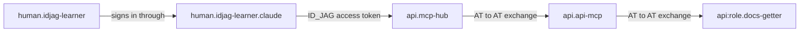
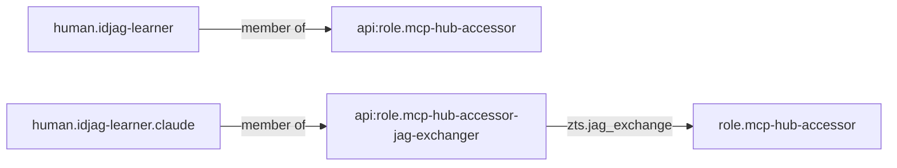
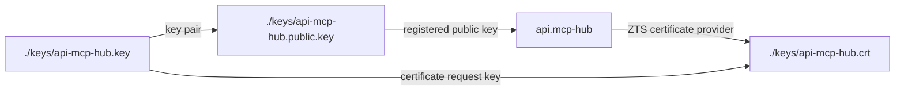
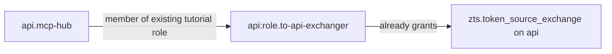
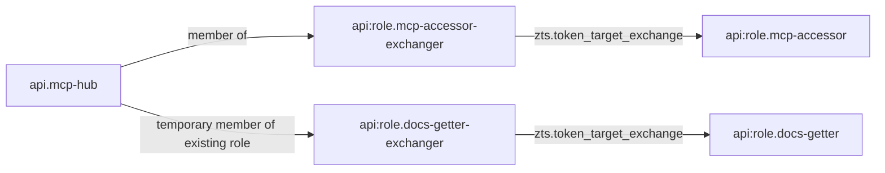

# Goal

The goal of this document is to model a full ID-JAG delegated exchange chain from Claude to `mcp-hub`, then to `mcp`, then to the final API role, with the following steps:

<!-- TOC depthFrom:2 depthTo:2 -->

- [Setup 1. Create the mcp-hub access and JAG exchange roles](#setup-1-create-the-mcp-hub-access-and-jag-exchange-roles)
- [Setup 2. Create the mcp-hub service identity](#setup-2-create-the-mcp-hub-service-identity)
- [Setup 3. Allow mcp-hub to use api tokens as exchange input](#setup-3-allow-mcp-hub-to-use-api-tokens-as-exchange-input)
- [Setup 4. Allow mcp-hub to exchange into the mcp carry-forward scopes](#setup-4-allow-mcp-hub-to-exchange-into-the-mcp-carry-forward-scopes)
- [Step 1. Fetch an id_token for the Claude service client](#step-1-fetch-an-id_token-for-the-claude-service-client)
- [Step 2. Exchange the id_token for ID_JAG](#step-2-exchange-the-id_token-for-id_jag)
- [Step 3. Fetch a delegated mcp-hub access token with ID_JAG](#step-3-fetch-a-delegated-mcp-hub-access-token-with-id_jag)
- [Step 4. Fetch actor id_tokens for mcp-hub and mcp](#step-4-fetch-actor-id_tokens-for-mcp-hub-and-mcp)
- [Step 5. Reproduce the wrong actor token failure](#step-5-reproduce-the-wrong-actor-token-failure)
- [Step 6. Exchange from mcp-hub to mcp](#step-6-exchange-from-mcp-hub-to-mcp)
- [Step 7. Exchange from mcp to API](#step-7-exchange-from-mcp-to-api)
- [Clean-up 8. Delete temporary test resources](#clean-up-8-delete-temporary-test-resources)

<!-- /TOC -->

<details>
<summary>Last verified on Jul 10, 2026 — ✅ Success</summary>

| # | Date         | Confirmed Working                                                                                                                                    |
|---|--------------|------------------------------------------------------------------------------------------------------------------------------------------------------|
| 1 | Jun 13, 2026 | 🟡 — setup tokens fetched; exchange blocked pending Athenz PR #3388                                                                                  |
| 2 | Jul 10, 2026 | ✅ — setup completed successfully as expected; 👍 wrong actor token failed as expected; ✅ mcp-hub to mcp and mcp to API delegated exchanges succeeded |

</details>

# Prerequisites

This tutorial requires the following to be completed:

- [16-id-jag.md](../../../tutorials/16-id-jag.md)

# Steps

Here is the procedure to get to the goals. The setup sections create test-only Athenz objects; the core reproduction starts at Step 1.

The intended delegated path is:



## Setup 1. Create the mcp-hub access and JAG exchange roles

Create `api:role.mcp-hub-accessor` as the first-hop role for the hub. This is intentionally separate from `mcp-accessor`, which remains the role for the MCP layer.



```sh
./tools/athenz/create-role.sh api mcp-hub-accessor
./tools/athenz/add-role-member.sh api mcp-hub-accessor human.idjag-learner
```

```sh
#   ✔  Role created: api:role.mcp-hub-accessor
#   ✔  human.idjag-learner  →  api:role.mcp-hub-accessor
```

Because the ID_JAG token will request `api:role.mcp-hub-accessor`, create the matching tutorial-style `mcp-hub-accessor-jag-exchanger` role and grant `human.idjag-learner.claude` permission to perform JAG exchange into that target role:

```sh
./tools/athenz/create-role.sh api mcp-hub-accessor-jag-exchanger
./tools/athenz/add-policy.sh api mcp-hub-accessor-jag-exchanger zts.jag_exchange role.mcp-hub-accessor
./tools/athenz/add-role-member.sh api mcp-hub-accessor-jag-exchanger human.idjag-learner.claude
```

```sh
#   ✔  Role created: api:role.mcp-hub-accessor-jag-exchanger
#   ✔  Policy created: api:policy.mcp-hub-accessor-jag-exchanger_zts_jag_exchange_role_mcp-hub-accessor
#   ✔  human.idjag-learner.claude  →  api:role.mcp-hub-accessor-jag-exchanger
```

## Setup 2. Create the mcp-hub service identity

Create the temporary `api.mcp-hub` service identity and fetch its service certificate:



```sh
./tools/athenz/create-private-key.sh ./keys/api-mcp-hub
./tools/athenz/create-service.sh api mcp-hub ./keys/api-mcp-hub.public.key
./tools/athenz/enable-cert-provider.sh api mcp-hub
./tools/athenz/fetch-cert.sh api mcp-hub ./keys/api-mcp-hub.key v1
```

```sh
#   ·  Generating RSA key pair for: ./keys/api-mcp-hub...
#   ✔  Keys generated: ./keys/api-mcp-hub.key, ./keys/api-mcp-hub.public.key
#   ·  Registering Service: api.mcp-hub...
#   ✔  Service registered: api.mcp-hub
#   ·  Enabling ZTS Certificate Provider for api.mcp-hub...
#   ✔  ZTS Certificate Provider enabled for api.mcp-hub
#   ·  Fetching X.509 Certificate for api.mcp-hub...
#   ✔  Certificate saved to: ./keys/api-mcp-hub.crt
```

## Setup 3. Allow mcp-hub to use api tokens as exchange input

The base token-exchange tutorial already creates `api:role.to-api-exchanger` and grants it `zts.token_source_exchange` on the `api` domain. That role controls who may use an existing `api` access token as the subject token in a token exchange.

For this research flow, add the temporary `api.mcp-hub` service as a member of that existing source-exchange role. Do not create or delete the `to-api-exchanger` role itself here; it belongs to the completed tutorial baseline.



```sh
./tools/athenz/add-role-member.sh api to-api-exchanger api.mcp-hub
```

```sh
#   ✔  api.mcp-hub  →  api:role.to-api-exchanger
```

## Setup 4. Allow mcp-hub to exchange into the mcp carry-forward scopes

The mcp-hub to mcp exchange must keep `docs-getter` in the intermediate token, because a later token exchange can only request scopes that are still present in the subject token. Create the matching target-exchange role for `mcp-accessor`, then add temporary `api.mcp-hub` membership to the existing tutorial-owned `docs-getter-exchanger` role:



```sh
./tools/athenz/create-role.sh api mcp-accessor-exchanger
./tools/athenz/add-policy.sh api mcp-accessor-exchanger zts.token_target_exchange api:role.mcp-accessor
./tools/athenz/add-role-member.sh api mcp-accessor-exchanger api.mcp-hub
```

```sh
#   ✔  Role created: api:role.mcp-accessor-exchanger
#   ✔  Policy created: api:policy.mcp-accessor-exchanger_zts_token_target_exchange_api_role_mcp-accessor
#   ✔  api.mcp-hub  →  api:role.mcp-accessor-exchanger
```

Add `api.mcp-hub` to the existing tutorial-owned `docs-getter-exchanger` role separately, because that membership is what lets the intermediate MCP token keep `docs-getter` for the final hop:

```sh
./tools/athenz/add-role-member.sh api docs-getter-exchanger api.mcp-hub
```

```sh
#   ✔  api.mcp-hub  →  api:role.docs-getter-exchanger
```

The final `mcp` to API hop uses the existing `docs-getter` role and the existing `api.api-mcp` exchange permissions from the base tutorial.

## Step 1. Fetch an id_token for the Claude service client

Enable Direct Access Grants for `human.idjag-learner.claude`, then fetch an `id_token` for the Keycloak username `idjag-learner`:

```sh
./tools/keycloak/set-direct-access-grants.sh human.idjag-learner.claude true
_client_secret=$(./tools/keycloak/get-client-secret.sh human.idjag-learner.claude)
_id_token=$(./tools/keycloak/get-id-token.sh human.idjag-learner.claude "$_client_secret" idjag-learner)
```

```sh
#   ·  Fetching Keycloak admin token...
#   ·  Looking up UUID for client human.idjag-learner.claude...
#   ·  Fetching client human.idjag-learner.claude...
#   ·  Setting Direct Access Grants for human.idjag-learner.claude: true...
#   ✔  Direct Access Grants set for human.idjag-learner.claude: true
#   ·  Fetching id_token from Keycloak for Keycloak username: idjag-learner, client: human.idjag-learner.claude...
#   ✔  id_token issued for Keycloak username: idjag-learner
# {
#   "alg": "RS256",
#   "typ": "JWT",
#   ...
# }
# {
#   "iss": "http://localhost:34443/realms/master",
#   "aud": "human.idjag-learner.claude",
#   "typ": "ID",
#   "azp": "human.idjag-learner.claude",
#   "preferred_username": "idjag-learner",
#   "email": "idjag-learner@athenz.io",
#   ...
# }
```

## Step 2. Exchange the id_token for ID_JAG

Exchange the Keycloak `id_token` for an ID_JAG token scoped to the user roles needed across the full intended chain:

```sh
_id_jag_scope="api:role.docs-getter api:role.mcp-accessor api:role.mcp-hub-accessor"

_id_jag=$(./tools/athenz/fetch-id-jag.sh \
  ./keys/human-idjag-learner-claude.crt \
  ./keys/human-idjag-learner-claude.key \
  "$_id_token" \
  "$_id_jag_scope")
```

```sh
#   ·  Exchanging id_token for ID_JAG (scope: api:role.docs-getter api:role.mcp-accessor api:role.mcp-hub-accessor)...
#   ✔  ID_JAG issued (scope: api:role.docs-getter api:role.mcp-accessor api:role.mcp-hub-accessor)
# {
#   "typ": "oauth-id-jag+jwt",
#   "alg": "RS256",
#   ...
# }
# {
#   "sub": "human.idjag-learner",
#   "aud": "https://athenz-zts-server.athenz:4443/zts/v1",
#   "client_id": "human.idjag-learner.claude",
#   "scope": "api:role.docs-getter api:role.mcp-accessor api:role.mcp-hub-accessor",
#   ...
# }
```

## Step 3. Fetch a delegated mcp-hub access token with ID_JAG

Request a delegation access token, not an impersonation-style token. Following Athenz PR #3388, the important switch is the `actor` request parameter: when `actor=api.mcp-hub` is present, ZTS should mint the access token with a `may_act` claim for `api.mcp-hub`.

```sh
_hub_scope="api:role.docs-getter api:role.mcp-accessor api:role.mcp-hub-accessor"
_hub_actor="api.mcp-hub"

_hub_at=$(./tools/athenz/fetch-access-token-with-id-jag.sh \
  ./keys/human-idjag-learner-claude.crt \
  ./keys/human-idjag-learner-claude.key \
  "$_id_jag" \
  "$_hub_scope" \
  --actor "$_hub_actor")
```

```sh
#   ·  Fetching Access Token with ID_JAG for scope: api:role.docs-getter api:role.mcp-accessor api:role.mcp-hub-accessor...
#   ✔  Access token issued with ID_JAG for scope: api:role.docs-getter api:role.mcp-accessor api:role.mcp-hub-accessor
# {
#   "typ": "at+jwt",
#   "alg": "RS256",
#   ...
# }
# {
#   "sub": "human.idjag-learner",
#   "scp": [
#     "docs-getter",
#     "mcp-accessor",
#     "mcp-hub-accessor"
#   ],
#   "client_id": "human.idjag-learner.claude",
#   "aud": "api",
#   "act": {
#     "sub": "human.idjag-learner.claude"
#   },
#   "may_act": {
#     "sub": "api.mcp-hub"
#   },
#   ...
# }
```

## Step 4. Fetch actor id_tokens for mcp-hub and mcp

Fetch actor `id_token` values for both service identities in the intended chain:

```sh
_mcp_hub_actor_id_token=$(./tools/athenz/fetch-actor-token.sh \
  ./keys/api-mcp-hub.crt \
  ./keys/api-mcp-hub.key \
  api.mcp-hub)

_mcp_actor_id_token=$(./tools/athenz/fetch-actor-token.sh \
  ./keys/api-mcp.crt \
  ./keys/api-mcp.key \
  api.api-mcp)
```

```sh
#   ·  Fetching actor id_token from Athenz ZTS for client: api.mcp-hub...
#   ✔  Actor id_token issued for client: api.mcp-hub
# {
#   "sub": "api.mcp-hub",
#   "aud": "api.mcp-hub",
#   "client_id": "api.mcp-hub",
#   ...
# }
#   ·  Fetching actor id_token from Athenz ZTS for client: api.api-mcp...
#   ✔  Actor id_token issued for client: api.api-mcp
# {
#   "sub": "api.api-mcp",
#   "aud": "api.api-mcp",
#   "client_id": "api.api-mcp",
#   ...
# }
```

## Step 5. Reproduce the wrong actor token failure

First, try the exchange with the wrong actor token. This intentionally fails because `_hub_at` says `may_act.sub` is `api.mcp-hub`, but this request presents the `api.api-mcp` actor token instead.

```sh
_mcp_scope="api:role.docs-getter api:role.mcp-accessor"

./tools/athenz/exchange-access-token.sh \
  ./keys/api-mcp-hub.crt \
  ./keys/api-mcp-hub.key \
  "$_hub_at" \
  "$_mcp_scope" \
  --actor-token "$_mcp_actor_id_token" \
  --actor api.api-mcp
```

```sh
#   ·  Exchanging access token for scope: api:role.docs-getter api:role.mcp-accessor...
# {
#   "code": 400,
#   "message": "Invalid subject token: may_act sub does not match actor token subject"
# }
```

## Step 6. Exchange from mcp-hub to mcp

Now perform the first delegated AT→AT exchange correctly: `api.mcp-hub` exchanges the hub token into the MCP carry-forward scopes for `api.api-mcp`.

`docs-getter` must stay in `_mcp_scope`; otherwise the final `api.api-mcp` to API exchange cannot request `docs-getter` because Athenz restricts the requested scope to what is present in the subject token.

The `--actor-token "$_mcp_hub_actor_id_token"` proves the current actor is `api.mcp-hub`, which must match the `may_act.sub` in `_hub_at`. The `--actor api.api-mcp` parameter names the next actor, so the exchanged token receives a new `may_act` claim for `api.api-mcp`.

Store the access token returned by this exchange as `_mcp_at`. This is the MCP-layer subject token for the final `api.api-mcp` to API exchange.

```sh
_mcp_at=$(./tools/athenz/exchange-access-token.sh \
  ./keys/api-mcp-hub.crt \
  ./keys/api-mcp-hub.key \
  "$_hub_at" \
  "$_mcp_scope" \
  --actor-token "$_mcp_hub_actor_id_token" \
  --actor api.api-mcp \
  --token-only)
```

```sh
#   ·  Exchanging access token for scope: api:role.docs-getter api:role.mcp-accessor...
#   ✔  Access token exchanged for scope: api:role.docs-getter api:role.mcp-accessor
# {
#   "typ": "at+jwt",
#   "alg": "RS256",
#   ...
# }
# {
#   "sub": "human.idjag-learner",
#   "scp": [
#     "docs-getter",
#     "mcp-accessor"
#   ],
#   "client_id": "api.mcp-hub",
#   "aud": "api",
#   "uid": "api.mcp-hub",
#   "act": {
#     "sub": "api.mcp-hub",
#     "act": {
#       "sub": "human.idjag-learner.claude"
#     }
#   },
#   "may_act": {
#     "sub": "api.api-mcp"
#   },
#   ...
# }
```

> [!NOTE]
> Delegated AT→AT exchange with a subject token obtained via ID_JAG is covered by Athenz PR #3388 and PR #3390.

## Step 7. Exchange from mcp to API

The final hop is for `api.api-mcp` to exchange `_mcp_at` into the final API role `docs-getter`. This works because `_mcp_at` still contains `docs-getter`.

The resulting `act` chain should show `api.api-mcp` as the current actor, wrapping the previous `api.mcp-hub` actor, which wraps the original Claude service client.

```sh
_api_scope="api:role.docs-getter"

./tools/athenz/exchange-access-token.sh \
  ./keys/api-mcp.crt \
  ./keys/api-mcp.key \
  "$_mcp_at" \
  "$_api_scope" \
  --actor-token "$_mcp_actor_id_token" \
  --actor api
```

```sh
#   ·  Exchanging access token for scope: api:role.docs-getter...
#   ✔  Access token exchanged for scope: api:role.docs-getter
# {
#   "typ": "at+jwt",
#   "alg": "RS256",
#   ...
# }
# {
#   "sub": "human.idjag-learner",
#   "scp": [
#     "docs-getter"
#   ],
#   "client_id": "api.api-mcp",
#   "aud": "api",
#   "uid": "api.api-mcp",
#   "act": {
#     "sub": "api.api-mcp",
#     "act": {
#       "sub": "api.mcp-hub",
#       "act": {
#         "sub": "human.idjag-learner.claude"
#       }
#     }
#   },
#   "may_act": {
#     "sub": "api"
#   },
#   ...
# }
# {
#   "access_token": "...",
#   "token_type": "Bearer",
#   "expires_in": 3600,
#   "scope": "api:role.docs-getter",
#   ...
# }
```

## Clean-up 8. Delete temporary test resources

Clean up in dependency order: first remove the temporary `api.mcp-hub` memberships from tutorial-owned roles, then remove the provider-template assertion for `api.mcp-hub`, then delete the temporary `api.mcp-hub` service identity, and then delete the temporary policies and roles created only for this test.

The role deletes also remove their temporary members:

- `human.idjag-learner` from `api:role.mcp-hub-accessor`
- `human.idjag-learner.claude` from `api:role.mcp-hub-accessor-jag-exchanger`
- `api.mcp-hub` from `api:role.mcp-accessor-exchanger`

```sh
./tools/athenz/delete-role-member.sh api to-api-exchanger api.mcp-hub
./tools/athenz/delete-role-member.sh api docs-getter-exchanger api.mcp-hub
./tools/athenz/delete-assertion.sh api zts_instance_launch_provider grant launch zts_instance_launch_provider service.mcp-hub
./tools/athenz/delete-service.sh api mcp-hub
./tools/athenz/delete-policy.sh api mcp-hub-accessor-jag-exchanger_zts_jag_exchange_role_mcp-hub-accessor
./tools/athenz/delete-role.sh api mcp-hub-accessor-jag-exchanger
./tools/athenz/delete-policy.sh api mcp-accessor-exchanger_zts_token_target_exchange_api_role_mcp-accessor
./tools/athenz/delete-role.sh api mcp-accessor-exchanger
./tools/athenz/delete-role.sh api mcp-hub-accessor
```

```sh
#   ✔  Role member deleted or already absent: api.mcp-hub  →  api:role.to-api-exchanger
#   ✔  Role member deleted or already absent: api.mcp-hub  →  api:role.docs-getter-exchanger
#   ·  Deleting assertion from api:policy.zts_instance_launch_provider: grant launch to zts_instance_launch_provider on service.mcp-hub...
#   ✔  Assertion deleted or already absent: api:policy.zts_instance_launch_provider  grant launch to zts_instance_launch_provider on service.mcp-hub
#   ·  Deleting service api.mcp-hub...
#   ✔  Service deleted or already absent: api.mcp-hub
#   ✔  Policy deleted or already absent: api:policy.mcp-hub-accessor-jag-exchanger_zts_jag_exchange_role_mcp-hub-accessor
#   ✔  Role deleted or already absent: api:role.mcp-hub-accessor-jag-exchanger
#   ✔  Policy deleted or already absent: api:policy.mcp-accessor-exchanger_zts_token_target_exchange_api_role_mcp-accessor
#   ✔  Role deleted or already absent: api:role.mcp-accessor-exchanger
#   ✔  Role deleted or already absent: api:role.mcp-hub-accessor
```

# Reference

- [Athenz PR #3388 — support ID-JAG AT→AT exchange](https://github.com/AthenZ/athenz/pull/3388)
- [Athenz PR #3390 — support subsequent delegated AT→AT exchange](https://github.com/AthenZ/athenz/pull/3390)
- [RFC 7521 — Assertion Framework](https://datatracker.ietf.org/doc/html/rfc7521)
- [RFC 8693 — Token Exchange](https://datatracker.ietf.org/doc/html/rfc8693)
