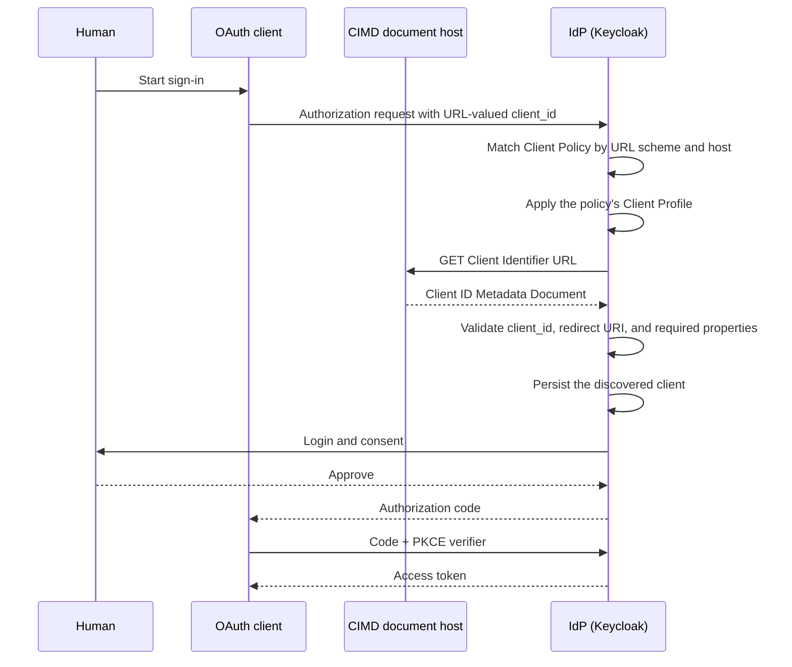

# Goal

The goal of this document is to learn Keycloak's experimental OAuth Client ID Metadata Document support by proving that Keycloak can discover and persist an unknown OAuth client from a URL-valued `client_id`, then issue an access token through the Authorization Code flow with PKCE.

<!-- TOC depthFrom:2 depthTo:2 -->

- [Step 1. Confirm the Keycloak version and baseline metadata](#step-1-confirm-the-keycloak-version-and-baseline-metadata)
- [Step 2. Enable the experimental CIMD feature](#step-2-enable-the-experimental-cimd-feature)
- [Step 3. Publish a local Client ID Metadata Document](#step-3-publish-a-local-client-id-metadata-document)
- [Step 4. Configure Keycloak to trust the research client domain](#step-4-configure-keycloak-to-trust-the-research-client-domain)
- [Step 5. Confirm the client is not registered](#step-5-confirm-the-client-is-not-registered)
- [Step 6. Authorize the discovered client and fetch an access token](#step-6-authorize-the-discovered-client-and-fetch-an-access-token)
- [Step 7. Verify that Keycloak discovered and persisted the client](#step-7-verify-that-keycloak-discovered-and-persisted-the-client)
- [Step 8. Verify the issued access token](#step-8-verify-the-issued-access-token)
- [Step 9. Reject mismatched and untrusted client metadata](#step-9-reject-mismatched-and-untrusted-client-metadata)

<!-- /TOC -->

<details>
<summary>Last human verified on Aug 15, 2026 — ✅ Success</summary>

| # | Date         | Confirmed Working                                                                                 |
|---|--------------|---------------------------------------------------------------------------------------------------|
| 1 | Aug 15, 2026 | ✅ Human verified — CIMD discovery, client persistence, token issuance, and rejection paths worked |

</details>

# Prerequisites

This tutorial requires the following to be completed:

1. Complete the main [ID-JAG The Hard Way tutorial](https://github.com/mlajkim/id-jag-the-hard-way/tree/main/tutorials).

# Prerequisite Knowledge

OAuth clients normally receive a `client_id` after being registered with an authorization server. A Client ID Metadata Document reverses that relationship: the client uses an HTTPS URL as its `client_id`, and that URL returns the client's registration metadata as JSON.

When Keycloak receives an authorization request from an allowed URL-valued `client_id`, it performs the following work:

1. Match the `client_id` URL against a Keycloak Client Policy.
1. Fetch the JSON document from that exact URL.
1. Verify that the document's `client_id` exactly matches the requested URL.
1. Validate the redirect URI, client authentication method, and configured URI restrictions.
1. Persist the discovered client in the realm and cache its metadata.
1. Continue the normal OAuth Authorization Code flow.



The IETF draft requires an HTTPS Client Identifier URL. This local experiment deliberately enables Keycloak's development-only HTTP allowance so the document can be served inside the Kind cluster. Production deployments must use HTTPS and narrowly restrict which domains Keycloak may fetch to reduce server-side request forgery risk.

This experiment tests CIMD only. It does not yet test MCP Protected Resource Metadata, an MCP resource server, ID-JAG issuance, or ID-JAG redemption.

# Steps

Here is the procedure to get to the goals.

## Step 1. Confirm the Keycloak version and baseline metadata

Record the exact Keycloak version used by the experiment:

```sh
kubectl -n idp exec deployment/keycloak \
  -c keycloak \
  -- /opt/keycloak/bin/kc.sh --version
```

```sh
# Keycloak 26.6.4
# JVM: 21.0.11 (Red Hat, Inc. OpenJDK 64-Bit Server VM 21.0.11+10-LTS)
# OS: Linux 6.10.11-linuxkit aarch64
```

This research was prepared against the Keycloak `26.6.4` image used by the completed tutorial on Aug 14, 2026.

Inspect the authorization server metadata before enabling CIMD:

```sh
./tools/keycloak/get-openid-configuration.sh \
  | jq '{
      issuer,
      client_id_metadata_document_supported,
      token_endpoint_auth_methods_supported
    }'
```

```sh
# {
#   "issuer": "http://localhost:34443/realms/master",
#   "client_id_metadata_document_supported": false,
#   "token_endpoint_auth_methods_supported": [
#     "private_key_jwt",
#     "client_secret_basic",
#     "client_secret_post",
#     "tls_client_auth",
#     "client_secret_jwt"
#   ]
# }
```

When CIMD is disabled in the tutorial's Keycloak 26.6.4 deployment, `client_id_metadata_document_supported` is `false`.

## Step 2. Enable the experimental CIMD feature

Enable `cimd` only on the Keycloak container. This preserves the optional Envoy HTTPS sidecar created by the Keycloak HTTPS FAQ and does not modify `athenz_dist`:

```sh
kubectl -n idp set env deployment/keycloak \
  --containers=keycloak \
  KC_FEATURES=cimd

kubectl -n idp rollout status deployment/keycloak
```

```sh
# deployment.apps/keycloak env updated
# deployment "keycloak" successfully rolled out
```

Inspect the authorization server metadata again:

```sh
./tools/keycloak/get-openid-configuration.sh \
  | jq '{
      client_id_metadata_document_supported,
      token_endpoint_auth_methods_supported
    }'
```

```sh
# {
#   "client_id_metadata_document_supported": true,
#   "token_endpoint_auth_methods_supported": [
#     "private_key_jwt",
#     "client_secret_basic",
#     "client_secret_post",
#     "tls_client_auth",
#     "client_secret_jwt"
#   ]
# }
```

The feature is active when `client_id_metadata_document_supported` is `true`. Keycloak also advertises `none` as a supported token-endpoint authentication method, which allows the public client used in this experiment to redeem its code without a client secret.

## Step 3. Publish a local Client ID Metadata Document

The CIMD values are read directly from `tools/config.yaml` with `config.sh` where they are used. Deploy a small NGINX server containing one valid document and one deliberately mismatched document. These are research-only Kubernetes resources and do not modify the tutorial distribution:

```sh
kubectl apply -f - <<EOF
apiVersion: v1
kind: ConfigMap
metadata:
  name: cimd-client-metadata
  namespace: idp
data:
  client.json: |
    {
      "client_id": "$(./tools/config.sh keycloak cimd client-id)",
      "client_name": "ID-JAG The Hard Way CIMD Client",
      "redirect_uris": ["$(./tools/config.sh keycloak cimd redirect-uri)"],
      "grant_types": ["authorization_code", "refresh_token"],
      "response_types": ["code"],
      "scope": "profile"
    }
  mismatched.json: |
    {
      "client_id": "$(./tools/config.sh keycloak cimd client-id)",
      "client_name": "Mismatched CIMD Client",
      "redirect_uris": ["$(./tools/config.sh keycloak cimd redirect-uri)"],
      "grant_types": ["authorization_code"],
      "response_types": ["code"]
    }
---
apiVersion: apps/v1
kind: Deployment
metadata:
  name: cimd-client-metadata
  namespace: idp
spec:
  replicas: 1
  selector:
    matchLabels:
      app: cimd-client-metadata
  template:
    metadata:
      labels:
        app: cimd-client-metadata
    spec:
      containers:
        - name: nginx
          image: nginx:alpine
          ports:
            - name: http
              containerPort: 80
          volumeMounts:
            - name: metadata
              mountPath: /usr/share/nginx/html
              readOnly: true
      volumes:
        - name: metadata
          configMap:
            name: cimd-client-metadata
---
apiVersion: v1
kind: Service
metadata:
  name: cimd-client-metadata
  namespace: idp
spec:
  selector:
    app: cimd-client-metadata
  ports:
    - name: http
      port: 80
      targetPort: http
EOF

kubectl -n idp rollout status deployment/cimd-client-metadata
```

```sh
# configmap/cimd-client-metadata created
# deployment.apps/cimd-client-metadata created
# service/cimd-client-metadata created
# deployment "cimd-client-metadata" successfully rolled out
```

Fetch the document from the same cluster network used by Keycloak:

```sh
kubectl -n idp exec deployment/cimd-client-metadata -- \
  wget -qO- "$(./tools/config.sh keycloak cimd client-id)" \
  | jq
```

```sh
# {
#   "client_id": "http://cimd-client-metadata.idp.svc.cluster.local/client.json",
#   "client_name": "ID-JAG The Hard Way CIMD Client",
#   "redirect_uris": [
#     "http://127.0.0.1:9214/callback"
#   ],
#   "grant_types": [
#     "authorization_code",
#     "refresh_token"
#   ],
#   "response_types": [
#     "code"
#   ],
#   "scope": "profile"
# }
```

The JSON must contain a `client_id` exactly equal to `keycloak.cimd.client-id` in `tools/config.yaml`. Even a semantically equivalent but textually different URL is a different OAuth client identifier.

## Step 4. Configure Keycloak to trust the research client domain

Keycloak separates CIMD availability, validation, and selection:

```text
KC_FEATURES=cimd → Make CIMD available
Client Profile   → Define how CIMD documents must be validated
Client Policy    → Select which client_id URLs use that profile
```

Add a Client Profile containing Keycloak's `client-id-metadata-document` executor. The existing profiles are retained, and any earlier copy of this research profile is replaced:

```sh
./tools/keycloak/set-cimd-client-profile.sh
```

See if registered:

```sh
curl -sS \
  -H "Authorization: Bearer $(./tools/keycloak/get-admin-token.sh)" \
  "http://localhost:$(./tools/port.sh keycloak)/admin/realms/master/client-policies/profiles" \
  | jq '.profiles[] | select(.name == "idthw-cimd-profile")'
```

```sh
# {
#   "name": "idthw-cimd-profile",
#   "description": "Discover the local IDTHW client from its Client ID Metadata Document",
#   "executors": [
#     {
#       "executor": "client-id-metadata-document",
#       "configuration": {
#         "cimd-allow-http-scheme": true,
#         "cimd-allow-permitted-domains": [
#           "cimd-client-metadata.idp.svc.cluster.local",
#           "127.0.0.1"
#         ],
#         "cimd-restrict-same-domain": false,
#         "cimd-required-properties": [
#           "client_id",
#           "redirect_uris",
#           "grant_types"
#         ]
#       }
#     }
#   ]
# }
```

Open the Client Profiles page in the Keycloak Admin Console:

```sh
./tools/open.sh \
  "http://localhost:$(./tools/port.sh keycloak)/admin/master/console/#/$(./tools/config.sh keycloak realm)/realm-settings/client-policies/profiles"
```

Add a Client Policy that invokes the profile only for HTTP client identifiers hosted by the research service:

```sh
./tools/keycloak/set-cimd-client-policy.sh
```

```sh
  # ·  Configuring the CIMD Client Policy in realm master...
  # ✔  CIMD Client Policy configured in realm master (HTTP 204)
```

```sh
curl -sS \
  -H "Authorization: Bearer $(./tools/keycloak/get-admin-token.sh)" \
  "http://localhost:$(./tools/port.sh keycloak)/admin/realms/master/client-policies/policies" \
  | jq '.policies[] | select(.name == "idthw-cimd-policy")'
```

```sh
# {
#   "name": "idthw-cimd-policy",
#   "description": "Apply CIMD only to the local IDTHW research domain",
#   "enabled": true,
#   "conditions": [
#     {
#       "condition": "client-id-uri",
#       "configuration": {
#         "client-id-uri-scheme": [
#           "http"
#         ],
#         "client-id-uri-allow-permitted-domains": [
#           "cimd-client-metadata.idp.svc.cluster.local"
#         ]
#       }
#     }
#   ],
#   "profiles": [
#     "idthw-cimd-profile"
#   ]
# }
```

Open the Client Policies page in the Keycloak Admin Console:

```sh
./tools/open.sh \
  "http://localhost:$(./tools/port.sh keycloak)/admin/master/console/#/$(./tools/config.sh keycloak realm)/realm-settings/client-policies/policies"
```

The profile is separate so the same validation rules can be reused by multiple policies. Each policy can independently decide which clients match those rules. The condition decides which URL-valued `client_id` values activate the CIMD executor. The executor separately validates the fetched document and every configured URI. Keeping both allowlists narrow is important because Keycloak makes the outbound metadata request itself.

## Step 5. Confirm the client is not registered

Query Keycloak before sending an authorization request:

```sh
./tools/keycloak/get-client.sh \
  "$(./tools/config.sh keycloak cimd client-id)"
```

```sh
# []
```

The result must be `[]`. This establishes that the next step is not using a manually pre-registered client.

## Step 6. Authorize the discovered client and fetch an access token

Start the complete Authorization Code flow with PKCE:

```sh
./tools/keycloak/fetch-access-token-with-cimd.sh \
  --client-id "$(./tools/config.sh keycloak cimd client-id)"
```

```sh
#   ✔  Authorization code received and state verified.
#   ·  Exchanging the authorization code for a Keycloak access token...
#   ✔  Keycloak access token received.
# {
#   "access_token": "eyJ...",
#   "token_type": "Bearer",
#   "expires_in": 300,
#   "access_token_claims": {
#     "iss": "http://localhost:34443/realms/master",
#     "sub": "...",
#     "azp": "http://cimd-client-metadata.idp.svc.cluster.local/client.json",
#     "scope": "openid profile"
#   }
# }
```

## Step 7. Verify that Keycloak discovered and persisted the client

Query the client again after the authorization request:

```sh
./tools/keycloak/get-client.sh \
  "$(./tools/config.sh keycloak cimd client-id)" \
  | jq '.[] | {
      id,
      clientId,
      name,
      publicClient,
      consentRequired,
      standardFlowEnabled,
      optionalClientScopes,
      cimdCacheExpiry: .attributes["cimd.cache.expiry.time.in.sec"]
    }'
```

Confirm the result shows the configured URL as `clientId`, `ID-JAG The Hard Way CIMD Client` as `name`, `true` as `publicClient`, and a non-empty `cimdCacheExpiry`. These values prove that Keycloak fetched the document, translated it into a realm client, and recorded a metadata cache expiry. This is internal persistence performed by Keycloak; the OAuth client still did not call Dynamic Client Registration or receive a registration access token.

## Step 8. Verify the issued access token

In the token details printed by Step 6, confirm that the `azp` claim equals the complete URL in `keycloak.cimd.client-id`. This proves the access token was issued to the client Keycloak discovered from the metadata document. The raw token remains available in `_access_token` for subsequent requests.

This token does not yet prove MCP authorization. No MCP resource-server audience or MCP tool scope has been configured in this experiment.

## Step 9. Reject mismatched and untrusted client metadata

First request the deliberately mismatched document. Its JSON says its `client_id` is `/client.json`, while the requested document URL is `/mismatched.json`:

```sh
./tools/keycloak/fetch-access-token-with-cimd.sh \
  --open "$(./tools/config.sh keycloak cimd mismatched-client-id)"
```

Keycloak displays the client ID mismatch:


Next use a client identifier outside the Client Policy's trusted-domain list:

```sh
./tools/keycloak/fetch-access-token-with-cimd.sh \
  --open 'http://untrusted.invalid/client.json'
```

Keycloak displays `Client not found` because the Client Policy does not trust this domain:


# Optional Clean-up

Delete the dynamically persisted client:

```sh
_dynamic_client_uuid=$(
  ./tools/keycloak/get-client.sh \
    "$(./tools/config.sh keycloak cimd client-id)" \
    | jq -er '.[].id'
)

curl -sS \
  -X DELETE \
  -H "Authorization: Bearer $(./tools/keycloak/get-admin-token.sh)" \
  -o /dev/null \
  -w 'Client HTTP status: %{http_code}\n' \
  "http://localhost:$(./tools/port.sh keycloak)/admin/realms/master/clients/${_dynamic_client_uuid}"
```

Remove the research policy before removing its referenced profile:

```sh
_policies_payload=$(
  curl -sS \
    -H "Authorization: Bearer $(./tools/keycloak/get-admin-token.sh)" \
    "http://localhost:$(./tools/port.sh keycloak)/admin/realms/master/client-policies/policies" \
  | jq '
      .policies |= map(select(.name != "idthw-cimd-policy"))
      | del(.globalPolicies)
    '
)

curl -sS \
  -X PUT \
  -H "Authorization: Bearer $(./tools/keycloak/get-admin-token.sh)" \
  -H 'Content-Type: application/json' \
  -d "${_policies_payload}" \
  -o /dev/null \
  -w 'Policy clean-up HTTP status: %{http_code}\n' \
  "http://localhost:$(./tools/port.sh keycloak)/admin/realms/master/client-policies/policies"

_profiles_payload=$(
  curl -sS \
    -H "Authorization: Bearer $(./tools/keycloak/get-admin-token.sh)" \
    "http://localhost:$(./tools/port.sh keycloak)/admin/realms/master/client-policies/profiles" \
  | jq '
      .profiles |= map(select(.name != "idthw-cimd-profile"))
      | del(.globalProfiles)
    '
)

curl -sS \
  -X PUT \
  -H "Authorization: Bearer $(./tools/keycloak/get-admin-token.sh)" \
  -H 'Content-Type: application/json' \
  -d "${_profiles_payload}" \
  -o /dev/null \
  -w 'Profile clean-up HTTP status: %{http_code}\n' \
  "http://localhost:$(./tools/port.sh keycloak)/admin/realms/master/client-policies/profiles"
```

Delete the temporary metadata server:

```sh
kubectl -n idp delete \
  service/cimd-client-metadata \
  deployment/cimd-client-metadata \
  configmap/cimd-client-metadata
```

If CIMD was not enabled before this experiment, remove the feature environment variable and wait for Keycloak to restart:

```sh
kubectl -n idp set env deployment/keycloak \
  --containers=keycloak \
  KC_FEATURES-

kubectl -n idp rollout status deployment/keycloak
```

# Reference

- [OAuth Client ID Metadata Document — Internet-Draft `draft-ietf-oauth-client-id-metadata-document-02`](https://datatracker.ietf.org/doc/draft-ietf-oauth-client-id-metadata-document/)
- [Keycloak Server Configuration — Features](https://www.keycloak.org/server/features)
- [Keycloak `ClientIdMetadataDocumentTest`](https://github.com/keycloak/keycloak/blob/main/tests/base/src/test/java/org/keycloak/tests/client/policies/ClientIdMetadataDocumentTest.java)
- [Keycloak CIMD Client Policy executor](https://github.com/keycloak/keycloak/blob/main/services/src/main/java/org/keycloak/protocol/oauth2/cimd/clientpolicy/executor/ClientIdMetadataDocumentExecutor.java)
- [KubeCon Japan 2026 Keycloak MCP and CIMD demonstration](https://youtu.be/r3pssyWPgLc?t=863)
