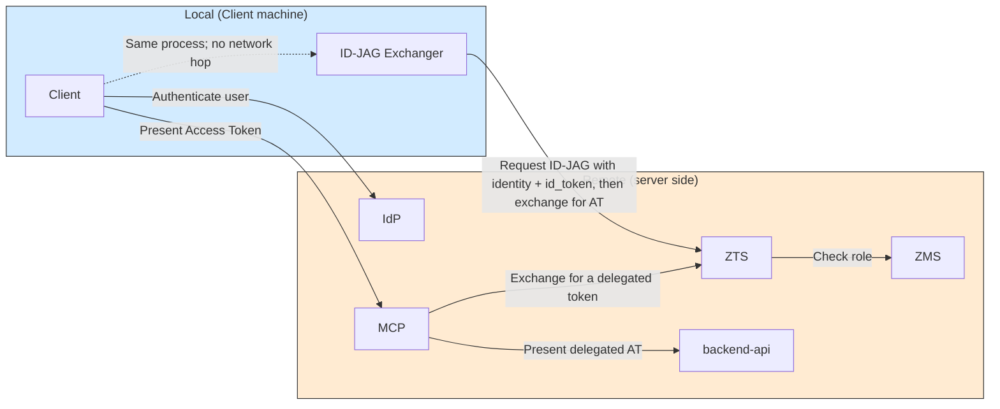
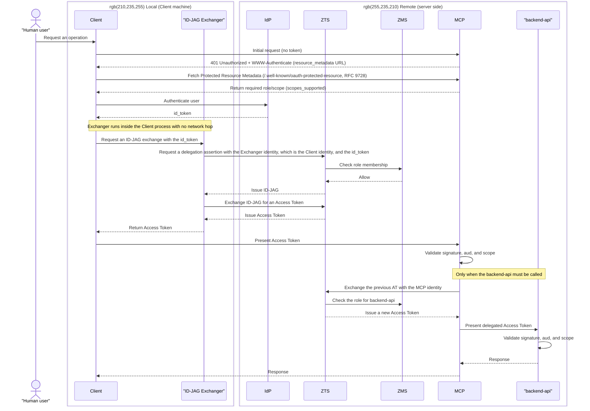

# Pattern 1: local id_token acquisition and local ID-JAG exchange

**Status: Not implemented (placeholder)**

See the [showcase README](../../README.md) for the overview and pattern comparison.

The Client itself has a verifiable workload identity for Athenz ZTS and performs the id_token → ID-JAG → Access Token exchange within the Client process.

## Architecture

The defining characteristic is that the Client and Exchanger run in the same process. No network authentication or DPoP is required for the Exchanger.

## Sequence

**Characteristics**: The Client must have a verifiable workload identity for Athenz ZTS. This pattern is not suitable for general-purpose MCP clients running on an end-user device.

Protected Resource Metadata (RFC 9728) is used to let the Client learn the role/scope required by the connected MCP, not to discover a separate AS. Because the Exchanger runs in the same process, AS Metadata (RFC 8414) discovery is not required.
