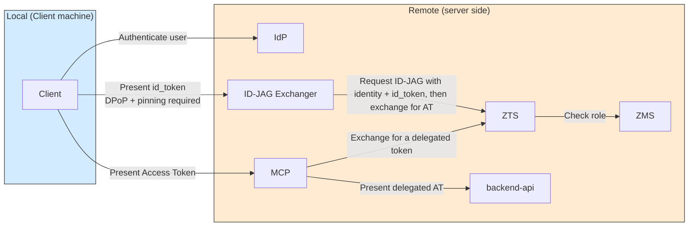
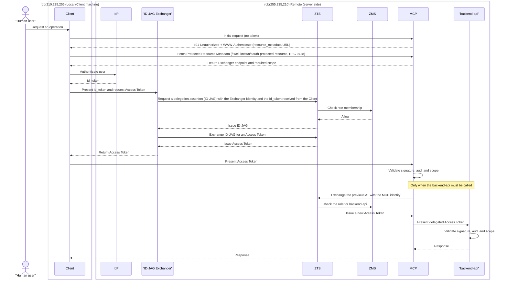

# Pattern 2a: local id_token acquisition, remote ID-JAG exchange, AT returned to Client

**Status: Not implemented (placeholder)**

See the [showcase README](../../README.md) for the overview and pattern comparison.

The Client obtains an id_token as an OIDC RP, presents it to a separate Exchanger, and receives an Access Token that it presents directly to MCP.

## Architecture

The Client reaches both the Exchanger and MCP. Presenting the id_token to the Exchanger requires DPoP and public-key pinning, while presenting the Access Token to MCP relies on MCP's own signature, audience, and scope validation.

## Sequence

**Characteristics**: The Client must obtain an id_token as an OIDC RP, so the id_token reaches the end user's device.

The Protected Resource Metadata (RFC 9728) points the Client to the Exchanger endpoint. Because the Exchanger does not expose standard AS endpoints such as `/authorize` and `/token`, AS Metadata (RFC 8414) discovery is not used.

**Requirement**: Presenting the id_token to the Exchanger requires DPoP (RFC 9449) and public-key pinning. Because the id_token reaches the Client device, presenting it as a plain Bearer token would allow a stolen token to be misused. If the IdP cannot embed `cnf.jkt` in the id_token, the Exchanger must pre-register a public key for each Client and compare it with the key in the DPoP proof. DPoP validation includes the signature, `iat` freshness, and `jti` replay detection.
