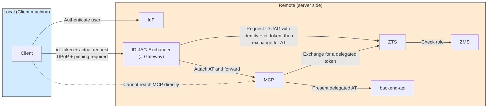
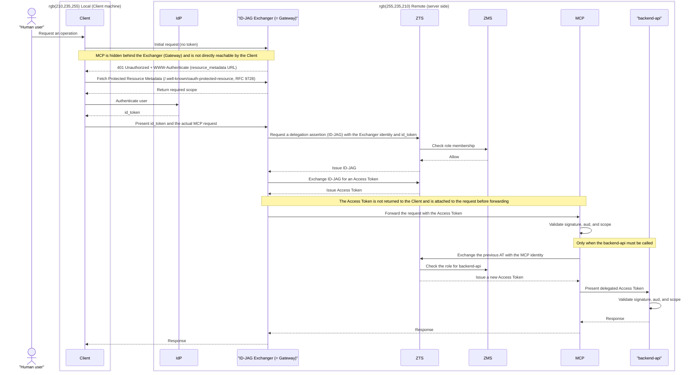

# Pattern 2b: local id_token acquisition, remote ID-JAG exchange, AT forwarded directly to MCP

**Status: Not implemented (placeholder)**

See the [showcase README](../../README.md) for the overview and pattern comparison.

The Exchanger does not return the Access Token to the Client. Instead, it attaches the token to the actual MCP request and forwards it. The Exchanger's role expands from a token exchange service to a gateway that relays real traffic.

## Architecture

The main difference from 2a is that the **Client → MCP path does not exist**. MCP is hidden behind the Exchanger, which handles both token exchange and data-plane traffic. This makes the Exchanger prone to becoming a single point of failure or bottleneck.

## Sequence

**Characteristics**: The Access Token never reaches the Client, reducing its storage and exposure risk. However, every request passes through the Exchanger, making it a potential single point of failure and bottleneck.

Unlike 2a, MCP is hidden behind the Exchanger (Gateway). Therefore, the initial request without a token, the 401 response, and Protected Resource Metadata retrieval all target the Exchanger itself.

**Requirement**: As in 2a, presenting the id_token to the Exchanger requires DPoP and public-key pinning. In addition, the Exchanger needs a session store that caches the Access Token issued by the initial exchange. Subsequent requests must validate the DPoP proof and use the cached Access Token.
