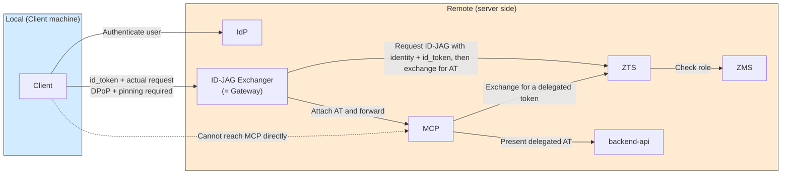
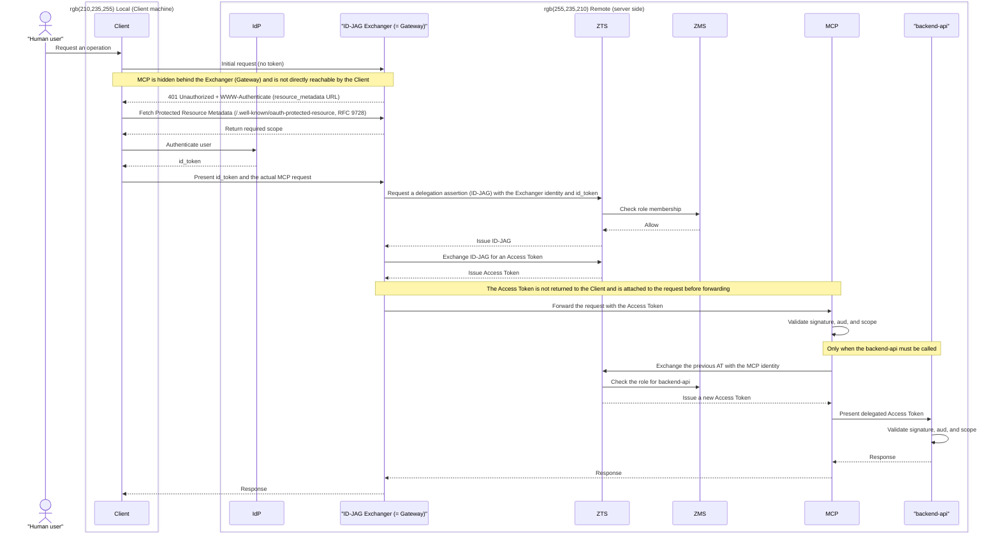

# Pattern 2b: local id_token acquisition, remote ID-JAG exchange, AT forwarded directly to MCP

**Status: Implemented**

This implements Pattern 2b from the [showcase README](../../README.md). The Client obtains an `id_token` locally, presents it with a DPoP proof to the remote gateway, and never receives the exchanged Access Token.

## Overview

Pattern 2b can be deployed alongside Pattern 3a in the same cluster - each uses its own namespace (`mcp-pattern-2b` vs `mcp-pattern-3a`) and Athenz domain (`mcp.pattern2b` vs `mcp.pattern3a`).

The Exchanger/Gateway is built on [agentgateway](https://agentgateway.dev)'s native `crossAppAccess` policy (a Gateway API CRD implementation), which performs the RFC 8693 2-leg ID-JAG exchange declaratively instead of requiring hand-written exchange code. A small custom `dpop-verifier` service (gRPC `ext_authz`) enforces the DPoP proof-of-possession requirement below. Pattern 2b exposes both the backend-connected `simple-mcp-server` and a backend-free echo MCP through separate authenticated routes.

The Exchanger does not return the Access Token to the Client. Instead, it attaches the token to the actual MCP request and forwards it. The Exchanger's role expands from a token exchange service to a gateway that relays real traffic.



The main difference from 2a is that the **Client → MCP path does not exist**. MCP is hidden behind the Exchanger, which handles both token exchange and data-plane traffic. This makes the Exchanger prone to becoming a single point of failure or bottleneck.



**Characteristics**: The Access Token never reaches the Client, reducing its storage and exposure risk. However, every request passes through the Exchanger, making it a potential single point of failure and bottleneck.

Unlike 2a, MCP is hidden behind the Exchanger (Gateway). Therefore, the initial request without a token, the 401 response, and Protected Resource Metadata retrieval all target the Exchanger itself.

**Requirement**: As in 2a, presenting the id_token to the Exchanger requires DPoP and public-key pinning. In addition, the Exchanger needs a session store that caches the Access Token issued by the initial exchange. Subsequent requests must validate the DPoP proof and use the cached Access Token.

### Implementation notes / deviations from the ideal design

This implementation carries two conscious simplifications, both already validated as acceptable tradeoffs by a reference agentgateway-based PoC before being adopted here:

- **No live Protected Resource Metadata discovery.** The Gateway does not actually serve RFC 9728 PRM, and the local test connector (`client/`) does not perform discovery - it is pre-configured with the Keycloak and gateway URLs, the same approach the reference implementation's `mcp-connector` takes. This is consistent with the Feasibility table above: no general-purpose MCP client can complete this pattern unassisted anyway, so a fully spec-compliant discovery flow buys nothing in practice. A local helper is mandatory regardless.
- **No Access Token caching.** The README's stated "session store" requirement is not implemented: every request re-runs the full `crossAppAccess` exchange against the real ZTS via agentgateway's native policy, relying on ZTS being fast enough. This is a known scalability limitation, not a security gap - DPoP replay prevention and public-key pinning are still enforced on every request by `dpop-verifier`.

Components:
- `dpop-verifier/` - gRPC `ext_authz` + HTTP `/register` service (Node.js) implementing RFC 9449 DPoP proof verification and TOFU key pinning.
- `k8s/agentgateway-routes/` - the `AgentgatewayBackend`/`AgentgatewayPolicy`/`HTTPRoute` CRDs wiring jwt authentication, the DPoP ext_authz check, and the `crossAppAccess` ID-JAG exchange together.
- `client/` - the local connector (PKCE login, DPoP key management, and MCP calls) used by Claude Code and by `make test` for end-to-end verification.

## Build and deploy

**Bootstrap the shared infrastructure first**

```sh
make -C showcases/mcp_x_idjag bootstrap-common
```

This builds the shared Kind, Keycloak, and Athenz infrastructure. The Athenz setup takes some time.

**Deploy Pattern 2b**

```sh
make -C showcases/mcp_x_idjag pattern-2b
```

This bootstraps and deploys Pattern 2b's roles, identities, API server, docs MCP, echo MCP, dpop-verifier, and agentgateway.

To access the gateway locally, run the following in a separate terminal:

```sh
make -C showcases/mcp_x_idjag pattern-2b-port-forward
```

### Using it from MCP Hub

After the Pattern 2b deployment is registered in MCP Hub, open the endpoint's `Client configuration` page. The page generates the local stdio connector configuration for GitHub Copilot, Claude Code, OpenCode, Codex, Cline, Cursor, and Gemini, including absolute paths for both the connector script and its dependency installation command. Set `MCP_HUB_CONNECTOR_REPOSITORY_ROOT` before deploying MCP Hub when the checkout is in a different location, install the dependencies shown on the page, copy the configuration for the desired client and scope, and keep the Pattern 2b gateway port-forward running.

### Using it from Claude Code

Claude Code's built-in remote-MCP support only drives standard `authorization_code`+PKCE against the MCP server itself (RFC 9728 PRM + RFC 8414 AS Metadata discovery, then presenting the returned `access_token` as a Bearer credential). Pattern 2b never returns an Access Token to the Client at all - the Client instead presents an `id_token` plus a DPoP proof to the gateway - so Claude Code **cannot** be pointed directly at the gateway URL as a remote MCP server (see the Feasibility table in the [showcase README](../../README.md)).

Use the included local connector as a stdio MCP server for each remote MCP endpoint. It bridges Claude Code's stdio transport to the gateway's HTTP endpoint and handles the PKCE login, DPoP key management, and `id_token`/DPoP headers itself. Set `REPOSITORY_ROOT` to the absolute checkout path and run the following from any directory while the gateway port-forward remains active in another terminal:

```sh
REPOSITORY_ROOT="/absolute/path/to/id-jag-the-hard-way"
npm --prefix "$REPOSITORY_ROOT/showcases/mcp_x_idjag/patterns/pattern-2b-remote-forward/client" install
claude mcp add --scope local pattern-2b-docs \
  -e PATTERN_2B_MCP_URL=http://mcp.pattern-2b.localhost:3002/mcp \
  -- node "$REPOSITORY_ROOT/showcases/mcp_x_idjag/patterns/pattern-2b-remote-forward/client/src/index.js"

claude mcp add --scope local pattern-2b-echo \
  -e PATTERN_2B_MCP_URL=http://echo.pattern-2b.localhost:3002/mcp \
  -- node "$REPOSITORY_ROOT/showcases/mcp_x_idjag/patterns/pattern-2b-remote-forward/client/src/index.js"

claude mcp list
claude
```

Both servers are intentionally registered without `--transport http`: Claude Code starts two local connector processes, and each connector talks to a different remote-forward route. The processes share the PKCE token cache and DPoP key under `~/.config/pattern-2b-connector/`; the first process to need credentials opens the Keycloak login, and the second reuses the cached credentials. The DPoP registration endpoint is shared and idempotent for that key. In Claude Code, run `/mcp` to confirm that `pattern-2b-docs` and `pattern-2b-echo` are connected, then ask for `get_k8s_docs` or `echo_pattern_2b`.

The connector uses these defaults:

```text
Docs MCP endpoint:  http://mcp.pattern-2b.localhost:3002/mcp
Echo MCP endpoint:  http://echo.pattern-2b.localhost:3002/mcp
DPoP register URL:  http://dpop-verifier.pattern-2b.localhost:3002/register
Keycloak issuer:    http://localhost:34443/realms/master
Callback:           http://127.0.0.1:8765/callback
```

`PATTERN_2B_DPOP_REGISTER_URL` is optional. The connector already defaults it to the DPoP verifier URL above; set it only when the verifier is exposed at a different URL. `PATTERN_2B_MCP_URL` is explicit in each client configuration: the docs endpoint uses the connector's default, while the echo endpoint must override it because the connector default points to docs.

When using different forwarded hostnames or ports, pass the values to the corresponding Claude Code stdio server configuration. The docs connector uses `PATTERN_2B_MCP_URL`; the echo connector uses `PATTERN_2B_ECHO_MCP_URL` only in the test runner, and uses `PATTERN_2B_MCP_URL` when started by Claude Code:

```sh
claude mcp add --scope local pattern-2b-docs \
  -e PATTERN_2B_MCP_URL=http://mcp.example.test:3002/mcp \
  -- node "$REPOSITORY_ROOT/showcases/mcp_x_idjag/patterns/pattern-2b-remote-forward/client/src/index.js"

claude mcp add --scope local pattern-2b-echo \
  -e PATTERN_2B_MCP_URL=http://echo.example.test:3002/mcp \
  -e PATTERN_2B_DPOP_REGISTER_URL=http://dpop-verifier.example.test:3002/register \
  -- node "$REPOSITORY_ROOT/showcases/mcp_x_idjag/patterns/pattern-2b-remote-forward/client/src/index.js"
```
