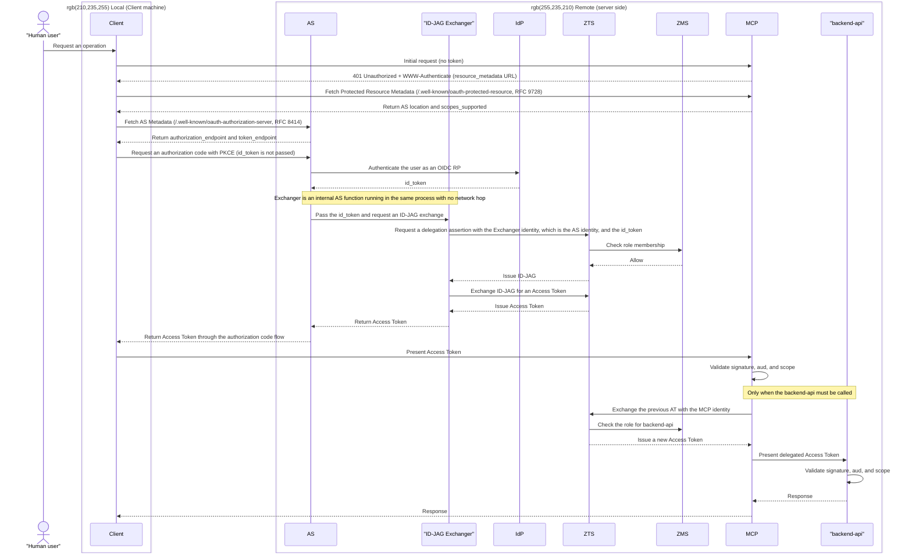

# Pattern 3a: remote id_token + remote ID-JAG exchange, Access Token returned to Client

**Status: Implemented**

This implements Pattern 3a from the [showcase README](../../README.md). The Client never handles the id_token and presents the **Athenz Access Token** received from the Authorization Server directly to MCP.

`mcp-reverse-proxy` and `simple-mcp-server` are located in [../../components](../../components), and `./mcp-oauth-proxy` is a git submodule referencing a fork of [AthenZ/mcp-oauth-proxy](https://github.com/AthenZ/mcp-oauth-proxy).

## Overview

The AS and Exchanger run in the same process on the remote side. The Client does not communicate directly with the IdP, so the **id_token never appears on the Client side**. The Client connects only to the AS and MCP and uses standard OAuth PKCE.



**Characteristics**: This pattern uses a standard OAuth Authorization Server such as mcp-oauth-proxy (MoP). The Client never handles the id_token and uses only standard OAuth 2.1 PKCE.

The flow from the unauthenticated MCP request through `401` and discovery follows the MCP Authorization specification, including RFC 9728 Protected Resource Metadata and RFC 8414 AS Metadata. The Client discovers the AS location from MCP at runtime.

## Build and deploy

**If no kind cluster exists**

```sh
make -C showcases/mcp_x_idjag pattern-3a
```

This builds the kind cluster, Athenz, api-server, MCP, authorization proxy, and Keycloak, then deploys this pattern. The Athenz setup takes some time.

**If an environment equivalent to tutorials 01–16 already exists**

```sh
make -C showcases/mcp_x_idjag pattern-3a-deploy
```

This builds and deploys MoP and the MCP server (`mcp-reverse-proxy` + `simple-mcp-server`).

To access the public endpoint locally, run:

```sh
make -C showcases/mcp_x_idjag pattern-3a-port-forward
```

Set `.mcp.json` to `http://localhost:3001/mcp` with `"type": "http"` and no static headers. `pattern-3a-port-forward` uses local port 3001 to avoid conflicting with the tutorials' Athenz UI, which uses local port 3000.

## Client TLS trust

Before starting Claude Code or another Node.js-based MCP client, configure Node.js to trust the local MoP CA certificate:

```sh
export NODE_EXTRA_CA_CERTS="/Users/fsudo/rbac-labs/github/gh-public/mlajkim/id-jag-the-hard-way/showcases/mcp_x_idjag/patterns/pattern-3a-remote-return/mop-tls/ca.crt"
```

Run this in the same shell before launching the client. The certificate is generated by `deploy-mop.sh`; set the variable again after recreating the Pattern 3a TLS files.

## Verification

1. Run `curl -i http://localhost:3001/mcp` without a token and confirm that it returns `401` and a `WWW-Authenticate` header containing `resource_metadata`.
2. Run `curl http://localhost:3001/.well-known/oauth-protected-resource` and confirm that `authorization_servers` contains the MoP issuer URL.
3. Run `/mcp` in Claude Code and complete the Keycloak login. Confirm that the token held by Claude Code is an Athenz-issued JWT rather than an opaque value by checking `aud` and `scp`.
4. Run `get docs from k8s doc server!` and confirm that it succeeds end to end.
5. Confirm that `mcp-reverse-proxy` logs contain `AUTHORIZED` or `REJECTED` and that `simple-mcp-server` logs show a token exchange with ZTS.
