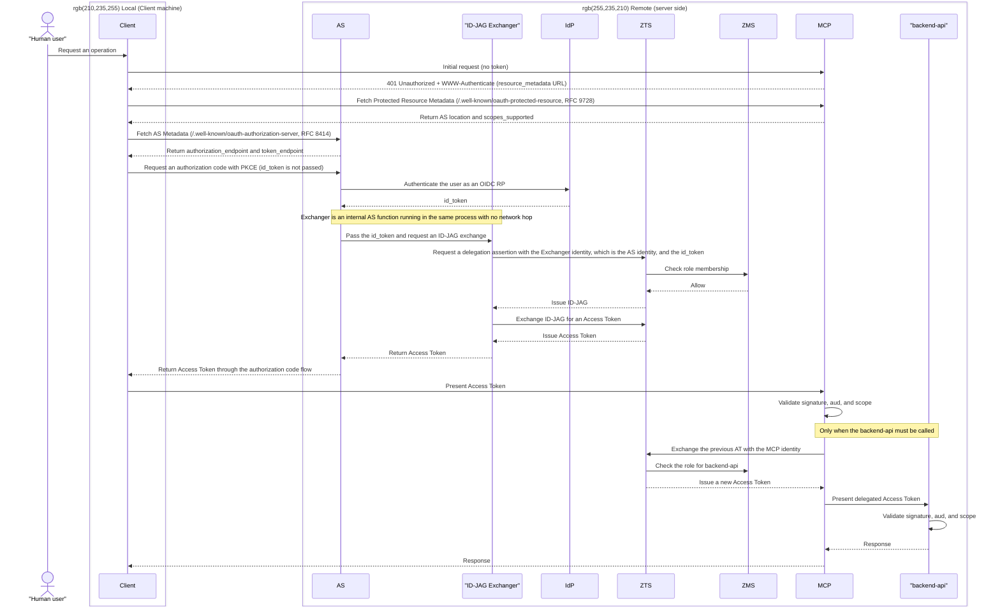

# Pattern 3a: remote id_token + remote ID-JAG exchange, Access Token returned to Client

**Status: Implemented**

This implements Pattern 3a from the [showcase README](../../README.md). The Client never handles the id_token and presents the **Athenz Access Token** received from the Authorization Server directly to MCP.

`mcp-reverse-proxy` and `simple-mcp-server` are located in [../../components](../../components), and `./mcp-oauth-proxy` is a git submodule referencing a fork of [AthenZ/mcp-oauth-proxy](https://github.com/AthenZ/mcp-oauth-proxy).

## Overview

The AS and Exchanger run in the same process on the remote side. The Client does not communicate directly with the IdP, so the **id_token never appears on the Client side**. The Client connects only to the AS and MCP and uses standard OAuth PKCE.



**Characteristics**: This pattern uses a standard OAuth Authorization Server such as mcp-oauth-proxy (MoP). The Client never handles the id_token and uses only standard OAuth 2.1 PKCE.

The flow from the unauthenticated MCP request through `401` and discovery follows the MCP Authorization specification, including RFC 9728 Protected Resource Metadata and RFC 8414 AS Metadata. The Client discovers the AS location from MCP at runtime.

## Build and deploy

**Bootstrap the shared infrastructure first**

```sh
make -C showcases/mcp_x_idjag bootstrap-common
```

This builds the shared Kind, Keycloak, and Athenz infrastructure. The Athenz setup takes some time.

**Deploy Pattern 3a**

```sh
make -C showcases/mcp_x_idjag pattern-3a
```

This bootstraps and deploys Pattern 3a's roles, identities, API server, MCP, MoP, the backend-free echo MCP, and the routing-only Envoy Gateway.

To access the two public MCP endpoints locally, run:

```sh
make -C showcases/mcp_x_idjag pattern-3a-port-forward
```

`pattern-3a-port-forward` forwards the routing-only Envoy Gateway to local port 3001; the MoP remains on local HTTPS port 8082.

### Using it from Claude Code

Pattern 3a is compatible with Claude Code's built-in remote MCP OAuth flow. Claude Code discovers the Protected Resource Metadata from the MCP endpoint, follows the MoP Authorization Server metadata, opens Keycloak for the user login, and receives an Athenz Access Token through the standard authorization-code + PKCE flow. Do not add a static `Authorization` header.

Register the MCP endpoint with `claude mcp add` from the repository root. Keep `NODE_EXTRA_CA_CERTS` exported in the same shell that starts Claude Code:

```sh
export NODE_EXTRA_CA_CERTS="$PWD/showcases/mcp_x_idjag/patterns/pattern-3a-remote-return/mop-tls/ca.crt"
claude mcp add --scope local --transport http \
  pattern-3a-docs http://docs.pattern-3a.localhost:3001/mcp

# Optional: register the backend-free echo MCP as a second server.
claude mcp add --scope local --transport http \
  pattern-3a-echo http://echo.pattern-3a.localhost:3001/mcp

claude mcp list
claude
```

In Claude Code, run `/mcp`, select `pattern-3a-docs` or `pattern-3a-echo`, and complete the Keycloak login when prompted. Then use `get_k8s_docs` with the docs server or `echo_pattern_3a` with the echo server. The first server demonstrates the full MCP → ID-JAG → backend API chain; the echo server demonstrates MCP authorization without a backend call.

`NODE_EXTRA_CA_CERTS` is needed when Claude Code contacts the locally generated MoP CA during OAuth discovery and token exchange. If the Pattern 3a TLS files are recreated, export the variable again.
