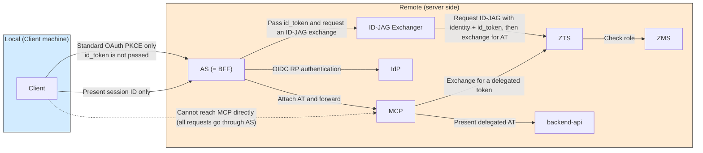
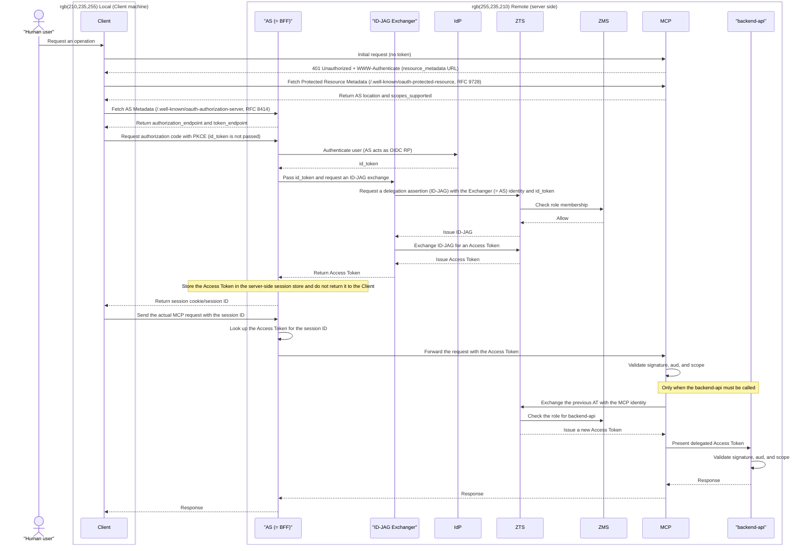

# Pattern 3b: remote id_token acquisition and remote ID-JAG exchange, AT forwarded directly to MCP

**Status: Implemented**

See the [showcase README](../../README.md) for the overview and pattern comparison.

This implementation reuses Pattern 2b's `agentgateway` + `crossAppAccess` for the actual ID-JAG/Access Token exchange with ZTS, so no ID-JAG exchange code is written from scratch here. The only new component is `mcp-bff-gateway` (lives at `../../components/mcp-bff-gateway` alongside the other showcase components), which plays the "Client" role that Pattern 2b's local `client/` connector plays, but driven by a *remote* id_token acquisition instead of a local one.

Unlike Pattern 2b, this pattern does **not** use DPoP. agentgateway's Gateway listener does not support inbound/frontend mTLS client-certificate validation (only outbound/backend TLS), so `mcp-bff-gateway` presents the id_token to agentgateway as a plain `Authorization: Bearer <id_token>` header over plain HTTP. The trust boundary that stands in for DPoP/mTLS proof-of-possession is instead: (1) a Kubernetes `NetworkPolicy` restricting inbound connections to agentgateway's pod to only `mcp-bff-gateway`'s pod, and (2) agentgateway's own `policy-jwt.yaml`, which only accepts id_tokens issued for `mcp-bff-gateway`'s specific Keycloak client id.

The AS does not return the Access Token to the Client. Instead, it attaches the token to the actual MCP request and forwards it. The Client receives a **session cookie or opaque session ID** instead of an Access Token, requiring a BFF (Backend For Frontend) / Token Handler pattern.

## Architecture



The differences from 3a are that the **Client → MCP path is not used in production** and that the AS contains both the Exchanger and the session store. The AS combines the roles of OAuth AS, ID-JAG Exchanger, and BFF session broker.

## Sequence



**Characteristics**: Neither the id_token nor the Access Token reaches the Client; the Client handles only a session identifier. This improves credential protection, but the AS must operate the session store and handle session revocation and CSRF protection.

Discovery begins with direct access to MCP, as in 3a. Because the Client never receives the actual Bearer AT and holds only a session identifier, subsequent tool calls must go through the AS.

## Implementation notes

This pattern's "AS (= BFF)" box is split into two deployed components:

- **`mcp-bff-gateway`** (new, [../../components/mcp-bff-gateway](../../components/mcp-bff-gateway)) - a small Go service, in the same style as this showcase's other Go components (`mcp-reverse-proxy`, `echo-mcp`), that is the Client's only point of contact. It is Keycloak's OIDC RP (remote id_token acquisition), holds the server-side session store, and is the only component the Client ever presents a Bearer credential to.
- **`agentgateway`** (reused unmodified from [pattern-2b-remote-forward](../pattern-2b-remote-forward)) - performs the actual ID-JAG/Access Token exchange with ZTS via its native `crossAppAccess` policy, and forwards the authorized request to `mcp-reverse-proxy`/`simple-mcp-server` (docs) or `echo-mcp` (echo).

Pattern 2b presents the id_token to agentgateway as `Authorization: Bearer <id_token>` plus a DPoP proof, because its Client is a local developer machine outside any trust boundary. Here, `mcp-bff-gateway` is itself a trusted, cluster-internal server-side workload, so its request to agentgateway carries no DPoP proof and no client certificate - only the plain Bearer id_token, restricted by the NetworkPolicy and JWT-audience checks described above. agentgateway's own Athenz-issued certificate (`pattern-3b-agentgateway`) is still used, unchanged from Pattern 2b, purely for its *outbound* mTLS connection to ZTS during the `crossAppAccess` exchange - it has nothing to do with the inbound connection from `mcp-bff-gateway`.

## Build and deploy

**Bootstrap the shared infrastructure first**

```sh
make -C showcases/mcp_x_idjag bootstrap-common
```

**Deploy Pattern 3b**

```sh
make -C showcases/mcp_x_idjag pattern-3b
```

This bootstraps and deploys Pattern 3b's roles, identities, API server, docs MCP, echo MCP, agentgateway, and `mcp-bff-gateway`.

To access the gateway locally, run:

```sh
make -C showcases/mcp_x_idjag pattern-3b-port-forward
```

`pattern-3b-port-forward` forwards `mcp-bff-gateway`'s Service to local port 3003. Unlike Pattern 3a/2b, agentgateway itself is never port-forwarded - it is reached only from inside the cluster, by `mcp-bff-gateway`.

### Using it from Claude Code

Pattern 3b works with Claude Code's built-in remote MCP OAuth flow the same way Pattern 3a does: Claude Code discovers `mcp-bff-gateway`'s `/.well-known/oauth-authorization-server`, drives a standard authorization-code + PKCE flow, and receives what looks like an ordinary Bearer access token - except it is really an opaque session identifier, not a real Athenz Access Token.

```sh
claude mcp add --scope local --transport http \
  pattern-3b-docs http://localhost:3003/docs/mcp

# Optional: register the backend-free echo MCP as a second server.
claude mcp add --scope local --transport http \
  pattern-3b-echo http://localhost:3003/echo/mcp

claude mcp list
claude
```

In Claude Code, run `/mcp`, select `pattern-3b-docs` or `pattern-3b-echo`, and complete the Keycloak login when prompted. Then use `get_k8s_docs` with the docs server or `echo_pattern_3b` with the echo server.

## Deviations from the ideal design

- **`WWW-Authenticate` shortcut**: `mcp-bff-gateway`'s 401 response points `resource_metadata` directly at its own `/.well-known/oauth-authorization-server` instead of a full RFC 9728 Protected Resource Metadata document, mirroring the same shortcut `ai_client_gateway` already takes.
- **Session store**: in-memory only, per `mcp-bff-gateway` pod - a restart invalidates every active session and forces re-login, the same tradeoff Pattern 2b's `dpop-verifier` pin store accepts.
- **No DPoP or mTLS between `mcp-bff-gateway` and agentgateway**: agentgateway (as of the version this pattern targets) does not support inbound/frontend mTLS client-certificate validation on a Gateway listener - only outbound/backend TLS (used, unchanged from Pattern 2b, for agentgateway's own connection to ZTS). The substitute controls are a `NetworkPolicy` restricting inbound connections to agentgateway's pod to only `mcp-bff-gateway`'s pod (see `k8s/agentgateway-networkpolicy.yaml`), and the JWT audience check in `policy-jwt.yaml`, which only accepts id_tokens issued for `mcp-bff-gateway`'s own Keycloak client id. **`kind`'s default CNI (kindnet) does not enforce `NetworkPolicy`**, so on an unmodified local `kind` cluster this control is applied but not actually enforced; fine-grained authorization is still enforced afterward via Athenz roles/ZTS (`crossAppAccess` scopes) regardless.
