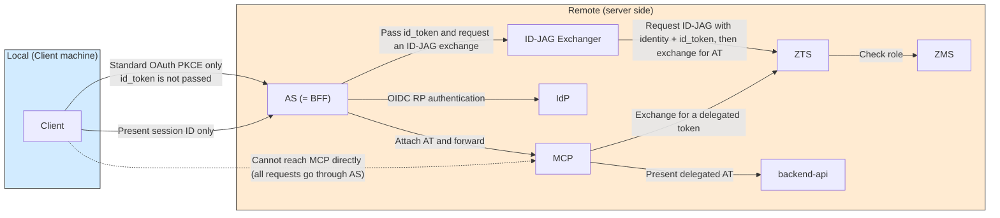
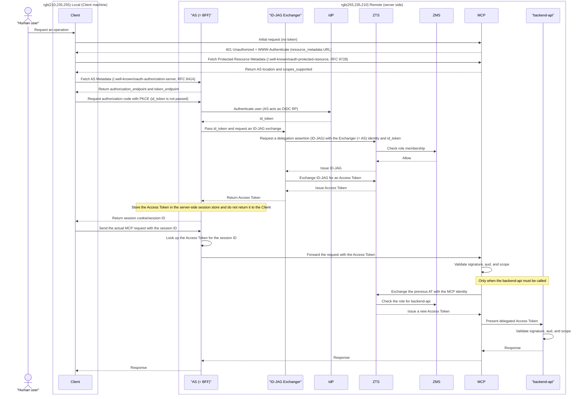

# Pattern 3b: remote id_token acquisition and remote ID-JAG exchange, AT forwarded directly to MCP

**Status: Not implemented (placeholder)**

See the [showcase README](../../README.md) for the overview and pattern comparison.

The AS does not return the Access Token to the Client. Instead, it attaches the token to the actual MCP request and forwards it. The Client receives a **session cookie or opaque session ID** instead of an Access Token, requiring a BFF (Backend For Frontend) / Token Handler pattern.

## Architecture

The differences from 3a are that the **Client → MCP path is not used in production** and that the AS contains both the Exchanger and the session store. The AS combines the roles of OAuth AS, ID-JAG Exchanger, and BFF session broker.

## Sequence

**Characteristics**: Neither the id_token nor the Access Token reaches the Client; the Client handles only a session identifier. This improves credential protection, but the AS must operate the session store and handle session revocation and CSRF protection.

Discovery begins with direct access to MCP, as in 3a. Because the Client never receives the actual Bearer AT and holds only a session identifier, subsequent tool calls must go through the AS.
