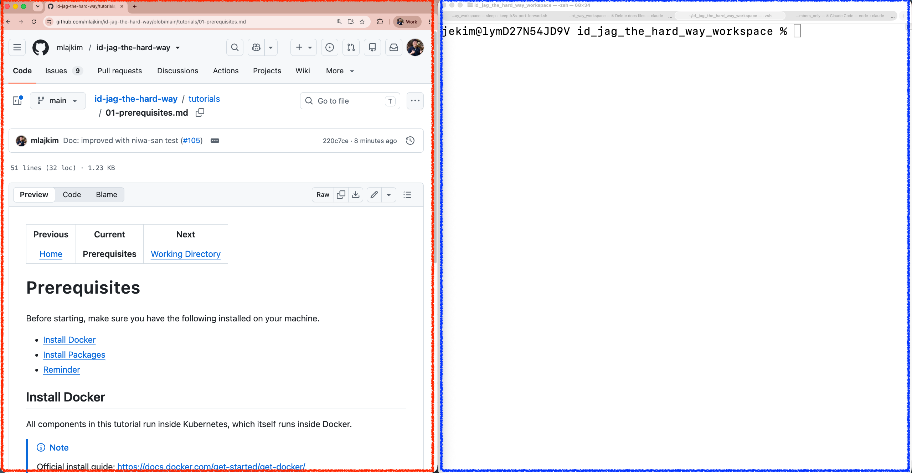

|                    Previous                    |      Current      |                       Next                       |
|:----------------------------------------------:|:-----------------:|:------------------------------------------------:|
| [Working Directory](./01-working-directory.md) | **Prerequisites** | [Kubernetes Cluster](./03-kubernetes-cluster.md) |

# Prerequisites

Before continuing, make sure you have the following installed on your machine.

<!-- TOC depthFrom:2 depthTo:2 -->

- [Install Docker](#install-docker)
- [Install Packages](#install-packages)
- [Open up two screens](#open-up-two-screens)
- [Reminder](#reminder)

<!-- /TOC -->

## Install Docker

All components in this tutorial run inside Kubernetes, which itself runs inside Docker.

> [!NOTE]
> Official install guide: https://docs.docker.com/get-started/get-docker/

Verify Docker is running:

```sh
docker ps
```

```sh
# CONTAINER ID   IMAGE     COMMAND   CREATED   STATUS    PORTS     NAMES
```

## Install Packages

> [!NOTE]
> Homebrew: https://brew.sh/

Install Homebrew:

```sh
/bin/bash -c "$(curl -fsSL https://raw.githubusercontent.com/Homebrew/install/HEAD/install.sh)"
```

Then install the following packages:

```sh
brew install jq gh kubectl
```

## Open up two screens

It is highly recommended to have your:

- `id-jag-the-hard-way` in the left (red box)
- `Terminal` in the right (blue box)

This is because you will be switching back and forth between the tutorial and the terminal throughout the steps.



## Reminder

The results of this tutorial should not be considered production-ready. The goal is to learn the architecture, not to ship a hardened production platform.

Next: [Kubernetes Cluster](./03-kubernetes-cluster.md)
