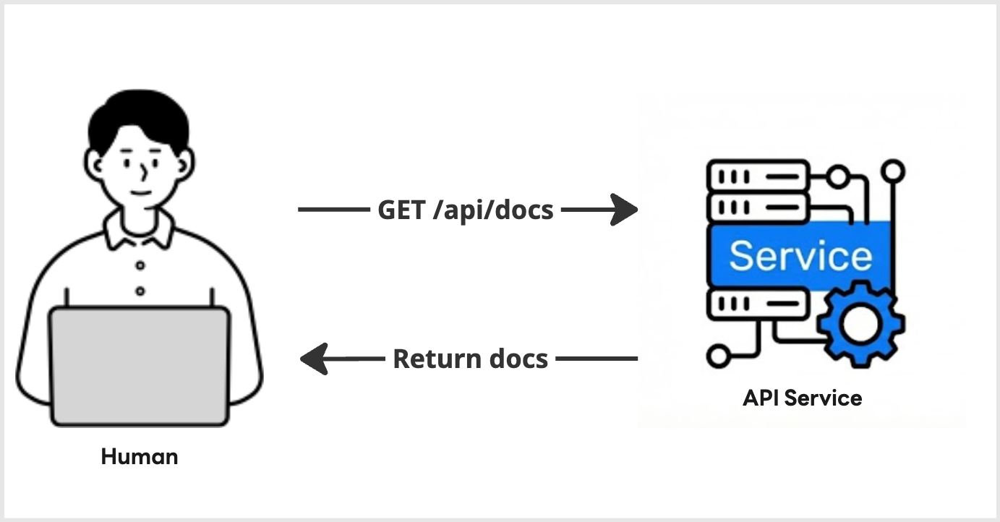
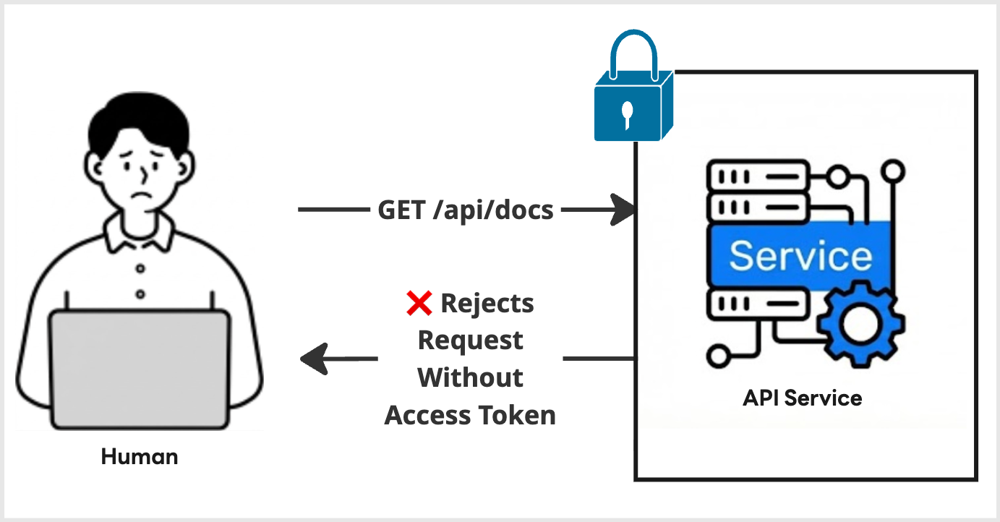

|                    Previous                    |    Current     |                         Next                         |
|:----------------------------------------------:|:--------------:|:----------------------------------------------------:|
| [Working Directory](./02-working-directory.md) | **API Server** | [Authorization Server](./04-authorization-server.md) |

# API Server

In this tutorial, we will set up a simple API server that exposes a small HTTP API for storing and managing documents.
We will first run the API server without authorization so that we can understand its basic behavior. Then, we will enable Access Token enforcement and confirm that unauthorized requests are rejected.

## Clone the API Server Provided by Athenz Community

Clone the sample API server repository.

Using SSH:

```sh
git clone git@github.com:athenz-community/java-provider-server-manifest.git api_server
```

Or using HTTPS:

```sh
git clone https://github.com/athenz-community/java-provider-server-manifest.git api_server
```

## Run the API Server Locally

> [!NOTE]
> You may use a different API server port by changing the _api_server_port variable. However, we recommend using the same port as this tutorial to avoid confusion in later steps.

Start the API server without Access Token enforcement:

```sh
_api_server_port=14442
make -C api_server local PORT=$_api_server_port AT_REQUIRED=false

# ...
# 🚀 Server started on port 14442 (Athenz Required: false)
```

## Send a Request to the API Server

Send a request to list the documents.

```sh
curl localhost:$_api_server_port/api/docs | jq .

# {
#   "docs": [
#     {
#       "name": "first default doc",
#       "id": 1,
#       "content": "hello world"
#     },
#     {
#       "name": "second default doc",
#       "id": 2,
#       "content": "how are you?"
#     }
#   ]
# }
```

## Learn About the API

This API server is intentionally simple.

It does not use a database. Instead, documents are stored in memory. If you restart the API server, the stored data will be reset to the default dummy documents.

This makes the server easy to run, easy to reset, and useful for learning how authorization changes the behavior of an API.

## Protect the API Server

> [!NOTE]
> At this point, you may see ERROR logs from the API server. You can ignore them for now.

In an enterprise environment, you usually do not want to expose an API server without authentication or authorization, even if the server is only reachable internally.

The API server you cloned already supports Access Token enforcement. You can enable it by setting `AT_REQUIRED=true`.

Start another API server with Access Token enforcement enabled:

```sh
_new_api_server_port=14443
make -C api_server local PORT=$_new_api_server_port AT_REQUIRED=true

# ...
# 🚀 Server started on port 14443 (Athenz Required: true)
```

Now send the same request to the protected API server:

```sh
curl "localhost:${_new_api_server_port}/api/docs" | jq .

# {
#   "error": "Unauthorized",
#   "message": "Authorization header is missing or invalid Bearer token.",
#   "status": 401
# }
```

`Unauthorized` is expected.

The API server is now protected, so requests without a valid Bearer Access Token are rejected.

## What you have done

You were able to fetch the data from the API Server, with `AT_REQUIRED=false` API Server:



But you also saw the Unauthorized error when you tried to fetch the data from the API Server, with `AT_REQUIRED=true` API Server:



## How to Fix the Unauthorized Error

To fix the Unauthorized error, we need to attach a valid Access Token to the request.

The API server expects an Access Token issued by an authorization server. In this tutorial, we will use [Athenz](https://github.com/AthenZ/athenz) as the authorization server. Athenz is a [CNCF Sandbox project](https://www.cncf.io/projects/athenz/) for authentication and authorization, used by [Yahoo Inc.](https://www.yahooinc.com/) in the United States, [LY Corporation](https://www.lycorp.co.jp/en/) in Japan, and [Vespa.ai](https://vespa.ai/) in Europe.

In the next tutorial, we will deploy Athenz locally and use it as the authorization server for this API server, and eventually pass the authorization requirement for the API & get a valid response from the API server.

Next: [Authorization Server](./04-authorization-server.md)
