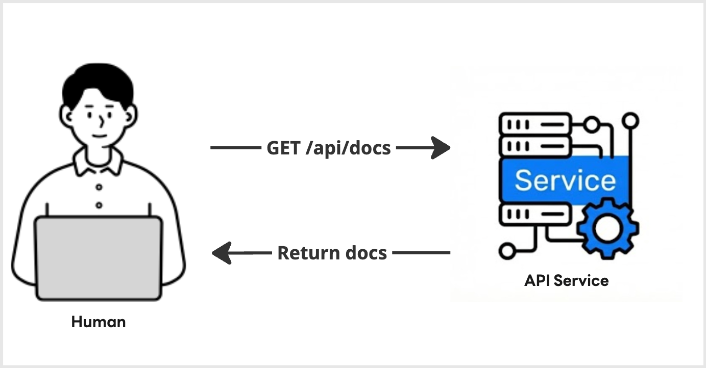
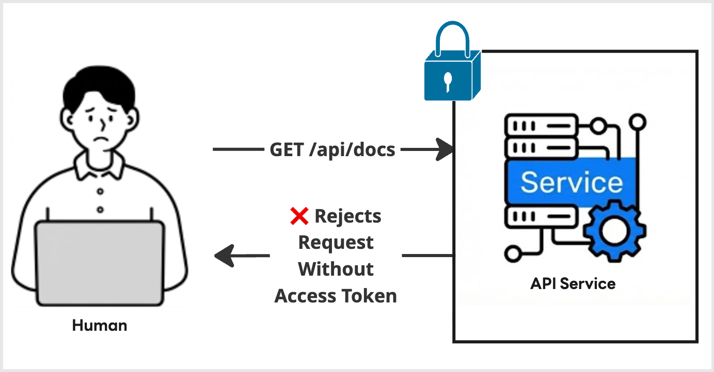

|                     Previous                     |    Current     |                         Next                         |
|:------------------------------------------------:|:--------------:|:----------------------------------------------------:|
| [Kubernetes Cluster](./03-kubernetes-cluster.md) | **API Server** | [Authorization Server](./05-authorization-server.md) |

# API Server

In this tutorial, we will set up a simple API server that exposes a small HTTP API for storing and managing documents.
We will first run the API server without authorization so that we can understand its basic behavior. Then, we will enable Access Token enforcement and confirm that unauthorized requests are rejected.

<!-- TOC depthFrom:2 depthTo:2 -->

- [Create a namespace `api` in kubernetes](#create-a-namespace-api-in-kubernetes)
- [Deploy a simple API server to the kubernetes](#deploy-a-simple-api-server-to-the-kubernetes)
- [Send a Request to the API Server](#send-a-request-to-the-api-server)
- [Learn About the API](#learn-about-the-api)
- [Protect the API Server](#protect-the-api-server)
- [Learn what's happened](#learn-whats-happened)
- [Learn what's next](#learn-whats-next)

<!-- /TOC -->



## Create a namespace `api` in kubernetes

```sh
kubectl create ns api
```

```sh
# namespace/api created
```

## Deploy a simple API server to the kubernetes

```sh
kubectl create deploy api-server -n api \
  --image=ghcr.io/mlajkim/api-server:latest
```


Create a simple service for the deploy above:

```sh
kubectl expose deploy api-server -n api --port 8080 --name api-server
```

```sh
# service/api-server exposed
```

## Send a Request to the API Server

Wait for the deployment to be ready:

```sh
kubectl rollout status deploy/api-server -n api
```

```sh
# deployment "api-server" successfully rolled out
```

Send a request to list the documents.

```sh
kubectl exec deploy/api-server -n api \
  -- curl -s http://localhost:8080/api/docs | jq
```

```sh
# {
#   "docs": [
#     {
#       "name": "first default doc",
#       "id": 1,
#       "content": "hello world"
#     },
#     {
#       "name": "second default doc",
#       "id": 2,
#       "content": "how are you?"
#     }
#   ]
# }
```

## Learn About the API

This API server is intentionally simple.

It does not use a database. Instead, documents are stored in memory. If you restart the API server, the stored data will be reset to the default dummy documents.

This makes the server easy to run, easy to reset, and useful for learning how authorization changes the behavior of an API.

## Protect the API Server

> [!NOTE]
> At this point, you may see ERROR logs from the API server. You can ignore them for now.

In an enterprise environment, you usually do not want to expose an API server without authentication or authorization, even if the server is only reachable internally.

The API server you cloned already supports Access Token enforcement. You can enable it by setting `AT_REQUIRED=true` as the following:

```sh
kubectl set env deploy/api-server AT_REQUIRED=true -n api
```

```sh
# deployment.apps/api-server env updated
```

Now send the same request to the protected API server:

```sh
kubectl exec deploy/api-server -n api \
  -- curl -s http://localhost:8080/api/docs | jq
```

```sh
# {
#   "error": "Unauthorized",
#   "message": "Authorization header is missing or invalid Bearer token.",
#   "status": 401
# }
```

`Unauthorized` is expected.

The API server is now protected, so requests without a valid Bearer Access Token are rejected.

## Learn what's happened

Unauthorized error is returned when you tried to fetch the data from the API Server, with `AT_REQUIRED=true` API Server:



## Learn what's next

So, how do we get past this Unauthorized error? We need a trusted authorization server.

In the next tutorial, we will introduce [Athenz](https://github.com/AthenZ/athenz)—a [CNCF Sandbox project](https://www.cncf.io/projects/athenz/) battle-tested by tech giants like [Yahoo Inc.](https://www.yahooinc.com/) in the United States, [LY Corporation](https://www.lycorp.co.jp/en/) in Japan, and [Vespa.ai](https://vespa.ai/) in Europe. We’ll deploy it locally, mint our own valid Access Token, and finally unlock our protected API server.

Next: [Authorization Server](./05-authorization-server.md)
