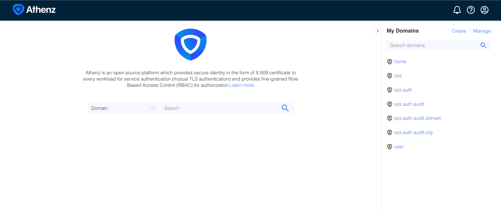

|             Previous             |         Current          |                        Next                        |
|:--------------------------------:|:------------------------:|:--------------------------------------------------:|
| [API Server](./03-api-server.md) | **Authorization Server** | [Athenz Access Token](./05-athenz-access-token.md) |

# Authorization Server

In this tutorial, you will deploy **Athenz** as the local authorization server and verify that it is running properly.

## Create Local Kubernetes Cluster

You can use any kubernetes cluster pretty much, but to simplify the step, we will use **Kind** (Kubernetes in Docker).

```sh
go install sigs.k8s.io/kind@latest
kind create cluster
```

> [!NOTE]
> The SSOT guide for download/install kind is [here](https://kind.sigs.k8s.io/)


## Deploy Athenz Server

> [!NOTE]
> Upcoming tutorial uses the directory `athenz_dist` by defualt, so not recommended to customize it.

Athenz Community offers a one-command manifest tool to deploy kubernetes cluster. Let's clone the repository:

```sh
git clone git@github.com:athenz-community/athenz-distribution.git athenz_dist
```

After finishing the clone, run the following command which takes about 5 minutes:

```sh
make -C athenz_dist clean-kubernetes-athenz deploy-kubernetes-athenz
```

> [!NOTE]
> The SSOT guide for using Athenz manifest [here](https://github.com/athenz-community/athenz-distribution/blob/main/README.md)

## Check if Athenz server is running

```sh
_athenz_components=(
  "athenz-db"
  "athenz-cli"
  "athenz-zms-server"
  "athenz-zts-server"
  "athenz-ui"
)

for component in "${_athenz_components[@]}"; do
  kubectl wait -n athenz \
    --for=condition=ready pod \
    --selector=app.kubernetes.io/name=$component \
    --timeout=180s || echo "Timed out waiting for $component. Check logs manually."
done

# pod/athenz-db-0 condition met
# pod/athenz-cli-574d747dff-mfdgz condition met
# pod/athenz-zms-server-568d4cfd89-tqwwn condition met
# pod/athenz-zts-server-6966ff7f66-4j67d condition met
# pod/athenz-ui-59f7f77667-5rpf7 condition met
```

See pods running:

```sh
kubectl get pods -n athenz

# NAME                                 READY   STATUS    RESTARTS   AGE
# athenz-cli-574d747dff-mfdgz          1/1     Running   0          87s
# athenz-db-0                          1/1     Running   0          88s
# athenz-ui-59f7f77667-5rpf7           2/2     Running   0          87s
# athenz-zms-server-568d4cfd89-tqwwn   1/1     Running   0          87s
# athenz-zts-server-6966ff7f66-4j67d   1/1     Running   0          87s
```

## Keep Athenz Endpoints Reachable

`kubectl port-forward` may stop when a pod restarts. Thus we need a way to keep port-forward running. Let's create a simple shell script `keep-athenz-port-forward.sh`:

```sh
cat > keep-athenz-port-forward.sh <<'EOF'
#!/usr/bin/env bash
set -euo pipefail

_zms_port="${1:-4443}"
_zts_port="${2:-8443}"
_athenz_ui_port="${3:-3000}"

_pf() {
  local name=$1
  local local_port=$2
  local remote_port=$3

  while true; do
    echo "Port-forwarding ${name}: ${local_port}:${remote_port}"
    kubectl -n athenz port-forward "deployment/${name}" "${local_port}:${remote_port}" || true
    echo "Restarting ${name} port-forward..."
    sleep 3
  done
}

_pf athenz-zms-server "${_zms_port}" 4443 &
_pf athenz-zts-server "${_zts_port}" 4443 &
_pf athenz-ui "${_athenz_ui_port}" 3000 &

wait
EOF

chmod +x keep-athenz-port-forward.sh
```

You may customize, but try to stay with the default port below:

```sh
_zms_port=4443
_zts_port=8443
_athenz_ui_port=3000

./keep-athenz-port-forward.sh "$_zms_port" "$_zts_port" "$_athenz_ui_port"
```

## Open Athenz UI

```sh
_athenz_ui_port=3000
open "http://localhost:${_athenz_ui_port}"
```



In the next tutorial, we will create a domain and roles, then fetch an access token.

Next: [Athenz Access Token](./05-athenz-access-token.md)
