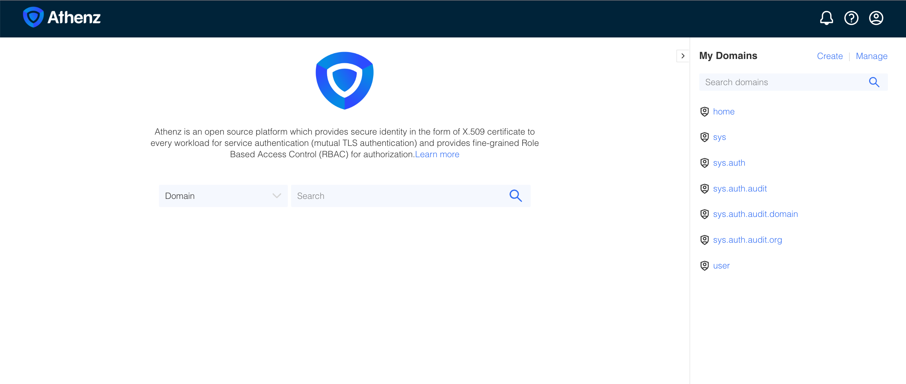

|             Previous             |         Current          |                Next                |
|:--------------------------------:|:------------------------:|:----------------------------------:|
| [API Server](./03-api-server.md) | **Authorization Server** | [ZPU Server](./04.1-zpu-server.md) |

# Authorization Server

In this tutorial, we will deploy Athenz as the local authorization server and verify that it is running properly in Kubernetes cluster.

<!-- TOC depthFrom:2 depthTo:2 -->

- [Deploy Athenz Server](#deploy-athenz-server)
- [Check Athenz Server Running](#check-athenz-server-running)
- [Keep Core Endpoints Locally Reachable](#keep-core-endpoints-locally-reachable)
- [Open Athenz UI](#open-athenz-ui)

<!-- /TOC -->

## Deploy Athenz Server

Run the following command (this will take about 5 minutes):

```sh
git submodule update --init --recursive
make -C athenz_dist clean-kubernetes-athenz deploy-kubernetes-athenz
```

> [!NOTE]
> The SSOT guide for using the Athenz manifest is available [here](https://github.com/athenz-community/athenz-distribution/blob/main/README.md)

Once you see the following output, you can proceed to the next step:

```sh
# ...
# namespace/athenz unchanged
# configmap/athenz-ui-config created
# secret/athenz-admin-keys configured
# secret/athenz-ui-keys created
# service/athenz-ui created
# deployment.apps/athenz-ui created
```

## Check Athenz Server Running

Execute the following to see the status of the Athenz server:

```sh
_athenz_components=(
  "athenz-db"
  "athenz-cli"
  "athenz-zms-server"
  "athenz-zts-server"
  "athenz-ui"
)

for component in "${_athenz_components[@]}"; do
  kubectl wait -n athenz \
    --for=condition=ready pod \
    --selector=app.kubernetes.io/name=$component \
    --timeout=180s || echo "Timed out waiting for $component. Check logs manually."
done
```

```sh
# pod/athenz-db-0 condition met
# pod/athenz-cli-574d747dff-mfdgz condition met
# pod/athenz-zms-server-568d4cfd89-tqwwn condition met
# pod/athenz-zts-server-6966ff7f66-4j67d condition met
# pod/athenz-ui-59f7f77667-5rpf7 condition met
```

Verify that the pods are running:

```sh
kubectl get pods -n athenz
```

```sh
# NAME                                 READY   STATUS    RESTARTS   AGE
# athenz-cli-574d747dff-mfdgz          1/1     Running   0          87s
# athenz-db-0                          1/1     Running   0          88s
# athenz-ui-59f7f77667-5rpf7           2/2     Running   0          87s
# athenz-zms-server-568d4cfd89-tqwwn   1/1     Running   0          87s
# athenz-zts-server-6966ff7f66-4j67d   1/1     Running   0          87s
```

## Keep Core Endpoints Locally Reachable

The `kubectl port-forward` command may stop if a pod restarts. Therefore, we need a way to keep the port-forwarding active. First of all, let's quickly create a directory `my_tools` to store the shell script:

```sh
mkdir -p my_tools
```

Now, let's create a simple shell script `keep-k8s-port-forward.sh` inside `my_tools`:

```sh
cat > my_tools/keep-k8s-port-forward.sh <<'EOF'
#!/usr/bin/env bash
set -euo pipefail

# Clean up all background jobs when the script is terminated:
trap 'kill $(jobs -p) 2>/dev/null || true' EXIT

_zms_port="${1:-4443}"
_zts_port="${2:-8443}"
_athenz_ui_port="${3:-3000}"
_api_port="${4:-14443}"
_mcp_port="${5:-24443}"

_pf() {
  local ns=$1
  local resource=$2
  local local_port=$3
  local remote_port=$4

  while true; do
    echo "Port-forwarding ${ns}/${resource}: ${local_port}:${remote_port}"
    kubectl -n "${ns}" port-forward "${resource}" "${local_port}:${remote_port}" || true
    echo "Restarting ${ns}/${resource} port-forward..."
    sleep 3
  done
}

_pf athenz deployment/athenz-zms-server "${_zms_port}" 4443 &
_pf athenz deployment/athenz-zts-server "${_zts_port}" 4443 &
_pf athenz deployment/athenz-ui "${_athenz_ui_port}" 3000 &
_pf api deployment/api-server "${_api_port}" 8080 &
_pf api service/mcp "${_mcp_port}" 8081 &

wait
EOF

chmod +x my_tools/keep-k8s-port-forward.sh
```

You may customize the ports, but we recommend sticking with the defaults below:

```sh
_zms_port=4443
_zts_port=8443
_athenz_ui_port=3000
_api_port=14443
_mcp_port=24443

./my_tools/keep-k8s-port-forward.sh "$_zms_port" "$_zts_port" "$_athenz_ui_port" "$_api_port" "$_mcp_port"
```

## Open Athenz UI

```sh
_athenz_ui_port=3000
open "http://localhost:${_athenz_ui_port}"
```



In the next tutorial, we will create a ZPU (details later explained):

Next: [ZPU Server](./04.1-zpu-server.md)
