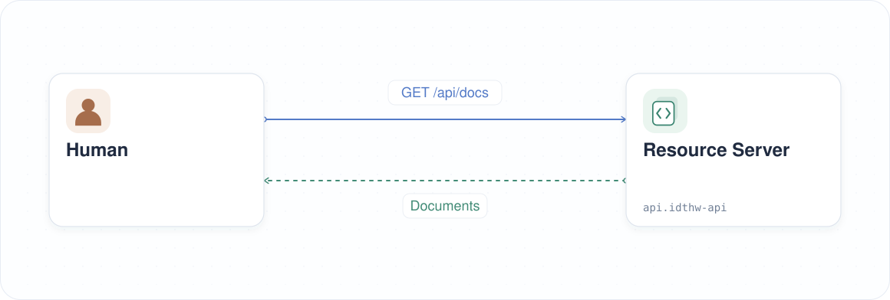
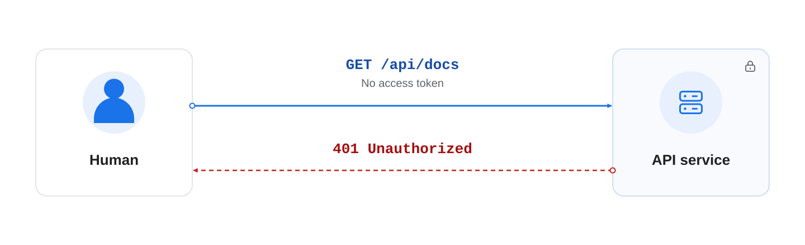

|                     Previous                     |    Current     |                         Next                         |
|:------------------------------------------------:|:--------------:|:----------------------------------------------------:|
| [Kubernetes Cluster](./03-kubernetes-cluster.md) | **Resource Server** | [Authorization Server](./05-authorization-server.md) |

# Resource Server

Deploy a simple document API and retrieve documents without an access token. Then enable token enforcement and confirm that the same request is rejected.

<!-- TOC depthFrom:2 depthTo:2 -->

- [Create the API Namespace](#create-the-api-namespace)
- [Deploy the API Server](#deploy-the-api-server)
- [Send a Request to the API Server](#send-a-request-to-the-api-server)
- [Understand the Result](#understand-the-result)
- [Learn About the API](#learn-about-the-api)
- [Enable Access Token Enforcement](#enable-access-token-enforcement)
- [Next Steps](#next-steps)

<!-- /TOC -->

<a id="create-a-namespace-api-in-kubernetes"></a>

## Create the API Namespace

```sh
kubectl create ns api
```

```sh
# namespace/api created
```

<a id="deploy-a-simple-api-server-to-the-kubernetes"></a>

## Deploy the API Server

```sh
kubectl create deploy api-server -n api \
  --image=ghcr.io/mlajkim/idthw-demo-api:latest
kubectl set env deploy/api-server -n api ACCESS_TOKEN_ENABLED=false
```


Expose the Deployment through a Kubernetes Service:

```sh
kubectl expose deploy api-server -n api --port 8080 --name api-server
```

```sh
# service/api-server exposed
```

## Send a Request to the API Server

Wait for the deployment to be ready:

```sh
kubectl rollout status deploy/api-server -n api
```

```sh
# deployment "api-server" successfully rolled out
```

Request documents without an access token:

```sh
kubectl exec deploy/api-server -n api \
  -- node -e 'fetch("http://localhost:8080/api/docs").then(async r => console.log(await r.text()))' | jq
```

```sh
# {
#   "docs": [
#     { "id": 1, "name": "first default doc", "content": "hello world" },
#     { "id": 2, "name": "second default doc", "content": "how are you?" }
#   ]
# }
```

<a id="learn-whats-happened"></a>

## Understand the Result

The API returns `200 OK` and documents because access-token enforcement is disabled:



## Learn About the API

This API server is intentionally simple.

It does not use a database. Instead, documents are stored in memory. If you restart the API server, the stored data will be reset to the default dummy documents.

This makes the server easy to run, easy to reset, and useful for learning how authorization changes the behavior of an API.

<a id="verify-access-token-enforcement"></a>
<a id="access-token-mode"></a>

## Enable Access Token Enforcement

Set `ACCESS_TOKEN_ENABLED=true` to require a valid Athenz access token and the scope for each document operation:

```sh
kubectl set env deploy/api-server -n api ACCESS_TOKEN_ENABLED=true
kubectl rollout status deploy/api-server -n api
```

Send the same request again without a token:

```sh
kubectl exec deploy/api-server -n api \
  -- node -e 'fetch("http://localhost:8080/api/docs").then(async r => console.log(await r.text()))' | jq
```

```sh
# {
#   "error": "missing_access_token",
#   "message": "Pass an Athenz access token as Authorization: Bearer <token>."
# }
```

The API now returns `401 Unauthorized`. This failure is intentional: token enforcement is enabled, but the request has no access token.



Keep token enforcement enabled.

<a id="learn-whats-next"></a>

## Next Steps

The API now requires an access token. In the next chapter, you will deploy Athenz as the authorization server.

Next: [Authorization Server](./05-authorization-server.md)
