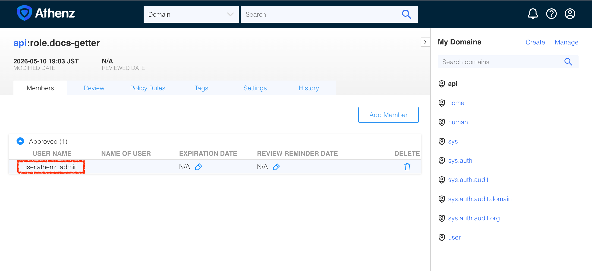
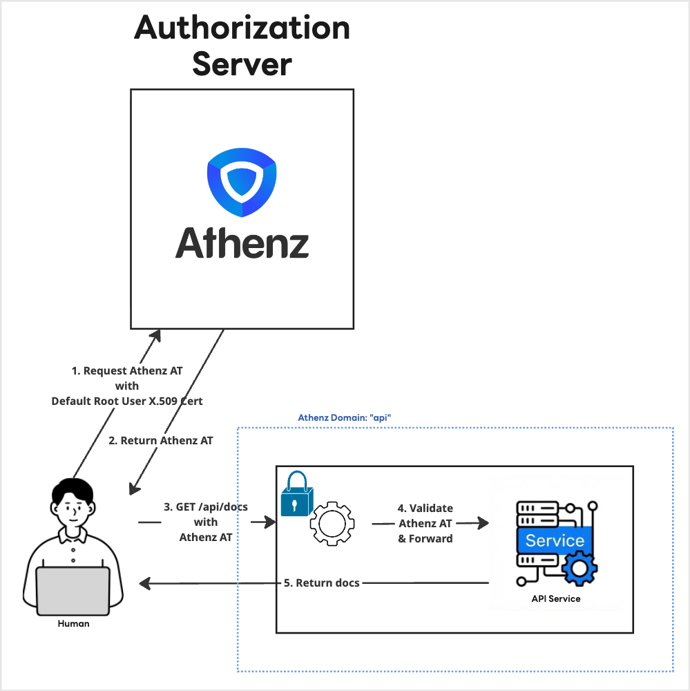

|                       Previous                       |         Current         |                        Next                        |
|:----------------------------------------------------:|:-----------------------:|:--------------------------------------------------:|
| [Authorization Server](./04-authorization-server.md) | **Athenz Access Token** | [Granular Permission](./06-granular-permission.md) |

# Athenz Access Token

In this tutorial, you will get Access Token that the API server requests.

## Create Athenz Top-Level Domain (TLD) for API Service

Now that the Athenz server is running and accessible, let's create a Top-Level Domain (TLD). We can achieve this by making a `POST` request to the Athenz ZMS API, authenticating with the admin certificates generated during the deployment.

Let's create a reusable script named `create-tld.sh` that takes the domain name as an argument:

```sh
cat > ./my_tools/create-tld.sh <<'EOF'
#!/usr/bin/env bash
set -euo pipefail

if [ -z "${1:-}" ]; then
  echo "Usage: $0 <tld_name>"
  exit 1
fi

tld_name=$1
echo "Creating TLD: ${tld_name}..."

curl -s -k -X POST "https://localhost:4443/zms/v1/domain" \
  --cert ./athenz_dist/certs/athenz_admin.cert.pem \
  --key ./athenz_dist/keys/athenz_admin.private.pem \
  -H "Content-Type: application/json" \
  -d '{
    "name": "'"${tld_name}"'",
    "description": "TLD for '"${tld_name}"'",
    "org": "ajkimkim",
    "enabled": true,
    "adminUsers": ["user.athenz_admin"]
  }'

EOF

chmod +x ./my_tools/create-tld.sh

```

Create a domain `api` that represents the API server domain:

```sh
./my_tools/create-tld.sh "api"
```

```sh
# {"description":"TLD for api","org":"ajkimkim","auditEnabled":false,"ypmId":0,"autoDeleteTenantAssumeRoleAssertions":false,"name":"api","modified":"2026-05-10T07:56:23.059Z","id":"bce22e30-4c45-11f1-8af4-88f84977247b"}
```

You can verify that this domain is created successfully by refreshing the **Athenz UI** (`http://localhost:3000`):


The new domain (or Top Level Domain, or TLD) `api` you just created represents the following blue dotted line:


## Create Athenz Role under the API domain

Athenz uses **Role-Based Access Control (RBAC)**. When a user or service is added to a role, they are granted the permissions associated with that role.

Earlier, in our API server, we needed a way to check if a client has permission to perform a `get` (HTTP method) operation on the `api`'s resource `docs` (or `api:docs` in Athenz Grammar). Currently, there are no roles defined for this, so let's create them.

Let's create a script named `create-role.sh` that takes the domain name and the role name as arguments:

```sh
cat > ./my_tools/create-role.sh <<'EOF'
#!/usr/bin/env bash
set -euo pipefail

if [ $# -lt 2 ]; then
  echo "Usage: $0 <domain> <role>"
  exit 1
fi

domain=$1
role=$2
echo "Creating Role: ${domain}:role.${role}..."

curl -s -k -X PUT "https://localhost:4443/zms/v1/domain/${domain}/role/${role}" \
  --cert ./athenz_dist/certs/athenz_admin.cert.pem \
  --key ./athenz_dist/keys/athenz_admin.private.pem \
  -H "Content-Type: application/json" \
  -d '{
    "name": "'"${domain}:role.${role}"'"
  }'

EOF

chmod +x ./my_tools/create-role.sh
```

Now, execute the script to create the `docs-getter` role inside the `api` domain:

```sh
./my_tools/create-role.sh "api" "docs-getter"
```

```sh
# Creating Role: api:role.docs-getter...
```

You can verify the new role by navigating to the `api` domain in the **Athenz UI**:

```sh
_athenz_ui_port=3000
open "http://localhost:${_athenz_ui_port}/domain/api/role"
```


## Create Policies

The role we just created (`docs-getter`) is a container for members. The actual permissions are defined as **Policies** in Athenz and then attached to roles. Once attached, a member of that role inherits the defined permissions.

Let's create a script named `add-policy.sh` that helps to create policy:

```sh
cat > ./my_tools/add-policy.sh <<'EOF'
#!/usr/bin/env bash
set -euo pipefail

if [ $# -lt 4 ]; then
  echo "Usage: $0 <domain> <role_name> <resource> <action>"
  exit 1
fi

domain=$1
role_name=$2
action=$3
resource=$4

sanitize_policy_name() {
  local s="$1"

  s="$(printf '%s' "$s" \
    | sed -E 's/[^A-Za-z0-9_-]+/_/g; s/_+/_/g; s/^_+//; s/_+$//')"

  if [ -z "$s" ]; then
    s="policy"
  fi

  if [[ ! "$s" =~ ^[A-Za-z0-9_] ]]; then
    s="_${s}"
  fi

  printf '%s' "$s"
}

raw_policy_name="${role_name}_${action}_${resource}"
policy_name="$(sanitize_policy_name "$raw_policy_name")"

echo "Creating Policy: ${domain}:policy.${policy_name}..."

curl -s -k -X PUT "https://localhost:4443/zms/v1/domain/${domain}/policy/${policy_name}" \
  --cert ./athenz_dist/certs/athenz_admin.cert.pem \
  --key ./athenz_dist/keys/athenz_admin.private.pem \
  -H "Content-Type: application/json" \
  -d '{
    "name": "'"${domain}:policy.${policy_name}"'",
    "assertions": [
      {
        "role": "'"${domain}:role.${role_name}"'",
        "resource": "'"${domain}:${resource}"'",
        "action": "'"${action}"'"
      }
    ]
  }'
EOF

chmod +x ./my_tools/add-policy.sh
```

The API server has its own logic to translate the client request to Athenz resource and action.

- HTTP Action `get` -> Athenz Action `get`
- HTTP Resource `docs` -> Athenz Resource `docs`

Therefore, we need to create a policy like this:

```sh
./my_tools/add-policy.sh "api" "docs-getter" "get" "docs"
```

The command above means, attach a policy `docs-get-policy` to the role `docs-getter` under the domain `api`. This policy grants the role `docs-getter` the permission to `get` the resource `docs` under the domain `api`, or `docs:api`. The `get` action on `docs:api` is equivalent to the `GET /docs` request to the API server.

You can verify these policies and their assertions by navigating to the **Policies** tab under the `api` domain in the **Athenz UI**.

```sh
_athenz_ui_port=3000
open "http://localhost:${_athenz_ui_port}/domain/api/role/docs-getter/policy"
```


## Sync Policies Locally

To allow every service integrated with Athenz to perform localized authentication and authorization, Athenz offers a distributed feature where each service can run policy checks locally. In the Athenz ecosystem, this component is known as the ZTS Policy Updater (ZPU).

Let's create our own simplified `zpu` script:

```sh
cat > ./my_tools/zpu.sh <<'EOF'
#!/usr/bin/env bash
set -euo pipefail

DOMAIN="$1"
CERT="$2"
KEY="$3"
POLICY_DIR="$4"

ZTS_URL="${ZTS_URL:-https://localhost:8443/zts/v1}"
INTERVAL=30

FILE_DOMAIN="${DOMAIN//./_}"
OUT_FILE="${POLICY_DIR}/${FILE_DOMAIN}.pol"
TMP_FILE="${POLICY_DIR}/${FILE_DOMAIN}.pol.tmp.$$"

log() {
  local LEVEL="$1"
  shift
  local MSG="$@"
  local NOW=$(TZ="Asia/Tokyo" date '+%Y-%m-%d %H:%M:%S JST')
  echo "[${NOW}] [${LEVEL}] ${MSG}"
}

log "INFO" "Starting ZPU Service for domain [${DOMAIN}] (Interval: ${INTERVAL}s)..."

while true; do
  log "INFO" "Getting policy for domain [${DOMAIN}] ..."
  mkdir -p "${POLICY_DIR}"

  set +e
  CURL_OUT=$(curl -fsS -k -X GET "${ZTS_URL%/}/domain/${DOMAIN}/signed_policy_data" \
    -H "Accept: application/json" \
    --cert "${CERT}" \
    --key "${KEY}" 2>&1)
  CURL_STATUS=$?
  set -e

  if [ $CURL_STATUS -eq 0 ]; then
    echo "${CURL_OUT}" > "${TMP_FILE}"
    mv "${TMP_FILE}" "${OUT_FILE}"
    log "INFO" "Successfully synced the domain into \"${OUT_FILE}\""
  else
    rm -f "${TMP_FILE}"
    ERR_MSG=$(echo "${CURL_OUT}" | head -n 1)
    log "ERROR" "Failed to get policy for domain [${DOMAIN}] ... Error: ${ERR_MSG}"
  fi

  log "INFO" "Next sync starts after ${INTERVAL} seconds..."
  sleep ${INTERVAL}
done
EOF

chmod +x ./my_tools/zpu.sh
```

Now, run the ZPU service to start syncing policies for the `api` domain:

```sh
./my_tools/zpu.sh \
  "api" \
  "./athenz_dist/certs/athenz_admin.cert.pem" \
  "./athenz_dist/keys/athenz_admin.private.pem" \
  "./api_server/policies"
```

## Add Root User as a member

When we manifested Athenz server, it gives us the root user certificate by default. For now, we will use the root user to get the access token. To get the Access Token for the specific role (or scope), we first need to add the root user as a member of the role.

```sh
cat > ./my_tools/add-role-member.sh <<'EOF'
#!/usr/bin/env bash
set -euo pipefail

if [ $# -lt 3 ]; then
  echo "Usage: $0 <domain> <role_name> <member_name>"
  exit 1
fi

domain=$1
role_name=$2
member_name=$3

echo "Adding Member ${member_name} to Role: ${domain}:role.${role_name}..."

curl -s -k -X PUT "https://localhost:4443/zms/v1/domain/${domain}/role/${role_name}/member/${member_name}" \
  --cert ./athenz_dist/certs/athenz_admin.cert.pem \
  --key ./athenz_dist/keys/athenz_admin.private.pem \
  -H "Content-Type: application/json" \
  -d '{
    "memberName": "'"${member_name}"'",
    "roleName": "'"${role_name}"'"
  }'

EOF

chmod +x ./my_tools/add-role-member.sh
```

The default service name for the root user is `user.athenz_admin`. We can add the admin user as a member of the `docs-getter` role in the `api` domain:

```sh
./my_tools/add-role-member.sh "api" "docs-getter" "user.athenz_admin"
```

You can see that `user.athenz_admin` is added to the `docs-getter` role in the `api` domain:

```sh
_athenz_ui_port=3000
open "http://localhost:${_athenz_ui_port}/domain/api/role/docs-getter/members"
```



## Get Access Token as Root User

At this point, we have the necessary ingredients to get the access token as `user.athenz_admin`. Let's create a script named `fetch-access-token.sh`:

```sh
cat > ./my_tools/fetch-access-token.sh <<'EOF'
#!/usr/bin/env bash
set -euo pipefail

if [ $# -lt 3 ]; then
  echo "Usage: $0 <cert_path> <key_path> <scope>"
  exit 1
fi

cert_path=$1
key_path=$2
scope=$3
output=$4
zts_url="https://localhost:8443/zts/v1/oauth2/token"

# Print logs to stderr so stdout only outputs the pure token string
echo "Fetching Access Token for scope: ${scope}..." >&2

response=$(curl -s -k -X POST "${zts_url}" \
  --cert "${cert_path}" \
  --key "${key_path}" \
  -H "Content-Type: application/x-www-form-urlencoded" \
  -d "grant_type=client_credentials&scope=${scope}&expires_in=3600")

token=$(echo "${response}" | jq -r '.access_token // empty')

if [ -z "${token}" ]; then
  echo "🔥 [ERROR] Failed to issue an access token. ZTS Response:" >&2
  echo "${response}" | jq . >&2
  exit 1
else
  echo "✅ [SUCCESS] Issued the following access token:" >&2
  echo "${token}" | jq -R 'split(".") | .[0] | @base64d | fromjson' >&2
  echo "${token}" | jq -R 'split(".") | .[1] | @base64d | fromjson' >&2
  echo "${token}" > "${output}"
  echo "${token}"
fi
EOF

chmod +x ./my_tools/fetch-access-token.sh
```

Quickly create a directory for tokens under `keys/`:

```sh
mkdir -p ./keys
```

Execute the script, using the root user certificate and key generated by the athenz-distribution, and save the output directly into a variable named `_root_user_at`.

```sh
_scope="api:role.docs-getter"
_root_user_at=$(./my_tools/fetch-access-token.sh \
  "./athenz_dist/certs/athenz_admin.cert.pem" \
  "./athenz_dist/keys/athenz_admin.private.pem" \
  "${_scope}" \
  "./keys/api_docs-getter.jwt")
```

```sh
# Fetching Access Token for scope: api:role.docs-getter...
# ✅ [SUCCESS] Issued the following access token:
# {
#   "kid": "athenz-zts-server-6966ff7f66-4j67d",
#   "typ": "at+jwt",
#   "alg": "RS256"
# }
# {
#   "sub": "user.athenz_admin",
#   "scp": [
#     "docs-getter"
#   ],
#   "ver": 1,
#   "iss": "athenz-zts-server-6966ff7f66-4j67d",
#   "client_id": "user.athenz_admin",
#   "aud": "api",
#   "uid": "user.athenz_admin",
#   "auth_time": 1778407550,
#   "scope": "docs-getter",
#   "cnf": {
#     "x5t#S256": "ify-xpF2OH2YWreL9ollKhZZt6xM35BPhli-dNnt19Y"
#   },
#   "exp": 1778411150,
#   "iat": 1778407550,
#   "jti": "b5836abf-3033-439d-82cd-0c02a662862d"
# }
```

## Send request to the protected server

Last time we tried to access the `docs` resource of the API server, but we got a 401 Unauthorized error:

```sh
curl -s -k http://localhost:14443/api/docs | jq .
```

```sh
# {
#   "error": "Unauthorized",
#   "message": "Authorization header is missing or invalid Bearer token.",
#   "status": 401
# }
```


With the Access Token, let's see if we can access it now.

```sh
curl -s -k -H "Authorization: Bearer $_root_user_at" http://localhost:14443/api/docs | jq .
```

```sh
# {
#   "docs": [
#     {
#       "name": "first default doc",
#       "id": 1,
#       "content": "hello world"
#     },
#     {
#       "name": "second default doc",
#       "id": 2,
#       "content": "how are you?"
#     }
#   ]
# }
```

## What we have done so far

We have successfully retrieved an Athenz Access Token as `user.athenz_admin` and used it to access the protected API.



## What's next?

As you may have noticed, relying on the highly privileged `user.athenz_admin` for everyday operations is a bad security practice. While it was a valuable exercise for testing our protected API, we need to strictly enforce the principle of **least privilege**.

In the next section, we will generate a new X.509 certificate that represents *you*—the one learning `id-jag`—and use it to securely access the API!

Next: [Granular Permission](./06-granular-permission.md)
