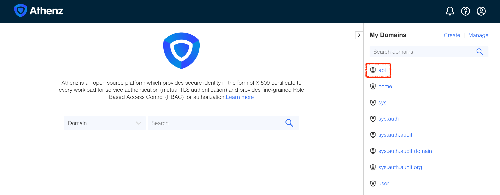
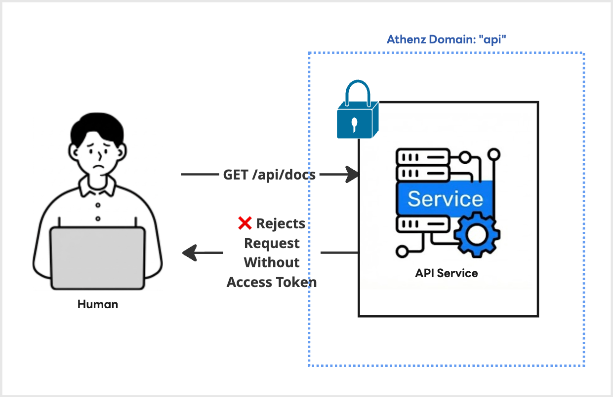
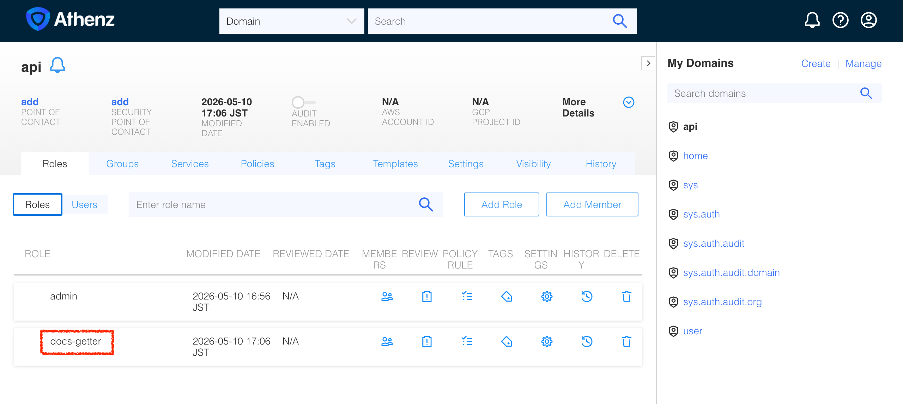
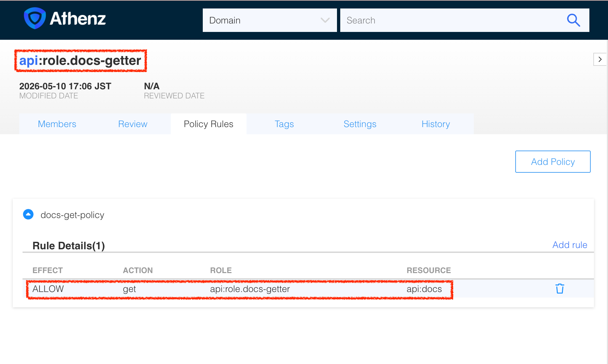

|                       Previous                       |         Current         | Next |
|:----------------------------------------------------:|:-----------------------:|:----:|
| [Authorization Server](./04-authorization-server.md) | **Athenz Access Token** |  -   |

# Athenz Access Token

In this tutorial, you will get Access Token that the API server requests.

## Create Athenz Top-Level Domain (TLD) for API Service

Now that the Athenz server is running and accessible, let's create a Top-Level Domain (TLD). We can achieve this by making a `POST` request to the Athenz ZMS API, authenticating with the admin certificates generated during the deployment.

Let's create a reusable script named `create-tld.sh` that takes the domain name as an argument:

```sh
cat > create-tld.sh <<'EOF'
#!/usr/bin/env bash
set -euo pipefail

if [ -z "${1:-}" ]; then
  echo "Usage: $0 <tld_name>"
  exit 1
fi

tld_name=$1
echo "Creating TLD: ${tld_name}..."

curl -s -k -X POST "https://localhost:4443/zms/v1/domain" \
  --cert ./athenz_dist/certs/athenz_admin.cert.pem \
  --key ./athenz_dist/keys/athenz_admin.private.pem \
  -H "Content-Type: application/json" \
  -d '{
    "name": "'"${tld_name}"'",
    "description": "TLD for '"${tld_name}"'",
    "org": "ajkimkim",
    "enabled": true,
    "adminUsers": ["user.athenz_admin"]
  }'

echo -e "\nDone!"
EOF

chmod +x create-tld.sh

```

Create a domain `api` that represents the API server domain:

```sh
./create-tld.sh "api"

# {"description":"TLD for api","org":"ajkimkim","auditEnabled":false,"ypmId":0,"autoDeleteTenantAssumeRoleAssertions":false,"name":"api","modified":"2026-05-10T07:56:23.059Z","id":"bce22e30-4c45-11f1-8af4-88f84977247b"}
```

You can verify that this domain is created successfully by refreshing the **Athenz UI** (`http://localhost:3000`):



And finally, the new domain (or TLD) `api` represents the following blue dotted line:



## Create Athenz Role under the API domain

Athenz uses **Role-Based Access Control (RBAC)**. When a user or service is added to a role, they are granted the permissions associated with that role.

Earlier, in our API server, we needed a way to check if a client has permission to perform a `get` (HTTP method) operation on the `api`'s resource `docs` (or `api:docs` in Athenz Grammar). Currently, there are no roles defined for this, so let's create them.

Let's create a script named `create-role.sh` that takes the domain name and the role name as arguments:

```sh
cat > create-role.sh <<'EOF'
#!/usr/bin/env bash
set -euo pipefail

if [ $# -lt 2 ]; then
  echo "Usage: $0 <domain> <role>"
  exit 1
fi

domain=$1
role=$2
echo "Creating Role: ${domain}:role.${role}..."

curl -s -k -X PUT "https://localhost:4443/zms/v1/domain/${domain}/role/${role}" \
  --cert ./athenz_dist/certs/athenz_admin.cert.pem \
  --key ./athenz_dist/keys/athenz_admin.private.pem \
  -H "Content-Type: application/json" \
  -d '{
    "name": "'"${domain}:role.${role}"'"
  }'

echo -e "\nDone!"
EOF

chmod +x create-role.sh
```

Now, execute the script to create the `docs-getter` and `docs-poster` roles inside the `api` domain:

```sh
./create-role.sh "api" "docs-getter"

# Creating Role: api:role.docs-getter...

# Done!
```

Once again, you can verify these new roles by navigating to the `api` domain in the **Athenz UI** (`http://localhost:3000/domain/api/role`):



## Create Policies

The role we just created (`docs-getter`) is a container for members. The actual permissions are defined as **Policies** in Athenz and then attached to roles. Once attached, a member of that role inherits the defined permissions.

Let's create a script named `add-policy.sh` that helps to create policy:

```sh
cat > add-policy.sh <<'EOF'
#!/usr/bin/env bash
set -euo pipefail

if [ $# -lt 4 ]; then
  echo "Usage: $0 <domain> <role_name> <resource> <action>"
  exit 1
fi

domain=$1
role_name=$2
resource=$3
action=$4
policy_name="${resource}-${action}-policy"

echo "Creating Policy: ${domain}:policy.${policy_name}..."

curl -s -k -X PUT "https://localhost:4443/zms/v1/domain/${domain}/policy/${policy_name}" \
  --cert ./athenz_dist/certs/athenz_admin.cert.pem \
  --key ./athenz_dist/keys/athenz_admin.private.pem \
  -H "Content-Type: application/json" \
  -d '{
    "name": "'"${domain}:policy.${policy_name}"'",
    "assertions": [
      {
        "role": "'"${domain}:role.${role_name}"'",
        "resource": "'"${domain}:${resource}"'",
        "action": "'"${action}"'"
      }
    ]
  }'

echo -e "\nDone!"
EOF

chmod +x add-policy.sh
```

The API server has its own logic to translate the client request to Athenz resource and action.

- HTTP Action `get` -> Athenz Action `get`
- HTTP Resource `docs` -> Athenz Resource `docs`

Therefore, we need to create a policy like this:

```sh
./add-policy.sh "api" "docs-getter" "docs" "get"
```

The command above means, attach a policy `docs-get-policy` to the role `docs-getter` under the domain `api`. This policy grants the role `docs-getter` the permission to `get` the resource `docs` under the domain `api`, or `docs:api`. The `get` action on `docs:api` is equivalent to the `GET /docs` request to the API server.

You can verify these policies and their assertions by navigating to the **Policies** tab under the `api` domain in the **Athenz UI**.

http://localhost:3000/domain/api/role/docs-getter/policy



## Create Service Identity that represents you

