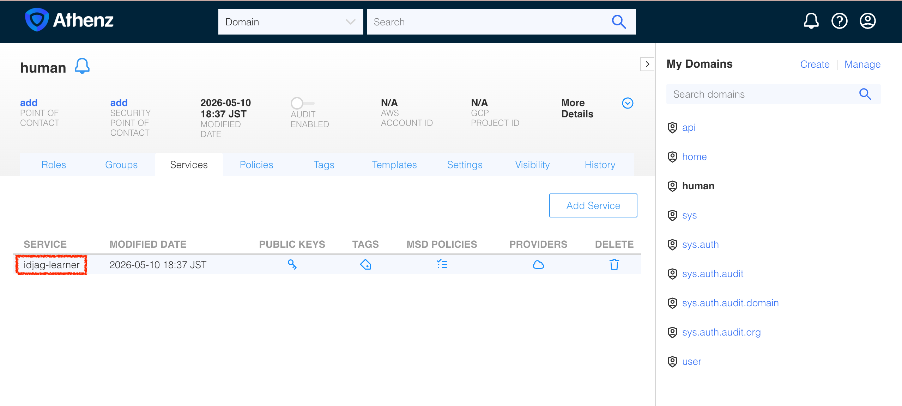

In this tutorial, you will learn how to create more granular permissions for the API server.

## Create Athenz Top-Level Domain (TLD) for API Service

Now that the Athenz server is running and accessible, let's create a Top-Level Domain (TLD). We can achieve this by making a `POST` request to the Athenz ZMS API, authenticating with the admin certificates generated during the deployment.

Let's create a reusable script named `create-tld.sh` that takes the domain name as an argument:

```sh
cat > create-tld.sh <<'EOF'
#!/usr/bin/env bash
set -euo pipefail

if [ -z "${1:-}" ]; then
  echo "Usage: $0 <tld_name>"
  exit 1
fi

tld_name=$1
echo "Creating TLD: ${tld_name}..."

curl -s -k -X POST "https://localhost:4443/zms/v1/domain" \
  --cert ./athenz_dist/certs/athenz_admin.cert.pem \
  --key ./athenz_dist/keys/athenz_admin.private.pem \
  -H "Content-Type: application/json" \
  -d '{
    "name": "'"${tld_name}"'",
    "description": "TLD for '"${tld_name}"'",
    "org": "ajkimkim",
    "enabled": true,
    "adminUsers": ["user.athenz_admin"]
  }'

EOF

chmod +x create-tld.sh

```

Create a domain `api` that represents the API server domain:

```sh
./create-tld.sh "api"

# {"description":"TLD for api","org":"ajkimkim","auditEnabled":false,"ypmId":0,"autoDeleteTenantAssumeRoleAssertions":false,"name":"api","modified":"2026-05-10T07:56:23.059Z","id":"bce22e30-4c45-11f1-8af4-88f84977247b"}
```

You can verify that this domain is created successfully by refreshing the **Athenz UI** (`http://localhost:3000`):


And finally, the new domain (or TLD) `api` represents the following blue dotted line:


## Create Athenz Role under the API domain

Athenz uses **Role-Based Access Control (RBAC)**. When a user or service is added to a role, they are granted the permissions associated with that role.

Earlier, in our API server, we needed a way to check if a client has permission to perform a `get` (HTTP method) operation on the `api`'s resource `docs` (or `api:docs` in Athenz Grammar). Currently, there are no roles defined for this, so let's create them.

Let's create a script named `create-role.sh` that takes the domain name and the role name as arguments:

```sh
cat > create-role.sh <<'EOF'
#!/usr/bin/env bash
set -euo pipefail

if [ $# -lt 2 ]; then
  echo "Usage: $0 <domain> <role>"
  exit 1
fi

domain=$1
role=$2
echo "Creating Role: ${domain}:role.${role}..."

curl -s -k -X PUT "https://localhost:4443/zms/v1/domain/${domain}/role/${role}" \
  --cert ./athenz_dist/certs/athenz_admin.cert.pem \
  --key ./athenz_dist/keys/athenz_admin.private.pem \
  -H "Content-Type: application/json" \
  -d '{
    "name": "'"${domain}:role.${role}"'"
  }'

EOF

chmod +x create-role.sh
```

Now, execute the script to create the `docs-getter` role inside the `api` domain:

```sh
./create-role.sh "api" "docs-getter"

# Creating Role: api:role.docs-getter...
```

You can verify the new role by navigating to the `api` domain in the **Athenz UI** (`http://localhost:3000/domain/api/role`):


## Create Policies

The role we just created (`docs-getter`) is a container for members. The actual permissions are defined as **Policies** in Athenz and then attached to roles. Once attached, a member of that role inherits the defined permissions.

Let's create a script named `add-policy.sh` that helps to create policy:

```sh
cat > add-policy.sh <<'EOF'
#!/usr/bin/env bash
set -euo pipefail

if [ $# -lt 4 ]; then
  echo "Usage: $0 <domain> <role_name> <resource> <action>"
  exit 1
fi

domain=$1
role_name=$2
resource=$3
action=$4
policy_name="${resource}-${action}-policy"

echo "Creating Policy: ${domain}:policy.${policy_name}..."

curl -s -k -X PUT "https://localhost:4443/zms/v1/domain/${domain}/policy/${policy_name}" \
  --cert ./athenz_dist/certs/athenz_admin.cert.pem \
  --key ./athenz_dist/keys/athenz_admin.private.pem \
  -H "Content-Type: application/json" \
  -d '{
    "name": "'"${domain}:policy.${policy_name}"'",
    "assertions": [
      {
        "role": "'"${domain}:role.${role_name}"'",
        "resource": "'"${domain}:${resource}"'",
        "action": "'"${action}"'"
      }
    ]
  }'

EOF

chmod +x add-policy.sh
```

The API server has its own logic to translate the client request to Athenz resource and action.

- HTTP Action `get` -> Athenz Action `get`
- HTTP Resource `docs` -> Athenz Resource `docs`

Therefore, we need to create a policy like this:

```sh
./add-policy.sh "api" "docs-getter" "docs" "get"
```

The command above means, attach a policy `docs-get-policy` to the role `docs-getter` under the domain `api`. This policy grants the role `docs-getter` the permission to `get` the resource `docs` under the domain `api`, or `docs:api`. The `get` action on `docs:api` is equivalent to the `GET /docs` request to the API server.

You can verify these policies and their assertions by navigating to the **Policies** tab under the `api` domain in the **Athenz UI**.

http://localhost:3000/domain/api/role/docs-getter/policy


## Create Service Identity that represents you

To retrieve an access token from the Athenz server, you must first prove your identity. Unlike traditional systems that use passwords, Athenz uses asymmetric cryptography (Public Key Infrastructure). You will represent yourself using a private key that only you have access to.

Let's create a script named `create-private-key.sh` that generates an RSA private and public key pair using OpenSSL:

```sh
cat > create-private-key.sh <<'EOF'
#!/usr/bin/env bash
set -euo pipefail

if [ -z "${1:-}" ]; then
  echo "Usage: $0 <service_name>"
  exit 1
fi

service_name=$1
echo "Generating RSA key pair for: ${service_name}..."

# Generate 2048-bit RSA private key
openssl genrsa -out "${service_name}.old.key" 2048 >/dev/null 2>&1

# Extract public key
openssl rsa -in "${service_name}.old.key" -outform PEM -pubout -out "${service_name}.public.key" 2>/dev/null

# Convert private key to traditional format (PKCS#1)
openssl pkey -in "${service_name}.old.key" -out "${service_name}.key" -traditional

# Cleanup intermediate key
rm "${service_name}.old.key"

echo "Done! Keys generated: ${service_name}.key, ${service_name}.public.key"
EOF

chmod +x create-private-key.sh
```

Now, generate the key pair for your client identity. We will store these in the `./keys` directory to keep our workspace organized. And since you are a learner of this tutorial, we will name the client identity as `idjag-learner` which will represent you as a human user:

```sh
mkdir -p ./keys
./create-private-key.sh "./keys/idjag-learner"

# Generating RSA key pair for: ./keys/idjag-learner...
# Done! Keys generated: ./keys/idjag-learner.key, ./keys/idjag-learner.public.key
```

## Create Service Identity

To understand easier, let's create a tld `human`:

```sh
./create-tld.sh "human"
```

Let's create a script named `create-service.sh` that reads your public key, strips out the PEM headers (as required by the Athenz API), and registers the service:

```sh
cat > create-service.sh <<'EOF'
#!/usr/bin/env bash
set -euo pipefail

if [ $# -lt 3 ]; then
  echo "Usage: $0 <domain> <service_name> <public_key_path>"
  exit 1
fi

domain=$1
service_name=$2
pub_key_path=$3
key_id="v1"

echo "Registering Service: ${domain}.${service_name}..."

# Athenz expects the FULL PEM public key text encoded as YBase64.
# YBase64 mapping: + -> . , / -> _ , = -> -
pub_key_y64=$(base64 < "${pub_key_path}" | tr -d '\n' | tr '+/=' '._-')

curl -s -k --fail-with-body -X PUT "https://localhost:4443/zms/v1/domain/${domain}/service/${service_name}" \
  --cert ./athenz_dist/certs/athenz_admin.cert.pem \
  --key ./athenz_dist/keys/athenz_admin.private.pem \
  -H "Content-Type: application/json" \
  -d '{
    "name": "'"${domain}.${service_name}"'",
    "publicKeys": [
      {
        "id": "'"${key_id}"'",
        "key": "'"${pub_key_y64}"'"
      }
    ]
  }'

EOF

chmod +x create-service.sh
```

Execute the script to register your identity:

```sh
./create-service.sh "human" "idjag-learner" "./keys/idjag-learner.public.key"
```

Then create a service `idjag-learner` under the domain `human` to represent you as a human user:

http://localhost:3000/domain/human/service



## Enable Certificate Provisioning (Provider Setup)

In Athenz, when a service requests an X.509 certificate from ZTS, ZTS wants to verify the origin (or "Provider") of the request. This prevents a stolen private key from being used outside its designated environment. The origin could be:

- Your local Mac / PC
- A company's internal Kubernetes Cluster
- An OpenStack platform

In a production environment, you would need cryptographic proof from the platform (e.g., Kubernetes) that your workload is legitimate. However, for this tutorial, the exact origin is not important since we are testing locally.

We will authorize our `human` domain to use the default built-in ZTS provider (`sys.auth.zts`) by attaching the `zts_instance_launch_provider` template to our domain.

Let's create a script named `enable-cert-provider.sh` that takes the domain and service name as arguments and uses the `zms-cli` inside our cluster to attach the template:

```sh
cat > enable-cert-provider.sh <<'EOF'
#!/usr/bin/env bash
set -euo pipefail

if [ $# -lt 2 ]; then
  echo "Usage: $0 <domain> <service_name>"
  exit 1
fi

domain=$1
service_name=$2

echo "Enabling ZTS Certificate Provider for ${domain}.${service_name}..."

kubectl -n athenz exec -i deploy/athenz-cli -- \
  zms-cli \
    -i user.athenz_admin \
    -z https://athenz-zms-server.athenz:4443/zms/v1 \
    -key /var/run/athenz/athenz_admin.private.pem \
    -cert /var/run/athenz/athenz_admin.cert.pem \
    -d "${domain}" \
    set-domain-template zts_instance_launch_provider service="${service_name}"

EOF

chmod +x enable-cert-provider.sh
```

Execute the script to authorize the `idjag-learner` service to fetch certificates:

```sh
./enable-cert-provider.sh "human" "idjag-learner"

# Enabling ZTS Certificate Provider for human.idjag-learner...
# [Template(s) successfully applied to domain]
```

## Fetch the Service Certificate

Now that the provider is set up, we can request the X.509 certificate. We will use a tool called `zts-svccert` (available inside our `athenz-cli` pod).

Let's create a script named `fetch-cert.sh` that securely injects our local private key into the pod, generates the certificate via ZTS, and extracts the resulting certificate back to our local machine.

```sh
cat > fetch-cert.sh <<'EOF'
#!/usr/bin/env bash
set -euo pipefail

if [ $# -lt 4 ]; then
  echo "Usage: $0 <domain> <service> <private_key_path> <key_version>"
  exit 1
fi

domain=$1
service=$2
private_key_path=$3
key_version=$4

out_cert_file="${private_key_path%.key}.crt"
zts_url="https://athenz-zts-server.athenz:4443/zts/v1"

echo "Fetching X.509 Certificate for ${domain}.${service}..."

# Base64 encode the private key to safely pass it into the kubectl exec session
b64_key=$(base64 < "${private_key_path}" | tr -d '\n')

# Execute the cert request inside the athenz-cli pod
kubectl exec -i deploy/athenz-cli -n athenz -- sh -c "
  echo '${b64_key}' | base64 -d > /tmp/${service}.key && \
  zts-svccert \
    -domain ${domain} \
    -service ${service} \
    -private-key /tmp/${service}.key \
    -key-version ${key_version} \
    -zts ${zts_url} \
    -dns-domain zts.athenz.cloud \
    -provider sys.auth.zts \
    -instance \$(date +%s) \
    -cert-file /tmp/${service}.crt > /dev/null 2>&1 && \
  cat /tmp/${service}.crt && \
  rm -f /tmp/${service}.key /tmp/${service}.crt
" > "${out_cert_file}"

echo "Done! Certificate saved to: ${out_cert_file}"
EOF

chmod +x fetch-cert.sh

```

Execute the script using the parameters we configured earlier:

```sh
./fetch-cert.sh "human" "idjag-learner" "./keys/idjag-learner.key" "v1"

# Fetching X.509 Certificate for human.idjag-learner...
# Done! Certificate saved to: ./keys/idjag-learner.crt
```

## Fetch Access Token (JWT)

Now that you possess your Mutual TLS (mTLS) credentials (`idjag-learner.crt` and `idjag-learner.key`), you can use them to authenticate against the ZTS server and request an OAuth2 Access Token (JWT).

To enforce the principle of least privilege, we will specifically request a token scoped only to the `docs-getter` role within the `api` domain (`api:role.docs-getter`).

Let's create a script named `fetch-access-token.sh`:

```sh
cat > fetch-access-token.sh <<'EOF'
#!/usr/bin/env bash
set -euo pipefail

if [ $# -lt 3 ]; then
  echo "Usage: $0 <cert_path> <key_path> <scope>"
  exit 1
fi

cert_path=$1
key_path=$2
scope=$3
zts_url="https://localhost:8443/zts/v1/oauth2/token"

# Print logs to stderr so stdout only outputs the pure token string
echo "Fetching Access Token for scope: ${scope}..." >&2

response=$(curl -s -k -X POST "${zts_url}" \
  --cert "${cert_path}" \
  --key "${key_path}" \
  -H "Content-Type: application/x-www-form-urlencoded" \
  -d "grant_type=client_credentials&scope=${scope}&expires_in=3600")

token=$(echo "${response}" | jq -r '.access_token // empty')

if [ -z "${token}" ]; then
  echo "🔥 [ERROR] Failed to issue an access token. ZTS Response:" >&2
  echo "${response}" | jq . >&2
  exit 1
else
  echo "✅ [SUCCESS] Access token issued successfully." >&2
  echo "${token}"
fi
EOF

chmod +x fetch-access-token.sh
```

Execute the script, using your newly generated certificate and key, and save the output directly into a variable named `_my_access_token`.

```sh
_scope="api:role.docs-getter"
_my_access_token=$(./fetch-access-token.sh \
  "./keys/idjag-learner.crt" \
  "./keys/idjag-learner.key" \
  "${_scope}")

# 🔥 [ERROR] Failed to issue an access token. ZTS Response:
# {
#   "code": 403,
#   "message": "postaccesstokenrequest: principal human.idjag-learner is not included in the requested role(s) in domain api"
# }
```


```sh
echo $_at | jq -R 'split(".") | .[0] | @base64d | fromjson'
echo $_at | jq -R 'split(".") | .[1] | @base64d | fromjson'
```

> [!TIP]
> You can inspect the decoded contents of your JWT by running: `echo "${_my_access_token}" | jq -R 'split(".") | .[1] | @base64d | fromjson'`

## Access the Protected API

You have successfully navigated the hard way! You defined a domain, established roles and policies, registered a cryptographic identity, provisioned a service certificate, and exchanged it for a scoped Access Token.

It is time to reap the rewards. Let's send a request to the protected API server you set up in the previous tutorial, this time attaching your Access Token in the `Authorization` header.

```sh
curl -s -H "Authorization: Bearer ${_my_access_token}" "localhost:${_new_api_server_port}/api/docs" | jq .

```

If everything was configured correctly, the API server will validate the signature of your token against Athenz, confirm your permissions, and return the protected documents:

```json
{
  "docs": [
    {
      "name": "first default doc",
      "id": 1,
      "content": "hello world"
    },
    {
      "name": "second default doc",
      "id": 2,
      "content": "how are you?"
    }
  ]
}

```
