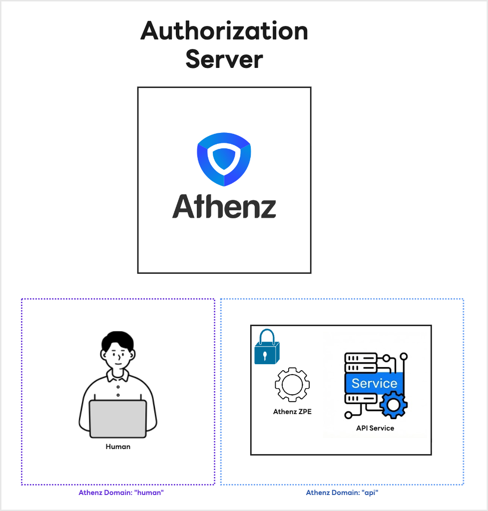
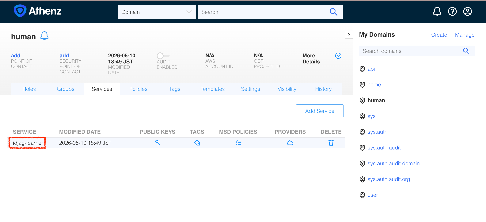
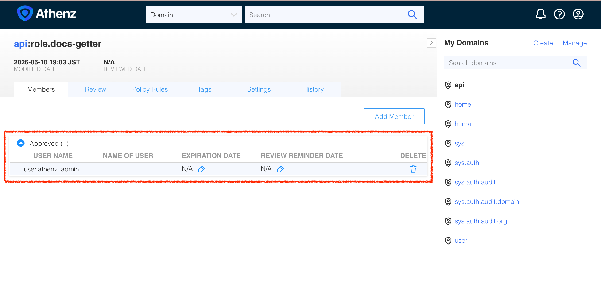
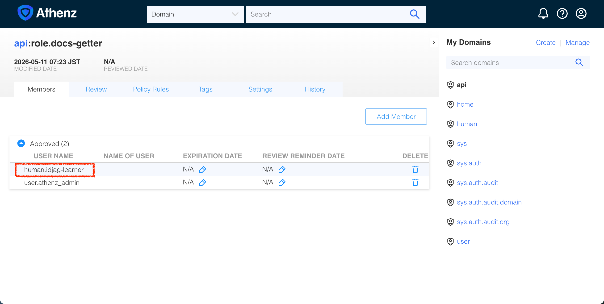
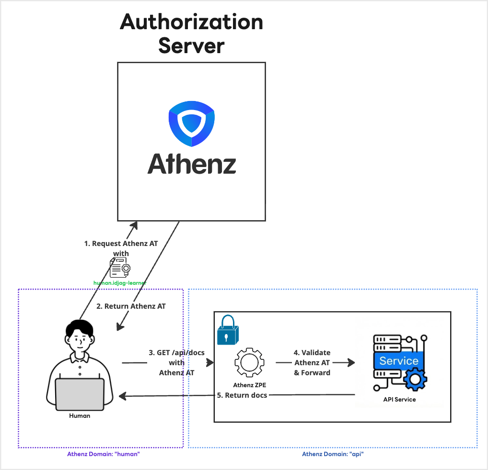

|                      Previous                       |         Current         |                       Next                       |
|:---------------------------------------------------:|:-----------------------:|:------------------------------------------------:|
| [Authorization Server](./05-athenz-access-token.md) | **Granular Permission** | [MCP Server for API](./07-mcp-server-for-api.md) |

# Granular Permission

In this tutorial, you will implement granular permissions by establishing a dedicated service identity to access the protected API server.

## Create Service Identity that represents you

In a production environment, you should never use administrative credentials for standard operations. Instead, we will create a dedicated service identity to represent you as a human user.

Let's create a script named `create-private-key.sh` that generates an RSA private and public key pair using OpenSSL:

```sh
cat > ./my_tools/create-private-key.sh <<'EOF'
#!/usr/bin/env bash
set -euo pipefail

if [ -z "${1:-}" ]; then
  echo "Usage: $0 <service_name>"
  exit 1
fi

service_name=$1
echo "Generating RSA key pair for: ${service_name}..."

# Generate 2048-bit RSA private key
openssl genrsa -out "${service_name}.old.key" 2048 >/dev/null 2>&1

# Extract public key
openssl rsa -in "${service_name}.old.key" -outform PEM -pubout -out "${service_name}.public.key" 2>/dev/null

# Convert private key to traditional format (PKCS#1)
openssl pkey -in "${service_name}.old.key" -out "${service_name}.key" -traditional

# Cleanup intermediate key
rm "${service_name}.old.key"

echo "Done! Keys generated: ${service_name}.key, ${service_name}.public.key"
EOF

chmod +x ./my_tools/create-private-key.sh
```

Now, generate the key pair for your client identity. We will store these in the `./keys` directory to keep our workspace organized. Since you are working through this tutorial, we will name this client identity `idjag-learner` to represent you:

```sh
./my_tools/create-private-key.sh "./keys/idjag-learner"
```

```sh
# Generating RSA key pair for: ./keys/idjag-learner...
# Done! Keys generated: ./keys/idjag-learner.key, ./keys/idjag-learner.public.key
```

## Create TLD for your future Service Identity

In Athenz, every service identity—even those representing human users—must reside within a domain. To keep things organized, let's create a new Top-Level Domain (TLD) named `human`.

Run the following command to create the TLD:

```sh
./my_tools/create-tld.sh "human"
```

This creates the `human` domain, represented by the purple section in the following diagram:



## Create Service Identity

Let's create a script named `create-service.sh` that reads your public key, strips out the PEM headers (as required by the Athenz API), and registers the service.

```sh
cat > ./my_tools/create-service.sh <<'EOF'
#!/usr/bin/env bash
set -euo pipefail

if [ $# -lt 3 ]; then
  echo "Usage: $0 <domain> <service_name> <public_key_path>"
  exit 1
fi

domain=$1
service_name=$2
pub_key_path=$3
key_id="v1"

echo "Registering Service: ${domain}.${service_name}..."

# Athenz expects the FULL PEM public key text encoded as YBase64.
# YBase64 mapping: + -> . , / -> _ , = -> -
pub_key_y64=$(base64 < "${pub_key_path}" | tr -d '\n' | tr '+/=' '._-')

curl -s -k --fail-with-body -X PUT "https://localhost:4443/zms/v1/domain/${domain}/service/${service_name}" \
  --cert ./athenz_dist/certs/athenz_admin.cert.pem \
  --key ./athenz_dist/keys/athenz_admin.private.pem \
  -H "Content-Type: application/json" \
  -d '{
    "name": "'"${domain}.${service_name}"'",
    "publicKeys": [
      {
        "id": "'"${key_id}"'",
        "key": "'"${pub_key_y64}"'"
      }
    ]
  }'

EOF

chmod +x ./my_tools/create-service.sh
```

Execute the script to register your identity:

```sh
./my_tools/create-service.sh "human" "idjag-learner" "./keys/idjag-learner.public.key"
```

This successfully creates the `idjag-learner` service under the `human` domain. You can verify the result in the Athenz UI:

```sh
_athenz_ui_port=3000
open "http://localhost:${_athenz_ui_port}/domain/human/service"
```



## Enable Certificate Provisioning (Provider Setup)

When a service requests an X.509 certificate from ZTS, ZTS verifies the origin (or "Provider") of the request to prevent a stolen private key from being used outside its designated environment. The origin could be:

- Your local Mac / PC
- A company's internal Kubernetes Cluster
- An OpenStack platform

In a production environment, you would need cryptographic proof from the platform that your workload is legitimate. However, for local testing, the exact origin is not critical.

We will authorize our `human` domain to use the default built-in ZTS provider (`sys.auth.zts`) by attaching the `zts_instance_launch_provider` template to our domain.

Let's create a script named `enable-cert-provider.sh`:

```sh
cat > ./my_tools/enable-cert-provider.sh <<'EOF'
#!/usr/bin/env bash
set -euo pipefail

if [ $# -lt 2 ]; then
  echo "Usage: $0 <domain> <service_name>"
  exit 1
fi

domain=$1
service_name=$2

echo "Enabling ZTS Certificate Provider for ${domain}.${service_name}..."

kubectl -n athenz exec -i deploy/athenz-cli -- \
  zms-cli \
    -i user.athenz_admin \
    -z https://athenz-zms-server.athenz:4443/zms/v1 \
    -key /var/run/athenz/athenz_admin.private.pem \
    -cert /var/run/athenz/athenz_admin.cert.pem \
    -d "${domain}" \
    set-domain-template zts_instance_launch_provider service="${service_name}"

EOF

chmod +x ./my_tools/enable-cert-provider.sh
```

Execute the script to authorize the `idjag-learner` service to fetch certificates:

```sh
./my_tools/enable-cert-provider.sh "human" "idjag-learner"
```

```sh
# Enabling ZTS Certificate Provider for human.idjag-learner...
# [Template(s) successfully applied to domain]
```

## Fetch the Service Certificate

Now that the provider is set up, we can request the X.509 certificate. We will use a tool called `zts-svccert` (available inside our `athenz-cli` pod).

Let's create a script named `fetch-cert.sh` that securely injects our local private key into the pod, generates the certificate via ZTS, and extracts the resulting certificate back to our local machine.

```sh
cat > ./my_tools/fetch-cert.sh <<'EOF'
#!/usr/bin/env bash
set -euo pipefail

if [ $# -lt 4 ]; then
  echo "Usage: $0 <domain> <service> <private_key_path> <key_version>"
  exit 1
fi

domain=$1
service=$2
private_key_path=$3
key_version=$4

out_cert_file="${private_key_path%.key}.crt"
zts_url="https://athenz-zts-server.athenz:4443/zts/v1"

echo "Fetching X.509 Certificate for ${domain}.${service}..."

# Base64 encode the private key to safely pass it into the kubectl exec session
b64_key=$(base64 < "${private_key_path}" | tr -d '\n')

# Execute the cert request inside the athenz-cli pod
kubectl exec -i deploy/athenz-cli -n athenz -- sh -c "
  echo '${b64_key}' | base64 -d > /tmp/${service}.key && \
  zts-svccert \
    -domain ${domain} \
    -service ${service} \
    -private-key /tmp/${service}.key \
    -key-version ${key_version} \
    -zts ${zts_url} \
    -dns-domain zts.athenz.cloud \
    -provider sys.auth.zts \
    -instance \$(date +%s) \
    -cert-file /tmp/${service}.crt > /dev/null 2>&1 && \
  cat /tmp/${service}.crt && \
  rm -f /tmp/${service}.key /tmp/${service}.crt
" > "${out_cert_file}"

echo "Done! Certificate saved to: ${out_cert_file}"
EOF

chmod +x ./my_tools/fetch-cert.sh

```

Execute the script using the parameters we configured earlier:

```sh
./my_tools/fetch-cert.sh "human" "idjag-learner" "./keys/idjag-learner.key" "v1"
```

```sh
# Fetching X.509 Certificate for human.idjag-learner...
# Done! Certificate saved to: ./keys/idjag-learner.crt
```

## Fetch Access Token (JWT)

Now that you possess your Mutual TLS (mTLS) credentials (`idjag-learner.crt` and `idjag-learner.key`), you can use them to authenticate against the ZTS server and request an Athenz Access Token (JWT).

To enforce the principle of least privilege, we will specifically request a token scoped only to the `docs-getter` role within the `api` domain (`api:role.docs-getter`):

```sh
_scope="api:role.docs-getter"
_my_access_token=$(./my_tools/fetch-access-token.sh \
  "./keys/idjag-learner.crt" \
  "./keys/idjag-learner.key" \
  "${_scope}" \
  "./keys/idjag-learner.jwt")
```

```sh
# 🔥 [ERROR] Failed to issue an access token. ZTS Response:
# {
#   "code": 403,
#   "message": "postaccesstokenrequest: principal human.idjag-learner is not included in the requested role(s) in domain api"
# }
```

## Troubleshoot: Missing Role Membership

Why did this request fail? Because the `human.idjag-learner` service identity is not explicitly authorized to assume the `api:role.docs-getter` role. Athenz defaults to deny. You can confirm this by checking the role members in the UI:

```sh
_athenz_ui_port=3000
open "http://localhost:${_athenz_ui_port}/domain/api/role/docs-getter/members"
```



To fix this, simply run the member addition script we created earlier:

```sh
./my_tools/add-role-member.sh "api" "docs-getter" "human.idjag-learner"
```

Open once again your Athenz UI to verify that `human.idjag-learner` has been successfully added to the role:

```sh
_athenz_ui_port=3000
open "http://localhost:${_athenz_ui_port}/domain/api/role/docs-getter/members"
```



Now that your service identity is a recognized member of the role, fetch the access token again:

```sh
_scope="api:role.docs-getter"
_my_access_token=$(./my_tools/fetch-access-token.sh \
  "./keys/idjag-learner.crt" \
  "./keys/idjag-learner.key" \
  "${_scope}" \
  "./keys/idjag-learner.jwt")
```

```sh
# ✅ [SUCCESS] Issued the following access token:
# {
#   "kid": "athenz-zts-server-6966ff7f66-4j67d",
#   "typ": "at+jwt",
#   "alg": "RS256"
# }
# {
#   "sub": "human.idjag-learner",
#   "scp": [
#     "docs-getter"
#   ],
#   "ver": 1,
#   "iss": "athenz-zts-server-6966ff7f66-4j67d",
#   "client_id": "human.idjag-learner",
#   "aud": "api",
#   "uid": "human.idjag-learner",
#   "auth_time": 1778451929,
#   "scope": "docs-getter",
#   "cnf": {
#     "x5t#S256": "QUXJN5ALSWRR_fK5iHMwo0hnmlp01mcnyiNcd141o1E"
#   },
#   "exp": 1778455529,
#   "iat": 1778451929,
#   "jti": "cca1a64e-f309-47bd-94b9-3cef584663ef"
# }
```

Finally, send a request to the protected API server with the newly minted access token attached to the Authorization header:

```sh
curl -s -k -H "Authorization: Bearer $_my_access_token" http://localhost:14443/api/docs | jq .
```

```sh
# {
#   "docs": [
#     {
#       "name": "first default doc",
#       "id": 1,
#       "content": "hello world"
#     },
#     {
#       "name": "second default doc",
#       "id": 2,
#       "content": "how are you?"
#     }
#   ]
# }
```

## Architecture Review

You successfully fetched an X.509 certificate for the non-admin service identity (`human.idjag-learner`) and exchanged it for an Athenz Access Token scoped specifically to `api:role.docs-getter`:



Next: [MCP Server for API](./07-mcp-server-for-api.md)
