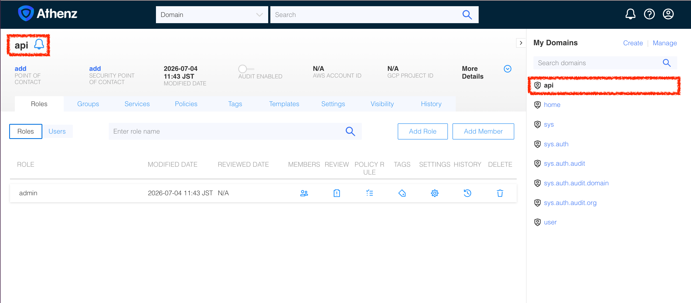
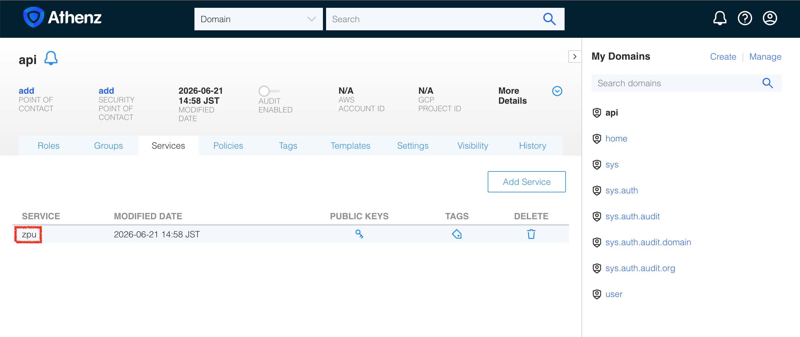

|                       Previous                       |    Current     |                        Next                        |
|:----------------------------------------------------:|:--------------:|:--------------------------------------------------:|
| [Authorization Server](./05-authorization-server.md) | **ZPU Server** | [Athenz Access Token](./07-athenz-access-token.md) |

# ZPU Server

In this tutorial, we will deploy a simple ZMS Policy Updater (ZPU) to synchronize policies from the Authorization Server (Athenz).

<!-- TOC depthFrom:2 depthTo:2 -->

- [Create Athenz Top-Level Domain (TLD) for API Service](#create-athenz-top-level-domain-tld-for-api-service)
- [Create Certificate for ZPU](#create-certificate-for-zpu)
- [Create Service Identity](#create-service-identity)
- [Enable Certificate Provisioning (Provider Setup)](#enable-certificate-provisioning-provider-setup)
- [Fetch X.509 Certificate for `api.zpu`](#fetch-x509-certificate-for-apizpu)
- [Create a TLS Secret for `api.zpu` as K8s Secret](#create-a-tls-secret-for-apizpu-as-k8s-secret)
- [Deploy ZPU Sidecar](#deploy-zpu-sidecar)
- [Verify](#verify)

<!-- /TOC -->

<details>
  <summary>Why we need ZPU?</summary>
  <br>

At an enterprise scale, system reliability is critical; we want our services to operate 24/7 without interruption. While security teams strive to keep the central Authorization Server running continuously, achieving true 100% uptime is virtually impossible—even tech giants like Google occasionally experience outages.

This is why a distributed authorization model is essential. While Athenz serves as the Single Source of Truth (SSOT) for our access control, we cannot rely on making a network call to the central server for every single request.

Instead, the ZPU periodically downloads the latest policies directly to the local environment. Each service then uses its embedded ZPE (ZMS Policy Engine) to evaluate these policies locally. This decoupled architecture guarantees that even if the central Athenz server goes down, your services can continue to authorize requests seamlessly.
</details>

## Create Athenz Top-Level Domain (TLD) for API Service

Now that the Athenz server is running and accessible, let's create a Top-Level Domain (TLD). We can achieve this by making a `POST` request to the Athenz ZMS API, authenticating with the admin certificates generated during the deployment.

> [!NOTE]
> `create-tld.sh` — POSTs to the Athenz ZMS API to register a new top-level domain. Run `cat ./tools/athenz/create-tld.sh` to inspect.

Create a domain `api` that represents the API server domain:

```sh
./tools/athenz/create-tld.sh "api"
```

```sh
# {"description":"TLD for api","org":"ajkimkim","auditEnabled":false,"ypmId":0,"autoDeleteTenantAssumeRoleAssertions":false,"name":"api","modified":"2026-05-10T07:56:23.059Z","id":"bce22e30-4c45-11f1-8af4-88f84977247b"}
```

You can verify that this domain is created successfully by refreshing the **Athenz UI** (`http://localhost:3000`). You can open it with:

```sh
tools/open.sh http://localhost:$(tools/port.sh athenz-ui)
```



The new domain (or Top Level Domain, or TLD) `api` you just created represents the following blue dotted line:


## Create Certificate for ZPU

In Athenz, every component (referred to as a `Service`) requires an X.509 certificate to authenticate itself when connecting to the central server. The standard process involves generating a private key and registering the corresponding public key as a `Service` within Athenz.

> [!NOTE]
> `create-private-key.sh` — Generates a 2048-bit RSA key pair using OpenSSL and outputs the private key (PKCS#1) and public key as separate files. Run `cat ./tools/athenz/create-private-key.sh` to inspect.

Create a key

```sh
./tools/athenz/create-private-key.sh "./keys/api-zpu"
```

```sh
#   ·  Generating RSA key pair for: ./keys/api-zpu...
#   ✔  Keys generated: ./keys/api-zpu.key, ./keys/api-zpu.public.key
```

## Create Service Identity

> [!NOTE]
> `create-service.sh` — Encodes the public key as YBase64 and PUTs it to the ZMS API to register a named service identity under a domain. Run `cat ./tools/athenz/create-service.sh` to inspect.

Execute the script to register the service:

```sh
./tools/athenz/create-service.sh "api" "zpu" "./keys/api-zpu.public.key"
```

```sh
#   ·  Registering Service: api.zpu...
#   ✔  Service registered: api.zpu
```

This successfully creates the `api.zpu` service identity. You can verify the result in the Athenz UI:

```sh
_athenz_ui_port=$(./tools/port.sh athenz-ui)
./tools/open.sh "http://localhost:${_athenz_ui_port}/domain/api/service"
```



## Enable Certificate Provisioning (Provider Setup)

When a service requests an X.509 certificate from ZTS, ZTS verifies the origin (or "Provider") of the request to prevent a stolen private key from being used outside its designated environment. The origin could be:

- Your local Mac / PC
- A company's internal Kubernetes Cluster
- An OpenStack platform

In a production environment, you would need cryptographic proof from the platform that your workload is legitimate. However, for local testing, the exact origin is not critical.

We will authorize our `human` domain to use the default built-in ZTS provider (`sys.auth.zts`) by attaching the `zts_instance_launch_provider` template to our domain.

> [!NOTE]
> `enable-cert-provider.sh` — Applies the `zts_instance_launch_provider` template via `zms-cli`, authorizing ZTS to issue X.509 certificates for the service. Run `cat ./tools/athenz/enable-cert-provider.sh` to inspect.

Then, execute the following:

```sh
./tools/athenz/enable-cert-provider.sh "api" "zpu"
```

```sh
#   ·  Enabling ZTS Certificate Provider for api.zpu...
#   ✔  ZTS Certificate Provider enabled for api.zpu
```

## Fetch X.509 Certificate for `api.zpu`

Now that the provider is set up, we can request the X.509 certificate. We will use a tool called `zts-svccert` (available inside our `athenz-cli` pod).

> [!NOTE]
> `fetch-cert.sh` — Injects the private key into the `athenz-cli` pod, runs `zts-svccert` to request an X.509 certificate from ZTS, then pulls the `.crt` back to your local machine. Run `cat ./tools/athenz/fetch-cert.sh` to inspect.

Then:

```sh
./tools/athenz/fetch-cert.sh "api" "zpu" "./keys/api-zpu.key" "v1"
```

```sh
#   ·  Fetching X.509 Certificate for api.zpu...
#   ✔  Certificate saved to: ./keys/api-zpu.crt
```

## Create a TLS Secret for `api.zpu` as K8s Secret

Create a Kubernetes Secret that represents the service `api.zpu`:

```sh
kubectl -n api create secret generic api-zpu-cert \
  --from-file=cert=./keys/api-zpu.crt \
  --from-file=key=./keys/api-zpu.key \
  --from-file=ca=./athenz_dist/certs/ca.cert.pem
```

```sh
#   ✔  Secret created: api/api-zpu-cert
```

## Deploy ZPU Sidecar

Now, we need to update our existing `api-server` deployment. We will use the **Sidecar Pattern** by injecting the ZPU container into the same pod as the API server.

We need to attach two volumes:
1. **Secret Volume:** Mounts the `api-zpu-cert` so ZPU can securely read the private key and certificate.
2. **EmptyDir Volume:** A shared directory where ZPU writes the `.pol` policy files, and the API Server reads them.

Let's patch the existing deployment using a YAML patch configuration:

```yaml
kubectl patch deploy api-server -n api --patch "$(cat <<'EOF'
spec:
  template:
    spec:
      containers:
        # 1. Update existing api-server container to read policies
        - name: api-server
          volumeMounts:
            - name: api-server-policies
              mountPath: /app/policies
              readOnly: true

        # 2. Add ZPU sidecar container
        - name: zpu
          image: ghcr.io/mlajkim/zpu:latest
          imagePullPolicy: Always
          env:
            - name: ZPU_DOMAIN
              value: "api"
            - name: ZTS_URL
              value: "https://athenz-zts-server.athenz:4443/zts/v1"
            - name: ZPU_INTERVAL_SECONDS
              value: "5"
          volumeMounts:
            - name: api-server-policies
              mountPath: /policies
            - name: api-zpu-cert
              mountPath: /var/run/athenz/zpu
              readOnly: true

      # 3. Define the volumes
      volumes:
        - name: api-server-policies
          emptyDir: {}
        - name: api-zpu-cert
          secret:
            secretName: api-zpu-cert
            defaultMode: 0400
EOF
)"
```

```sh
# deployment.apps/api-server patched
```

## Verify

Wait for the ZPU sidecar to be ready:

```sh
kubectl rollout status deploy/api-server -n api
```

```sh
# deployment "api-server" successfully rolled out
```

Verify that the policies have been successfully downloaded:

```sh
kubectl exec deploy/api-server -n api \
  -- cat /app/policies/api.pol | jq .
```

```sh
# {
#   "signedPolicyData": {
#     "policyData": {
#       "domain": "api",
#       "policies": [
#         {
#           "name": "api:policy.token-exchanging-mcp_zts_token_target_exchange_api_role_docs-getter",
#           "modified": "2026-05-17T21:41:12.752Z",
# ...
```

Next: [Athenz Access Token](./07-athenz-access-token.md)
