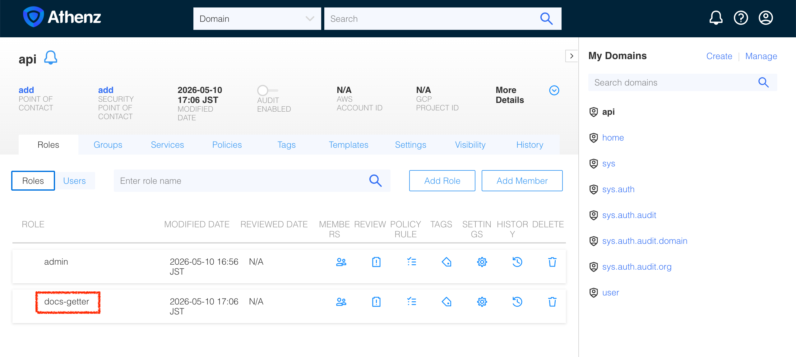
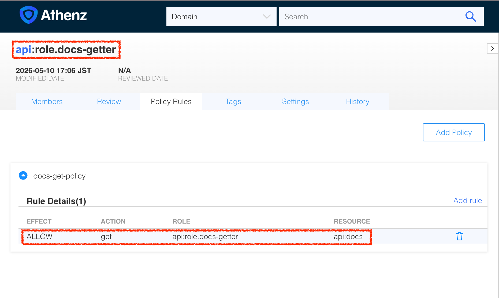
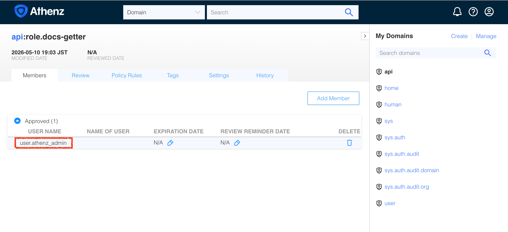
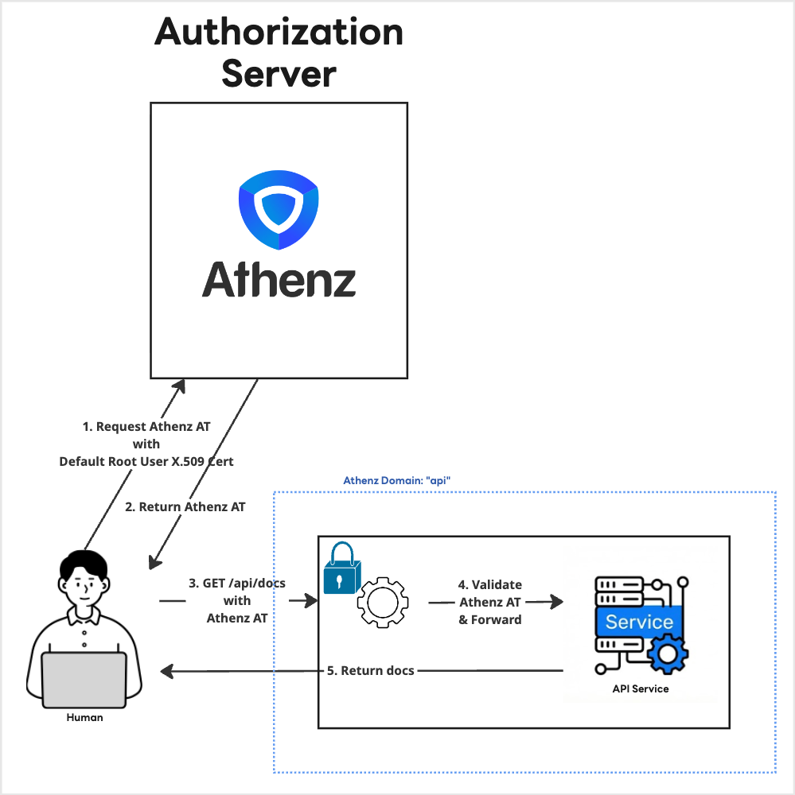

|             Previous             |         Current         |                        Next                        |
|:--------------------------------:|:-----------------------:|:--------------------------------------------------:|
| [ZPU Server](./06-zpu-server.md) | **Athenz Access Token** | [Granular Permission](./08-granular-permission.md) |

# Athenz Access Token

In this tutorial, you will get Access Token that the API server requests.

<!-- TOC depthFrom:2 depthTo:2 -->

- [Create Athenz Role under the API domain](#create-athenz-role-under-the-api-domain)
- [Create Policies](#create-policies)
- [Add Root User as a member](#add-root-user-as-a-member)
- [Get Access Token as Root User](#get-access-token-as-root-user)
- [Send request to the protected server](#send-request-to-the-protected-server)
- [What's done?](#whats-done)
- [What's next?](#whats-next)

<!-- /TOC -->

## Create Athenz Role under the API domain

Athenz uses **Role-Based Access Control (RBAC)**. When a user or service is added to a role, they are granted the permissions associated with that role.

Earlier, in our API server, we needed a way to check if a client has permission to perform a `get` (HTTP method) operation on the `api`'s resource `docs` (or `api:docs` in Athenz Grammar). Currently, there are no roles defined for this, so let's create them.

> [!NOTE]
> `create-role.sh` — PUTs an empty role definition to the ZMS API, creating a named role under a given domain. Run `cat ./tools/athenz/create-role.sh` to inspect.

Now, execute the script to create the `docs-getter` role inside the `api` domain:

```sh
./tools/athenz/create-role.sh "api" "docs-getter"
```

```sh
# Creating Role: api:role.docs-getter...
```

You can verify the new role by navigating to the `api` domain in the **Athenz UI**:

```sh
_athenz_ui_port=$(./tools/port.sh athenz-ui)
./tools/open.sh "http://localhost:${_athenz_ui_port}/domain/api/role"
```



## Create Policies

The role we just created (`docs-getter`) is a container for members. The actual permissions are defined as **Policies** in Athenz and then attached to roles. Once attached, a member of that role inherits the defined permissions.

> [!NOTE]
> `add-policy.sh` — Creates an Athenz policy assertion granting a role a specific action on a resource, then PUTs it to the ZMS API. Run `cat ./tools/athenz/add-policy.sh` to inspect.

The API server has its own logic to translate the client request to Athenz resource and action.

- HTTP Action `get` -> Athenz Action `get`
- HTTP Resource `docs` -> Athenz Resource `docs`

Therefore, we need to create a policy like this:

```sh
./tools/athenz/add-policy.sh "api" "docs-getter" "get" "docs"
```

The command above means, attach a policy `docs-get-policy` to the role `docs-getter` under the domain `api`. This policy grants the role `docs-getter` the permission to `get` the resource `docs` under the domain `api`, or `docs:api`. The `get` action on `docs:api` is equivalent to the `GET /docs` request to the API server.

You can verify these policies and their assertions by navigating to the **Policies** tab under the `api` domain in the **Athenz UI**.

```sh
_athenz_ui_port=$(./tools/port.sh athenz-ui)
./tools/open.sh "http://localhost:${_athenz_ui_port}/domain/api/role/docs-getter/policy"
```



## Add Root User as a member

When we manifested Athenz server, it gives us the root user certificate by default. For now, we will use the root user to get the access token. To get the Access Token for the specific role (or scope), we first need to add the root user as a member of the role.

> [!NOTE]
> `add-role-member.sh` — PUTs a member entry to a role via the ZMS API, granting that principal the permissions associated with the role. Run `cat ./tools/athenz/add-role-member.sh` to inspect.

The default service name for the root user is `user.athenz_admin`. We can add the admin user as a member of the `docs-getter` role in the `api` domain:

```sh
./tools/athenz/add-role-member.sh "api" "docs-getter" "user.athenz_admin"
```

You can see that `user.athenz_admin` is added to the `docs-getter` role in the `api` domain:

```sh
_athenz_ui_port=$(./tools/port.sh athenz-ui)
./tools/open.sh "http://localhost:${_athenz_ui_port}/domain/api/role/docs-getter/members"
```



## Get Access Token as Root User

> [!NOTE]
> `fetch-access-token.sh` — POSTs a `client_credentials` grant to the ZTS token endpoint and returns a signed Athenz access token scoped to the requested role. Run `cat ./tools/athenz/fetch-access-token.sh` to inspect.

Execute the script, using the root user certificate and key generated by the athenz-distribution, and save the output directly into a variable named `_root_user_at`.

```sh
_scope="api:role.docs-getter"
_root_user_at=$(./tools/athenz/fetch-access-token.sh \
  "./athenz_dist/certs/athenz_admin.cert.pem" \
  "./athenz_dist/keys/athenz_admin.private.pem" \
  "${_scope}" \
  "./keys/api_docs-getter.jwt")
```

```sh
# Fetching Access Token for scope: api:role.docs-getter...
# ✅ [SUCCESS] Issued the following access token:
# {
#   "kid": "athenz-zts-server-6966ff7f66-4j67d",
#   "typ": "at+jwt",
#   "alg": "RS256"
# }
# {
#   "sub": "user.athenz_admin",
#   "scp": [
#     "docs-getter"
#   ],
#   "ver": 1,
#   "iss": "athenz-zts-server-6966ff7f66-4j67d",
#   "client_id": "user.athenz_admin",
#   "aud": "api",
#   "uid": "user.athenz_admin",
#   "auth_time": 1778407550,
#   "scope": "docs-getter",
#   "cnf": {
#     "x5t#S256": "ify-xpF2OH2YWreL9ollKhZZt6xM35BPhli-dNnt19Y"
#   },
#   "exp": 1778411150,
#   "iat": 1778407550,
#   "jti": "b5836abf-3033-439d-82cd-0c02a662862d"
# }
```

## Send request to the protected server

Last time we tried to access the `docs` resource of the API server, but we got a 401 Unauthorized error:

```sh
curl -s -k http://localhost:14443/api/docs | jq .
```

```sh
# {
#   "error": "Unauthorized",
#   "message": "Authorization header is missing or invalid Bearer token.",
#   "status": 401
# }
```


With the Access Token, let's see if we can access it now.

```sh
curl -s -k -H "Authorization: Bearer $_root_user_at" http://localhost:14443/api/docs | jq .
```

```sh
# {
#   "docs": [
#     {
#       "name": "first default doc",
#       "id": 1,
#       "content": "hello world"
#     },
#     {
#       "name": "second default doc",
#       "id": 2,
#       "content": "how are you?"
#     }
#   ]
# }
```

## What's done?

We have successfully retrieved an Athenz Access Token as `user.athenz_admin` and used it to access the protected API.



## What's next?

As you may have noticed, relying on the highly privileged `user.athenz_admin` for everyday operations is a bad security practice. While it was a valuable exercise for testing our protected API, we need to strictly enforce the principle of **least privilege**.

In the next section, we will generate a new X.509 certificate that represents *you*—the one learning `id-jag`—and use it to securely access the API!

Next: [Granular Permission](./08-granular-permission.md)
