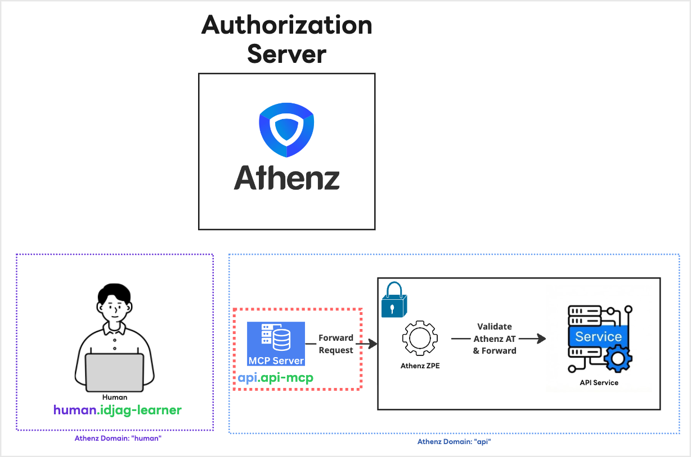

|                      Previous                      |        Current         |                    Next                    |
|:--------------------------------------------------:|:----------------------:|:------------------------------------------:|
| [Granular Permission](./06-granular-permission.md) | **MCP Server for API** | [AI Client Agent](./08-ai-client-agent.md) |

# MCP Server for API

In this tutorial, we will set up MCP Server for API so that our AI client agent that we will install in the next tutorial can interact with our protected API server for you.

## Run MCP Server for API

### Service Cert for MCP Server

To run the MCP Server, just like we have given service identity for human user `human.idjag-learner` , we also need to give service identity for the MCP server. Because mcp server is part of the API server, we will simply create service `api-mcp` under the tld (domain) `api`.

```sh
./create-private-key.sh "./keys/api-mcp"

# Done! Keys generated: ./keys/api-mcp.key, ./keys/api-mcp.public.key
```

Then create a service with the key created above:

```sh
./create-service.sh "api" "api-mcp" "./keys/api-mcp.public.key"

# Registering Service: api.api-mcp...
```

Enable cert provider for the service `api.api-mcp`:

```sh
./enable-cert-provider.sh "api" "api-mcp"

# [Template(s) successfully applied to domain]
```

And finally generate X.509 Certificate:

```sh
./fetch-cert.sh "api" "api-mcp" "./keys/api-mcp.key" "v1"

# Fetching X.509 Certificate for api.api-mcp...
# Done! Certificate saved to: ./keys/api-mcp.crt
```

### Run the MCP Server

The cloned repository for API server includes the MCP server as well. Before we run the server, the MCP Server expects its own X.509 and cert key stored in `/mcp/certs` directory. Since we just got one for them, lets quickly copy the certificate for it.

```sh
mkdir -p ./oss_sample_java_api_server/mcp/certs

cp ./keys/api-mcp.key ./oss_sample_java_api_server/mcp/certs/api-mcp.key
cp ./keys/api-mcp.crt ./oss_sample_java_api_server/mcp/certs/api-mcp.crt
```

Also copy the CA certificate of Athenz, that is generated by default when you did the athenz distribution:

```sh
cp ./athenz_dist/certs/ca.cert.pem ./oss_sample_java_api_server/mcp/certs/ca.crt
```

Then run the server:

```sh
make -C oss_sample_java_api_server mcp-local PORT=8101

# 🚀 OpenAPI MCP Server for API listening on: http://localhost:8101
# 🔗 Upstream API: http://localhost:14443
# 📄 OpenAPI Spec available at: http://localhost:8101/openapi.json
```

## What we have done

We create a new service identity `api.mcp-api` for the MCP Server that runs in port 8101.



## What's next?

In next tutorial, we will do actual chat with local AI Agent and see how it interacts with our protected API server through the MCP Server we just created.

Next: [AI Client Agent](./08-ai-client-agent.md)
