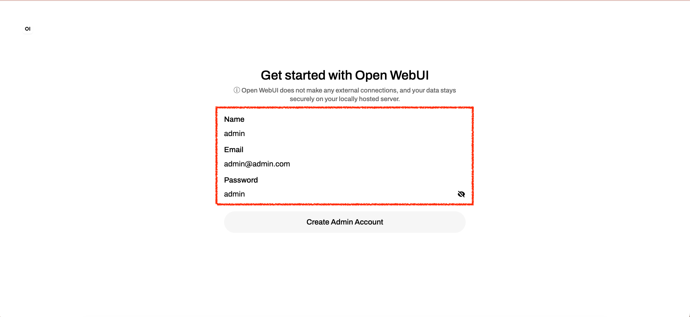
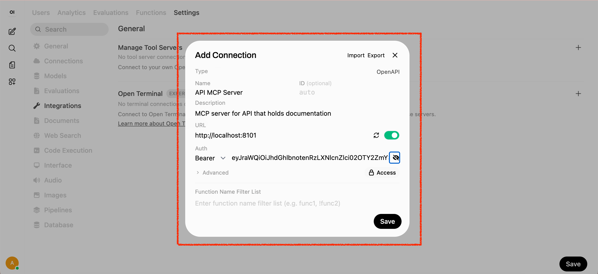
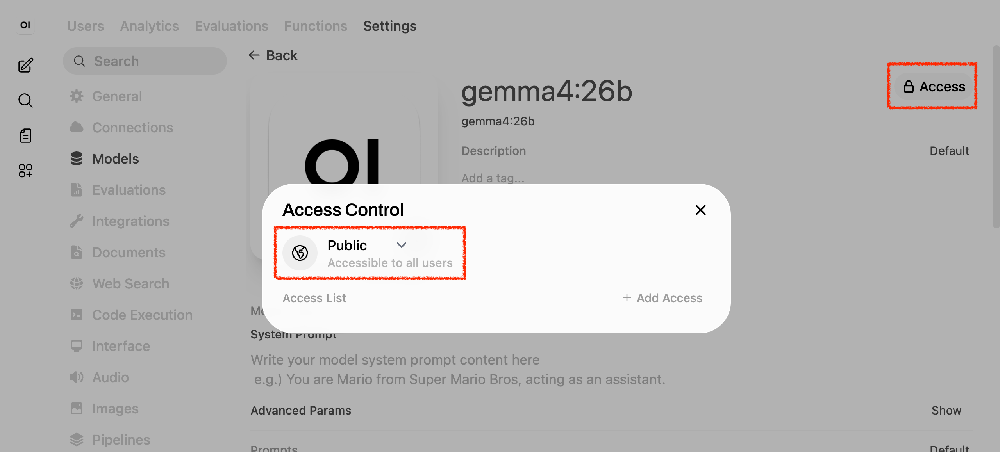
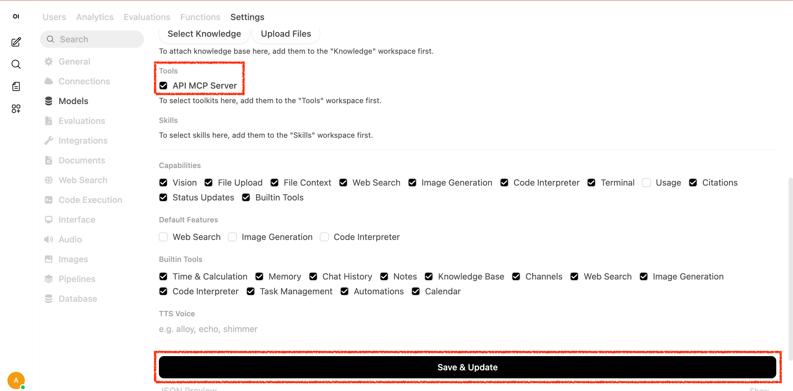
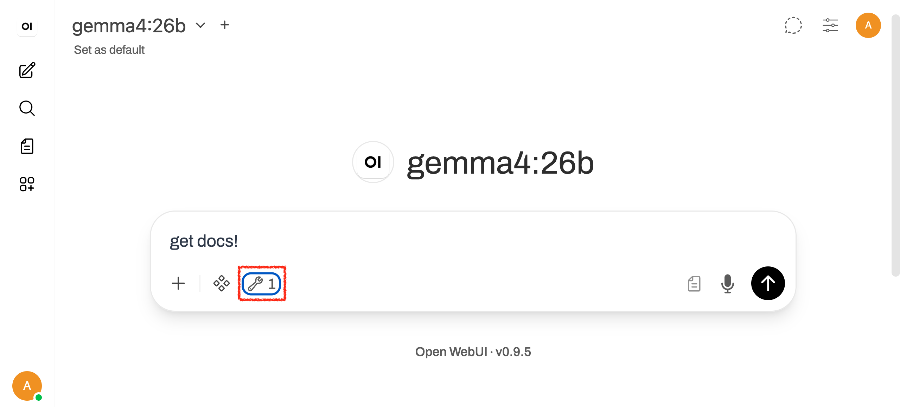
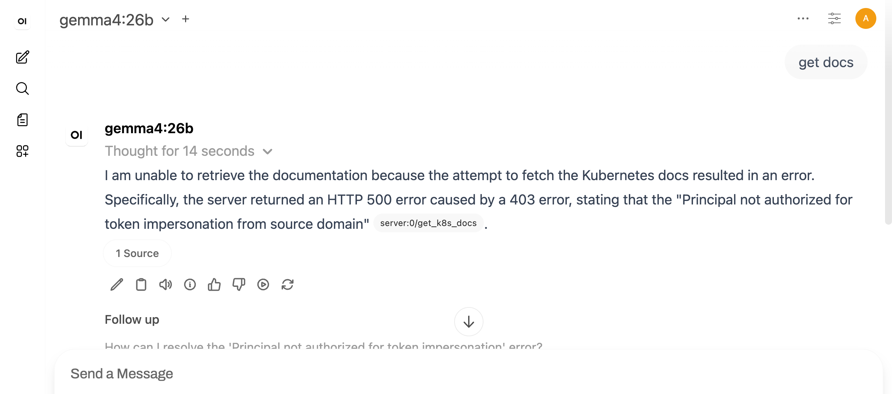
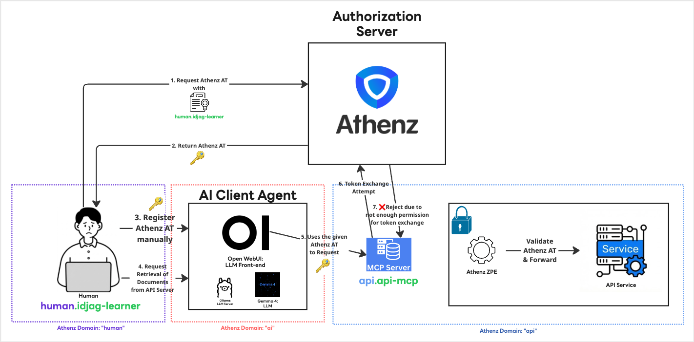

|                     Previous                     |       Current       |                   Next                   |
|:------------------------------------------------:|:-------------------:|:----------------------------------------:|
| [MCP Server for API](./07-mcp-server-for-api.md) | **AI Client Agent** | [Token Exchange](./09-token-exchange.md) |

# AI Client Agent

In this tutorial, we will install the AI Client Agent for the first time and talk to the API server through it.

## Install Ollama

Ollama is one of the easiest ways to install an open LLM locally and interact with it.

Simply run the following command:

```sh
curl -fsSL https://ollama.com/install.sh | sh
```

```sh
# Starting Ollama...
# >>> Downloading Ollama for macOS...
# ######################################################################## 100.0%
# >>> Installing Ollama to /Applications...
# >>> Adding 'ollama' command to PATH (may require password)...
# Password:
# >>> Starting Ollama...
# >>> Install complete. You can now run 'ollama'.
```

> [!NOTE]
> For the SSOT install method, visit: https://ollama.com/

## Install Gemma 4 with Ollama

> [!NOTE]
> Learn about the specs for the Gemma 4 model [here](https://ai.google.dev/gemma/docs/core?_gl=1*57y72w*_up*MQ..*_ga*MTM5MjUyNzM5NC4xNzc4NDU1OTc0*_ga_P1DBVKWT6V*czE3Nzg0NTU5NzQkbzEkZzAkdDE3Nzg0NTU5NzQkajYwJGwwJGgxMjMzODIwOTA0#gemma-4-inference-memory-requirements) 

In this tutorial, we will use Gemma 4's `gemma4:26b` as our AI model:

```sh
ollama pull gemma4:26b
```

## Install Open WebUI

Instead of using Ollama's native UI, we will use Open WebUI for a more feature-rich experience. Open WebUI requires a specific Python version and some system dependencies. At the time of writing, the official documentation states that Open WebUI runs on Python 3.11 or lower.

### Install Python

> [!NOTE]
> Learn how to install pyenv here: [pyenv/pyenv - GitHub](https://github.com/pyenv/pyenv)

Since managing Python versions can be a hassle, let's use the `pyenv` tool to manage them.

```sh
pyenv install 3.11
pyenv local 3.11
python --version

```sh
# Python 3.11.15
```

### Create OpenWebUI Runner Script

```sh
cat > ./my_tools/run-open-webui-without-keycloak.sh <<'EOF'
#!/usr/bin/env bash
set -euo pipefail

PORT="${1:-3200}"

mkdir -p data
export DATA_DIR="$(pwd)/data"
export OLLAMA_BASE_URL="${OLLAMA_BASE_URL:-http://localhost:11434}"

if [[ ! -x venv/bin/python ]]; then
  python3 -m venv venv
fi

source venv/bin/activate

if ! python -m pip show open-webui >/dev/null 2>&1; then
  python -m pip install open-webui \
    --trusted-host pypi.org \
    --trusted-host files.pythonhosted.org \
    --trusted-host edge.artifactory.corp.yahoo.co.jp
fi

exec open-webui serve --port "${PORT}"
EOF

chmod +x ./my_tools/run-open-webui-without-keycloak.sh
```

### Run Open WebUI without Keycloak for testing

Run the following command to start Open WebUI Server (Takes about 5 minutes):

```sh
mkdir -p open_webui
_open_webui_without_keycloak_port=3200
(
  cd open_webui
  ../my_tools/run-open-webui-without-keycloak.sh "$_open_webui_without_keycloak_port"
)
```

## Open Open WebUI

Open up the url:

```sh
_open_webui_without_keycloak_port=3200
open http://localhost:$_open_webui_without_keycloak_port
```

You will be prompted to create an admin account as the first user. You can simply use:

- `admin@admin.com`
- `admin`

However, the credentials are up to you.



## Register MCP Server as a Tool Server in Open WebUI

Get Access Token again:

```sh
_scope="api:role.docs-getter"
_root_user_at=$(./my_tools/fetch-access-token.sh \
  "./athenz_dist/certs/athenz_admin.cert.pem" \
  "./athenz_dist/keys/athenz_admin.private.pem" \
  "${_scope}" \
  "./keys/api_docs-getter.jwt")

cat "./keys/api_docs-getter.jwt"
```

Go to `User Icon` > `Admin Panel` > `Settings` > `Integrations` > `Manage Tool Servers` > `+ Icon` to register the MCP server as a tool server.

- Name: `API MCP Server`
- Description: `MCP server for API that holds documentation`
- URL: `http://localhost:8101`
- Auth type: `Bearer`
- API Key: `<YOUR_ACCESS_TOKEN_THAT_YOU'VE_FETCHED`
- Access: Change to `Public`



Before we ask the AI Agent, let's quickly add the tool as the default tool server, so that you do not have to manually add the tool every time.

Go to `User Icon` > `Admin Panel` > `Settings` > `Models`,

Select the edit (Pencil) Icon.

Select `Access` > `Private` then change to `Public` (auotmatic save):



Then in `tools` section, select the tool that we just created as the following:




## Verification

> [!NOTE]
> Make sure that the tool we just created is selected
> 

Finally, ask the AI Agent the following (It is expected to fail):

```
get docs!
```



## What's happened?



We were able to successfully install the AI Client Agent, using:

- Open WebUI as an LLM Front-end (for human interaction)
- Ollama as a Local LLM Provider
- Gemma 4's `gemma4:26b` as an LLM model

We manually passed the Access Token, which has permission to access the API server. However, it fails due to the default behavior of the MCP, which attempts to exchange the given Access Token into another token. This is an expected failure however. We will fix it in the next section.

Next: [Token Exchange](./09-token-exchange.md)
