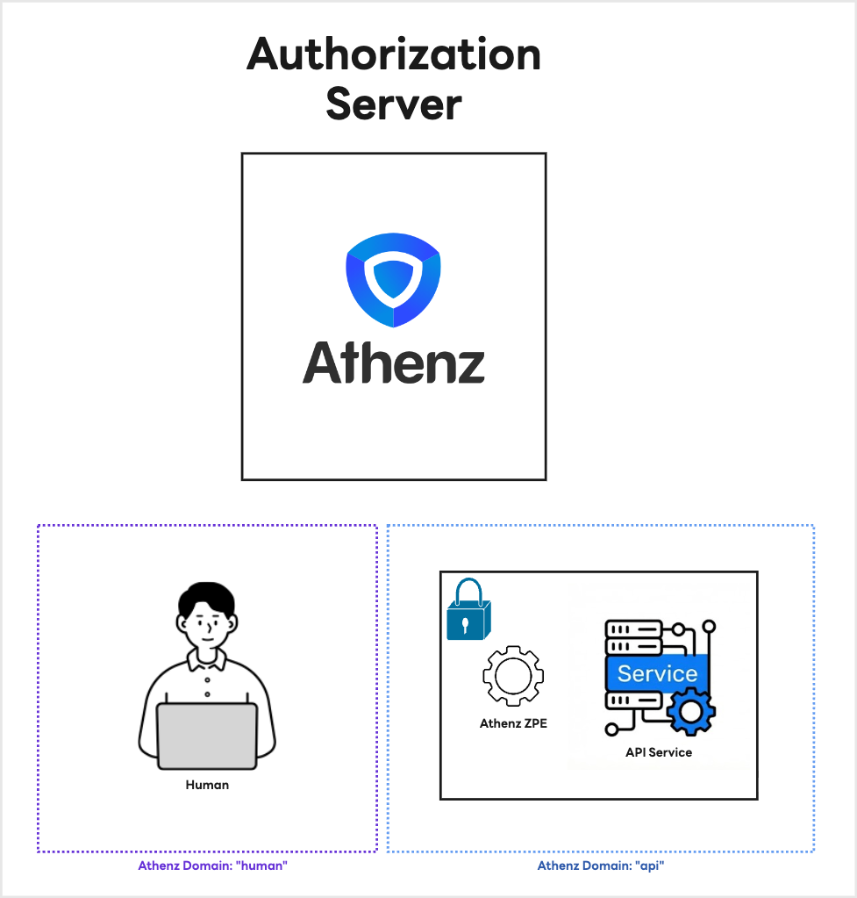
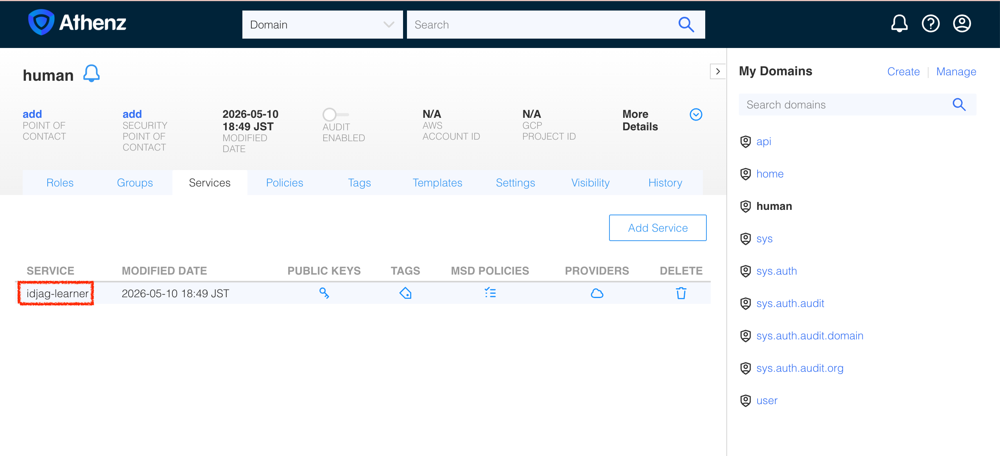
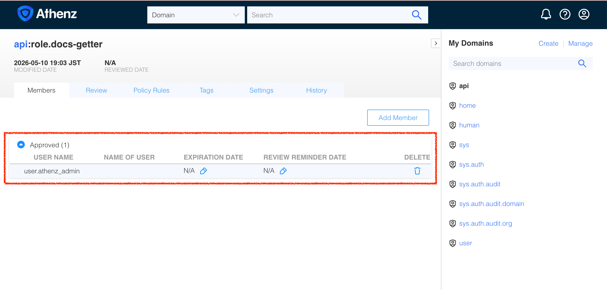
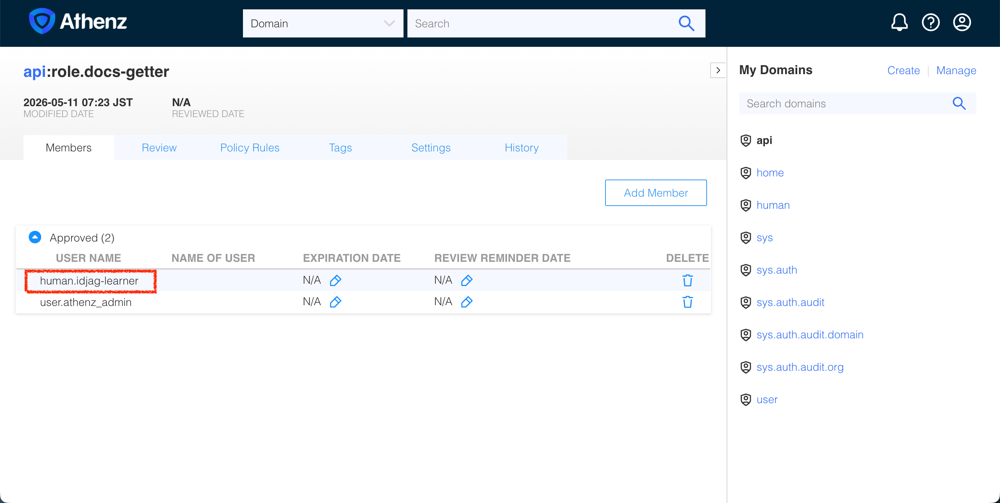
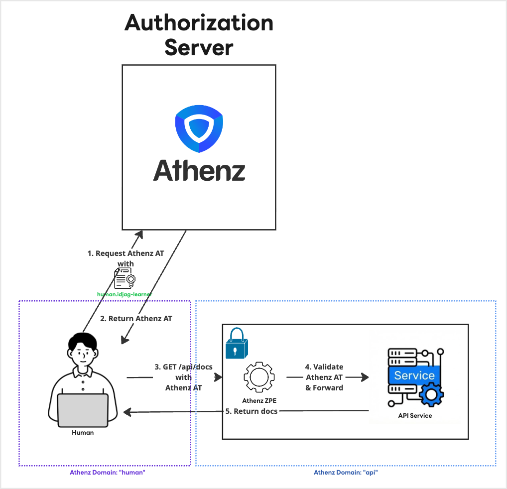

|                      Previous                      |         Current         |                       Next                       |
|:--------------------------------------------------:|:-----------------------:|:------------------------------------------------:|
| [Athenz Access Token](./07-athenz-access-token.md) | **Granular Permission** | [MCP Server for API](./09-mcp-server-for-api.md) |

# Granular Permission

In the previous tutorial, you used the admin certificate to mint an Access Token. In this tutorial, you will replace that admin credential with a dedicated learner identity and prove that it can only access what `api:role.docs-getter` allows with the following steps:

<!-- TOC depthFrom:2 depthTo:2 -->

- [Create a learner identity](#create-a-learner-identity)
- [Fetch an Access Token as the learner](#fetch-an-access-token-as-the-learner)
- [Troubleshoot missing role membership](#troubleshoot-missing-role-membership)
- [Grant the learner access to `docs-getter`](#grant-the-learner-access-to-docs-getter)
- [Fetch the Access Token again](#fetch-the-access-token-again)
- [Send request to the protected server](#send-request-to-the-protected-server)
- [Review Architecture](#review-architecture)

<!-- /TOC -->

<details>
<summary>Why does a dedicated identity matter?</summary>
<br>

Admin credentials can create domains, register services, and modify policies. Using them for routine API calls gives far more power than the request needs.

Instead, you will create a dedicated identity, `human.idjag-learner`, to represent you as the learner. Athenz evaluates access against a principal, so placing this principal into only the needed role gives it only the permissions attached to that role.

The token you fetch is also scoped to `api:role.docs-getter`. Even if the token is leaked, it can only call endpoints allowed by that role.

> [!NOTE]
> Athenz also supports UserCerts for real human users. This tutorial uses a service identity to keep the local setup focused on authorization flow rather than user certificate enrollment.
</details>

## Create a learner identity

You already used these identity and certificate helper scripts for ZPU. Run the same flow for a new learner identity, `human.idjag-learner`:

```sh
./tools/athenz/create-tld.sh "human"
./tools/athenz/create-private-key.sh "./keys/idjag-learner"
./tools/athenz/create-service.sh "human" "idjag-learner" "./keys/idjag-learner.public.key"
./tools/athenz/enable-cert-provider.sh "human" "idjag-learner"
./tools/athenz/fetch-cert.sh "human" "idjag-learner" "./keys/idjag-learner.key" "v1"
```

```sh
#   ·  Creating TLD: human...
#   ✔  TLD created: human
#   ·  Generating RSA key pair for: ./keys/idjag-learner...
#   ✔  Keys generated: ./keys/idjag-learner.key, ./keys/idjag-learner.public.key
#   ·  Registering Service: human.idjag-learner...
#   ✔  Service registered: human.idjag-learner
#   ·  Enabling ZTS Certificate Provider for human.idjag-learner...
# [Template(s) successfully applied to domain]
#   ✔  ZTS Certificate Provider enabled for human.idjag-learner
#   ·  Fetching X.509 Certificate for human.idjag-learner..
#   ·  Fetching X.509 Certificate for human.idjag-learner...
#   ✔  Certificate saved to: ./keys/idjag-learner.crt
```

The new `human` domain and `human.idjag-learner` service identity are represented below:



Open the service page to double-check the learner identity:

```sh
./tools/open.sh "http://localhost:$(./tools/port.sh athenz-ui)/domain/human/service"
```



## Fetch an Access Token as the learner

Now request the same `api:role.docs-getter` scope, but authenticate as `human.idjag-learner` instead of the admin user.

> [!WARNING]
> This command will fail. That is intentional.

```sh
_scope="api:role.docs-getter"
_my_access_token=$(./tools/athenz/fetch-access-token.sh \
  "./keys/idjag-learner.crt" \
  "./keys/idjag-learner.key" \
  "${_scope}" \
  "./keys/idjag-learner.jwt")
```

```sh
#   ·  Fetching Access Token for scope: api:role.docs-getter...
#   ✘  Failed to issue an access token. ZTS Response:
# {
#   "code": 403,
#   "message": "postaccesstokenrequest: principal human.idjag-learner is not included in the requested role(s) in domain api"
# }
#
# ✘ Token issuance failed for scope: api:role.docs-getter
```

## Troubleshoot missing role membership

The learner identity exists, but it is not a member of `api:role.docs-getter` yet. Athenz defaults to deny, so ZTS refuses to issue a token for that role.

Open the role members page to confirm:

```sh
./tools/open.sh "http://localhost:$(./tools/port.sh athenz-ui)/domain/api/role/docs-getter/members"
```



## Grant the learner access to `docs-getter`

Add `human.idjag-learner` to `api:role.docs-getter`:

```sh
./tools/athenz/add-role-member.sh "api" "docs-getter" "human.idjag-learner"
```

```sh
#   ·  Adding Member human.idjag-learner to Role: api:role.docs-getter...
#   ✔  human.idjag-learner  →  api:role.docs-getter
```

Open the role members page again:

```sh
./tools/open.sh "http://localhost:$(./tools/port.sh athenz-ui)/domain/api/role/docs-getter/members"
```



## Fetch the Access Token again

Now that the learner identity is a member of the role, request the token again:

```sh
_scope="api:role.docs-getter"
_my_access_token=$(./tools/athenz/fetch-access-token.sh \
  "./keys/idjag-learner.crt" \
  "./keys/idjag-learner.key" \
  "${_scope}" \
  "./keys/idjag-learner.jwt")
```

```sh
#   ·  Fetching Access Token for scope: api:role.docs-getter...
#   ✔  Access token issued for scope: api:role.docs-getter
# {
#   "kid": "athenz-zts-server-6966ff7f66-4j67d",
#   "typ": "at+jwt",
#   "alg": "RS256"
# }
# {
#   "sub": "human.idjag-learner",
#   "scp": [
#     "docs-getter"
#   ],
#   "ver": 1,
#   "iss": "athenz-zts-server-6966ff7f66-4j67d",
#   "client_id": "human.idjag-learner",
#   "aud": "api",
#   "uid": "human.idjag-learner",
#   "auth_time": 1778451929,
#   "scope": "docs-getter",
#   "cnf": {
#     "x5t#S256": "QUXJN5ALSWRR_fK5iHMwo0hnmlp01mcnyiNcd141o1E"
#   },
#   "exp": 1778455529,
#   "iat": 1778451929,
#   "jti": "cca1a64e-f309-47bd-94b9-3cef584663ef"
# }
```

## Send request to the protected server

Finally, send a request to the protected API server with the learner token:

```sh
curl -sS -k -H "Authorization: Bearer $_my_access_token" http://localhost:14443/api/docs | jq .
```

```sh
# {
#   "docs": [
#     {
#       "name": "first default doc",
#       "id": 1,
#       "content": "hello world"
#     },
#     {
#       "name": "second default doc",
#       "id": 2,
#       "content": "how are you?"
#     }
#   ]
# }
```

> [!TIP]
> If the request fails immediately after changing role membership, wait a few seconds and retry. ZPU and ZPE load policy changes on a short sync interval.

## Review Architecture

You successfully fetched an X.509 certificate for the non-admin service identity (`human.idjag-learner`) and exchanged it for an Athenz Access Token scoped specifically to `api:role.docs-getter`:



Next: [MCP Server for API](./09-mcp-server-for-api.md)
