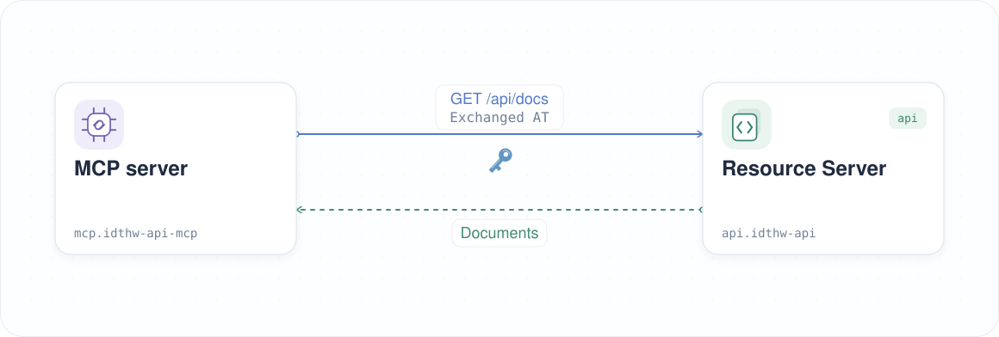

| Previous | Current | Next |
|:---:|:---:|:---:|
| [Granular Permission](./07-granular-permission.md) | **MCP Server for Resource Server** | [AI Agent](./09-ai-agent.md) |

# MCP Server for Resource Server

Deploy `idthw-demo-api-mcp`, connect to its MCP endpoint, and discover its document tools.

<!-- TOC depthFrom:2 depthTo:2 -->

- [Create the MCP Namespace](#create-the-mcp-namespace)
- [Deploy the MCP Server](#deploy-the-mcp-server)
- [Discover the Tools](#discover-the-tools)
- [Understand the Result](#understand-the-result)
- [Next Steps](#next-steps)

<!-- /TOC -->

## Create the MCP Namespace

Keep the MCP deployment in `mcp` and the resource server in `api`:

```sh
kubectl create ns mcp
```

```sh
# namespace/mcp created
```

## Deploy the MCP Server

Deploy the MCP server with its default configuration:

```sh
kubectl create deploy mcp -n mcp \
  --image=ghcr.io/mlajkim/idthw-demo-api-mcp:latest
```

```sh
# deployment.apps/mcp created
```

Expose the container's port `8080` through a Service on port `8081`:

```sh
kubectl expose deploy mcp -n mcp --port 8081 --target-port 8080 --name mcp
```

```sh
# service/mcp exposed
```

Wait for the MCP server to be ready:

```sh
kubectl rollout status deploy/mcp -n mcp
```

```sh
# deployment "mcp" successfully rolled out
```

Keep `./tools/keep-k8s-port-forward.sh` running in another terminal so you can reach the MCP Service locally.

## Discover the Tools

Initialize the stateless MCP connection:

```sh
_mcp_port=$(./tools/port.sh mcp)
curl -sS "http://localhost:${_mcp_port}/mcp" \
  -H 'Content-Type: application/json' \
  -H 'Accept: application/json, text/event-stream' \
  -d '{"jsonrpc":"2.0","id":1,"method":"initialize","params":{"protocolVersion":"2025-03-26","capabilities":{},"clientInfo":{"name":"tutorial","version":"1.0"}}}' | jq '.result.serverInfo'
```

```sh
# {
#   "name": "idthw-demo-api-mcp",
#   "title": "IDTHW Demo API MCP",
#   "version": "0.1.0"
# }
```

Notify the server that initialization is complete:

```sh
_mcp_port=$(./tools/port.sh mcp)
curl -sS "http://localhost:${_mcp_port}/mcp" \
  -H 'Content-Type: application/json' \
  -d '{"jsonrpc":"2.0","method":"notifications/initialized"}'
```

List the document tools:

```sh
_mcp_port=$(./tools/port.sh mcp)
curl -sS "http://localhost:${_mcp_port}/mcp" \
  -H 'Content-Type: application/json' \
  -d '{"jsonrpc":"2.0","id":2,"method":"tools/list"}' | jq '.result.tools[].name'
```

```sh
# "get_k8s_docs"
# "post_k8s_doc"
# "delete_k8s_doc"
```

Discovery is public. The API still requires a valid token when a tool requests documents.

## Understand the Result

The MCP server is running, initialization succeeds, and tool discovery returns `get_k8s_docs`, `post_k8s_doc`, and `delete_k8s_doc`. These operations work without an access token or Runtime Proxy.



Tool discovery does not call the API. The document tools use a supplied API access token to call the resource server, which continues enforcing tokens. The MCP server does not exchange tokens itself.

## Next Steps

The MCP server is ready and its tools are discoverable. In the next chapter, we will connect an AI client and verify that it can discover those tools.

Next: [AI Agent](./09-ai-agent.md)
