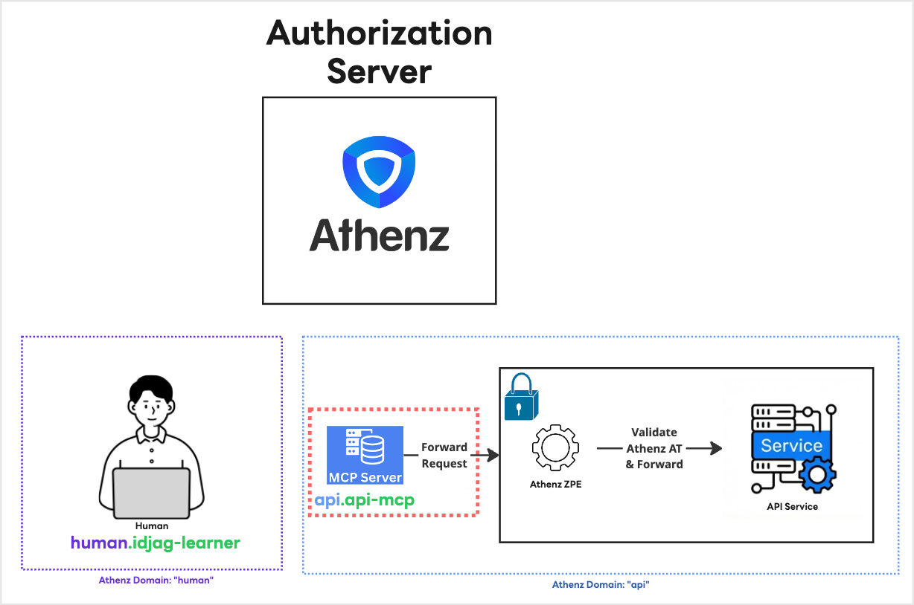

|                      Previous                      |        Current         |             Next             |
|:--------------------------------------------------:|:----------------------:|:----------------------------:|
| [Granular Permission](./08-granular-permission.md) | **MCP Server for API** | [AI Agent](./10-ai-agent.md) |

# MCP Server for API

In this tutorial, we will set up MCP Server for API so that our AI client agent that we will install in the next tutorial can interact with our protected API server for you.

<!-- TOC depthFrom:2 depthTo:2 -->

- [Run MCP Server for API](#run-mcp-server-for-api)
- [Create K8s Secret](#create-k8s-secret)
- [Mount Secret](#mount-secret)
- [What's done?](#whats-done)
- [What's next?](#whats-next)

<!-- /TOC -->

## Run MCP Server for API

### Service Cert for MCP Server

To run the MCP Server, just like we have given service identity for human user `human.idjag-learner` , we also need to give service identity for the MCP server. Because mcp server is part of the API server, we will simply create service `api-mcp` under the tld (domain) `api`.

Run the following:

```sh
./tools/athenz/create-private-key.sh "./keys/api-mcp"
./tools/athenz/create-service.sh "api" "api-mcp" "./keys/api-mcp.public.key"
./tools/athenz/enable-cert-provider.sh "api" "api-mcp"
```

## Create K8s Secret

Create a secret based on the generated certificates:

```sh
./tools/athenz/fetch-cert.sh "api" "api-mcp" "./keys/api-mcp.key" "v1"
kubectl -n api delete secret api-mcp-cert --ignore-not-found
kubectl -n api create secret generic api-mcp-cert \
  --from-file=api-mcp.crt=./keys/api-mcp.crt \
  --from-file=api-mcp.key=./keys/api-mcp.key \
  --from-file=ca.crt=./athenz_dist/certs/ca.cert.pem
```

```sh
# secret/api-mcp-cert created
```

### Run the MCP Server

```sh
kubectl create deploy mcp -n api \
  --image=ghcr.io/mlajkim/mcp:latest
```

Expose the deployment above:

```sh
kubectl expose deploy mcp -n api --port 8081 --name mcp
```


> [!NOTE]
> If you see the following error, the container is still starting up. Wait a few seconds and try again.
>
> ```
> Error from server (BadRequest): container "mcp" in pod is waiting to start: ContainerCreating
> ```

See the log:

```sh
kubectl logs deploy/mcp -n api
```

```sh
# ◇ injected env (0) from .env // tip: ⌘ enable debugging { debug: true }
# node:fs:560
#   return binding.open(
#                  ^

# Error: ENOENT: no such file or directory, open '/app/certs/api-mcp.crt'
# ...
```

## Mount Secret

```yaml
kubectl patch deploy mcp -n api --patch "$(cat <<'EOF'
spec:
  template:
    spec:
      containers:
        - name: mcp
          volumeMounts:
            - name: mcp-certs
              mountPath: /app/certs
              readOnly: true
      volumes:
        - name: mcp-certs
          secret:
            secretName: api-mcp-cert
EOF
)"
```

Verify:

```sh
kubectl logs deploy/mcp -n api
```

```sh
# ◇ injected env (0) from .env // tip: ⌘ multiple files { path: ['.env.local', '.env'] }
# 🚀 OpenAPI MCP Server for API listening on: http://mcp.api:8081
# 🌐 Upstream API: http://api-server.api:8080
# 📄 OpenAPI Spec available at: http://mcp.api:8081/openapi.json
# 🔌 MCP endpoint available at: http://mcp.api:8081/mcp
```

## What's done?

We have created a running MCP Server for API with service identity `api.mcp-api` highlighted in red below.



## What's next?

In next tutorial, we will do actual chat with local AI Agent and see how it interacts with our protected API server through the MCP Server we just created.

Next: [AI Agent](./10-ai-agent.md)
