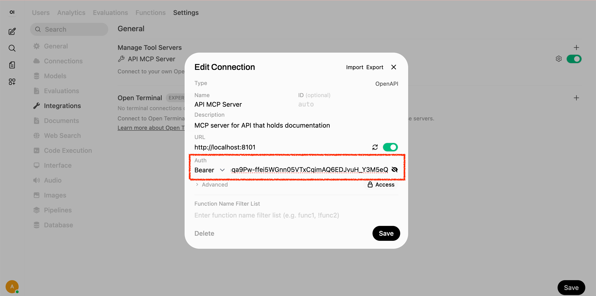
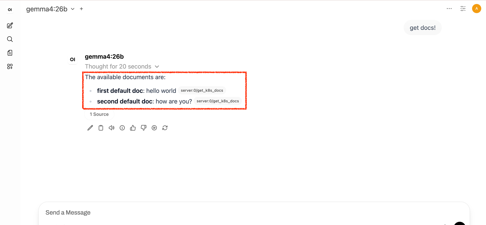
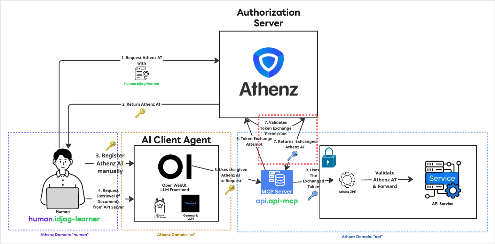

|                  Previous                  |      Current       |                              Next                              |
|:------------------------------------------:|:------------------:|:--------------------------------------------------------------:|
| [AI Client Agent](./08-ai-client-agent.md) | **Token Exchange** | [Protect MCP Server](./10-protect-mcp-server-with-keycloak.md) |

# Token Exchange

In this section, we will resolve the "Not Authorized for Token Impersonation" error from the previous step. This occurred because the MCP server attempted to exchange the Access Token it received from the AI client for a new one, but lacked the necessary permissions.

By implementing the OAuth 2.0 Token Exchange ([RFC 8693](https://www.rfc-editor.org/rfc/rfc8693.html)) mechanism, we will authorize the MCP server to exchange the user's Access Token and act on their behalf to access the API server.

## Allow MCP Server to Exchange the Given Access Token

Even if the original requester has `get` access to the `api:docs` resource, it doesn't mean just anyone can exchange the Access Token on their behalf. We must create a dedicated role specifically to allow token impersonation (exchange).

Let's add the role `api:role.docs-token-exchanger`. As the name implies, members of this role are authorized to exchange Access Tokens for the target scope `api:role.docs-getter`:

```sh
./create-role.sh "api" "docs-token-exchanger"
```

In Athenz, you must explicitly define both the **source** and **target** of the token exchange. Since the MCP server operates within the `api` domain, we can apply both policies as follows:

```sh
./add-policy.sh "api" "docs-token-exchanger" "zts.token_source_exchange" "api"
./add-policy.sh "api" "docs-token-exchanger" "zts.token_target_exchange" "api:role.docs-getter"
```

> [!NOTE]
> Note that the MCP server itself doesn't need direct access to the target resource; it only needs permission to perform the exchange.

Finally, add the member you want to authorize for the token exchange (in this case, the `api.api-mcp` service principal):

```sh
./add-role-member.sh "api" "docs-token-exchanger" "api.api-mcp"
```

## Verification

Fetch a fresh Athenz Access Token to ensure it hasn't expired:

```sh
_scope="api:role.docs-getter"
_my_access_token=$(./fetch-access-token.sh \
  "./keys/idjag-learner.crt" \
  "./keys/idjag-learner.key" \
  "${_scope}" \
  "./keys/api_docs-getter.jwt")

cat "./keys/api_docs-getter.jwt"
```

Navigate to `User Icon` > `Admin Panel` > `Settings` > `Integrations`, and click the configure icon for the API MCP Server.

Attach the access token exactly as we did previously:



Now, ask the AI Agent the exact same prompt that failed last time:

```
get docs!
```



## What's happened?

By introducing a specific role `docs-token-exchanger` that authorizes its members to perform token exchanges for a target scope, the MCP server can successfully exchange (Step 7 below) the provided Access Token for a new one, as illustrated below:



## What's next?

As shown in the architecture above, our API Server is now fully protected by Athenz Access Tokens. However, the MCP server itself remains unprotected, meaning anyone can access it. While the core API is secure, leaving the MCP server exposed is a bad security practice.

In the next section, we will implement an authentication layer for the MCP server to ensure only authenticated users can interact with it.

Next: [Protect MCP Server](./10-protect-mcp-server-with-keycloak.md)
