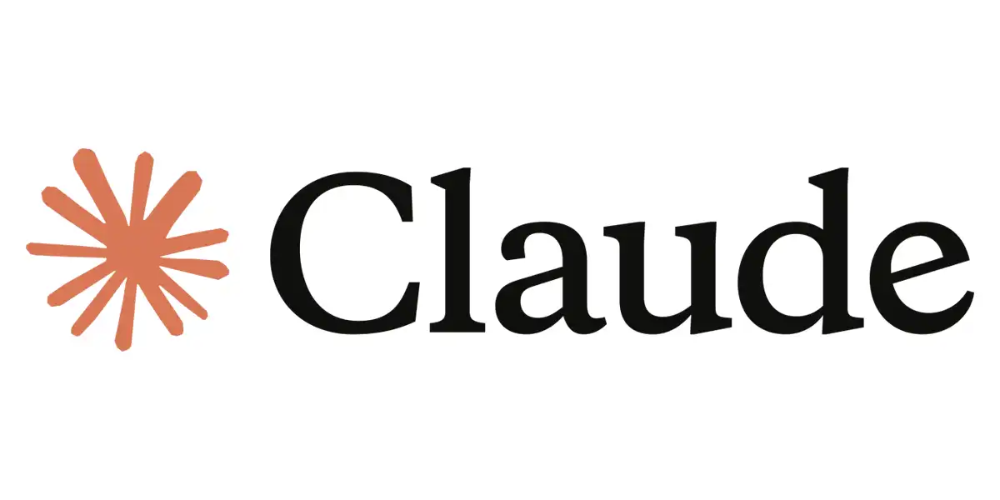
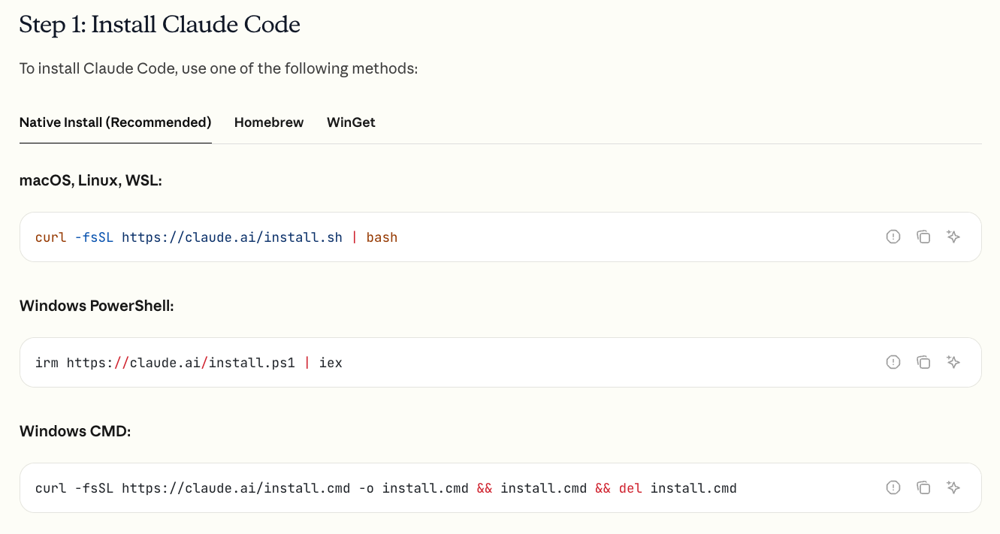
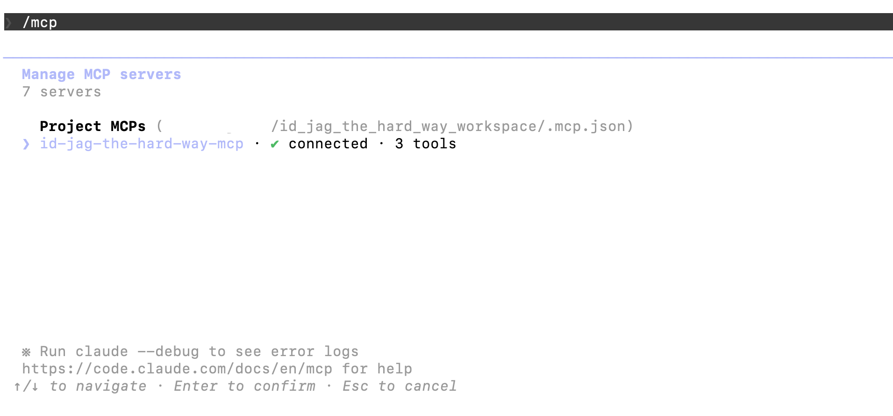
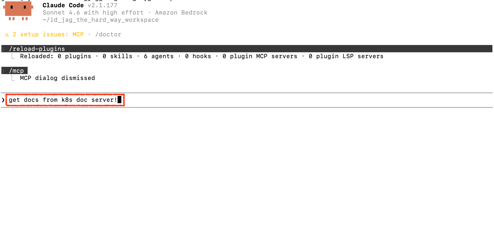
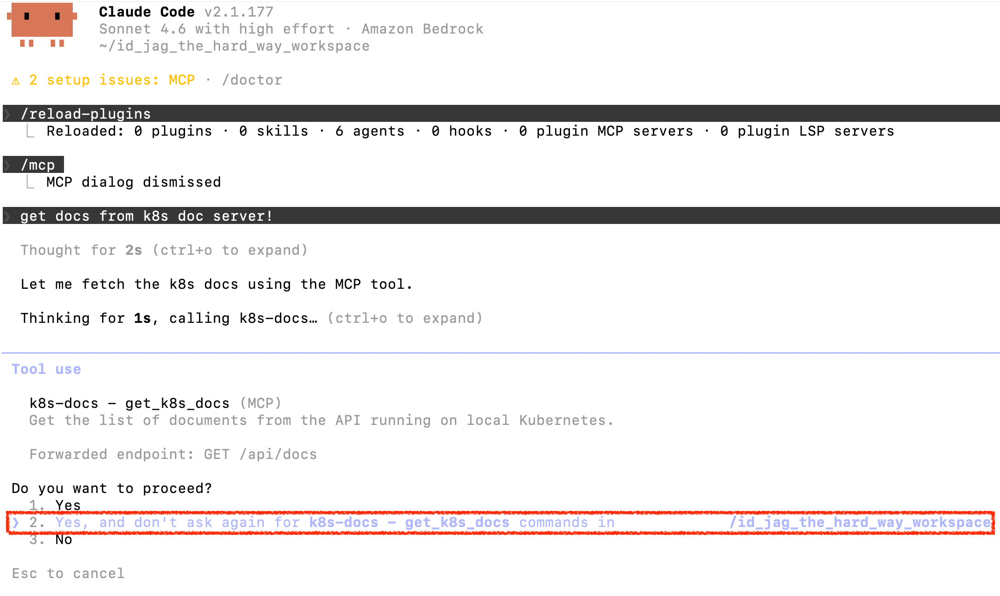
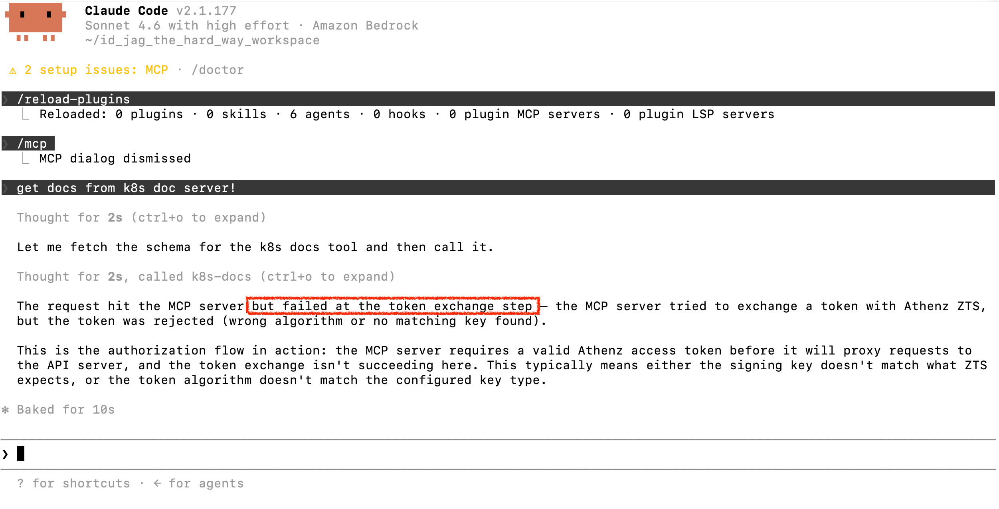

|                     Previous                     |   Current    |                   Next                   |
|:------------------------------------------------:|:------------:|:----------------------------------------:|
| [MCP Server for API](./09-mcp-server-for-api.md) | **AI Agent** | [Token Exchange](./11-token-exchange.md) |

# AI Agent: Claude



In this tutorial, we connect an AI agent to the MCP server for the first time. We will manually provide an Athenz Access Token as a Bearer header and see how far we get.

<!-- TOC depthFrom:2 depthTo:2 -->

- [Install Claude](#install-claude)
- [Add the MCP Server to Claude Code](#add-the-mcp-server-to-claude-code)
- [Login to Claude](#login-to-claude)
- [Connect to MCP Server](#connect-to-mcp-server)
- [Verify](#verify)
- [What's happened?](#whats-happened)

<!-- /TOC -->

> [!NOTE]
> `Claude Code` is the default client for this tutorial path. If you prefer a different client, see the alternatives:
> - [Codex](./codex/10-ai-agent.md)
> - [Open WebUI](./open_webui/10-ai-agent.md)


## Install Claude

Check if Claude is already installed:

```sh
claude --version
```

If you don't see a version (e.g. `X.X.XXX (Claude Code)`), install it:

macOS / Linux / WSL:

```sh
curl -fsSL https://claude.ai/install.sh | bash
```

Windows PowerShell:

```sh
irm https://claude.ai/install.ps1 | iex
```

Windows CMD:

```sh
curl -fsSL https://claude.ai/install.cmd -o install.cmd && install.cmd && del install.cmd
```

> [!NOTE]
> Official Claude installation guide: [Claude Code Quickstart](https://code.claude.com/docs/en/quickstart#native-install-recommended)
> 

## Add the MCP Server to Claude Code

Claude Code reads `.mcp.json` only on startup, so create this file before launching Claude.

Get the Access Token:

```sh
_scope="api:role.docs-getter"
_my_access_token=$(./tools/athenz/fetch-access-token.sh \
  "./keys/idjag-learner.crt" \
  "./keys/idjag-learner.key" \
  "${_scope}" \
  "./keys/idjag-learner.jwt")

cat "./keys/idjag-learner.jwt"
```

Create `.mcp.json` at the root of this project:

```sh
_mcp_port=$(./tools/port.sh mcp)
_at=$(cat ./keys/idjag-learner.jwt)

cat > .mcp.json <<EOF
{
  "mcpServers": {
    "id-jag-the-hard-way-mcp": {
      "type": "http",
      "url": "http://localhost:${_mcp_port}/mcp",
      "headers": {
        "Authorization": "Bearer ${_at}"
      }
    }
  }
}
EOF
```

Check the created `.mcp.json` file:

```sh
cat .mcp.json
```

```sh
# {
#   "mcpServers": {
#     "id-jag-the-hard-way-mcp": {
#       "type": "http",
#       "url": "http://localhost:<your_port>/mcp"
#     }
#   }
# }
```

## Login to Claude

Now start Claude — it will pick up `.mcp.json` automatically on launch:

```sh
claude
```

If it is your first time, choose `2. Anthropic Console account`. You can create an account or use **Continue with Google** for a faster sign-up.

## Connect to MCP Server

Run:

```sh
/mcp
```

You can see that you are `✅ Connected` for the `id-jag-the-hard-way-mcp`:



## Verify

Let's see if we can really talk through the `id-jag-the-hard-way-mcp` MCP.

Hit `Esc` one time to back to the prompt dialog:

```sh
get docs from k8s doc server!
```



You will be prompted `Do you want to proceed?`. select `2` (Or `1` if you want to get asked all the time):




This will intentionally fail — the request will return a `No Permission to Token Exchange` error, similar to:



This is expected. The MCP server received your Access Token and tried to exchange it for a narrower-scoped token to call the API server — but it does not yet have permission to do that.

## What's happened?

We successfully connected Claude Code to the MCP server with an Athenz Access Token. However, the MCP server's token exchange step is not yet authorized.

In the next tutorial we will fix this by granting the MCP server permission to exchange tokens.

Next: [Token Exchange](./11-token-exchange.md)
