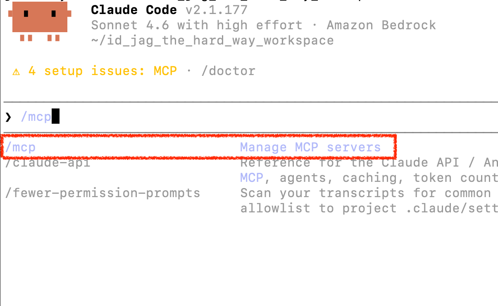
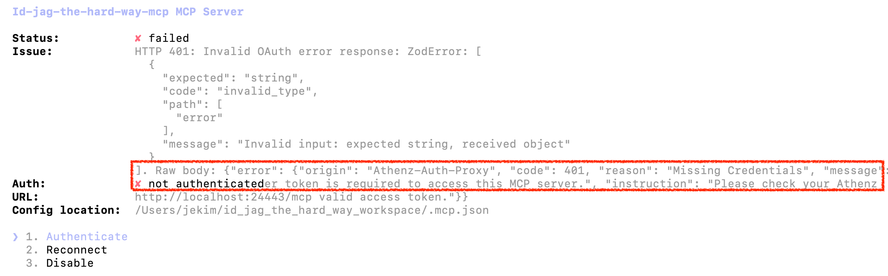
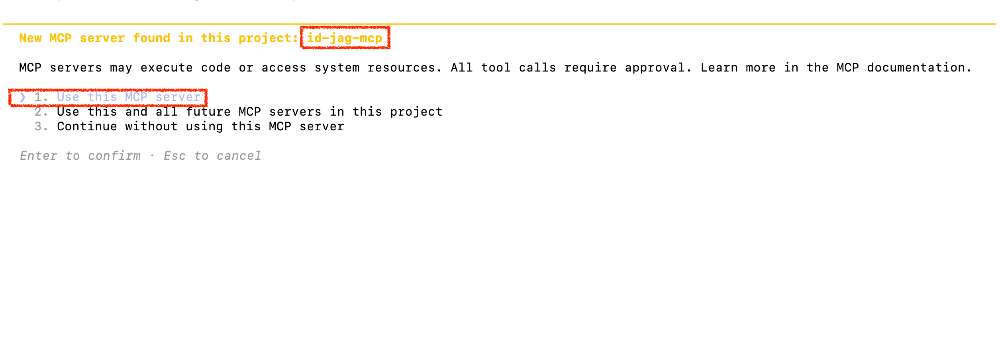

|                     Previous                     |   Current    |                  Next                  |
|:------------------------------------------------:|:------------:|:--------------------------------------:|
| [MCP Server for API](./09-mcp-server-for-api.md) | **AI Agent** | [Claude Code](./10-ai-client-agent.md) |

# AI Agent

In this tutorial, we connect an AI client to the MCP server for the first time, with the following:

<!-- TOC depthFrom:2 depthTo:2 -->

- [Install Calude](#install-calude)
- [Login into Claude](#login-into-claude)
- [Add the MCP Server to Claude Code](#add-the-mcp-server-to-claude-code)
- [Get Access Token & Attach](#get-access-token--attach)
- [Open Claude](#open-claude)
- [Authenticate](#authenticate)
- [Verify](#verify)
- [What's happened?](#whats-happened)

<!-- /TOC -->

> [!NOTE]
> `Claude CLI` is currently the default, but if you are interested in a different client, see the alternatives below.
>
> - Codex *Coming soon*
> - Gemini CLI *Coming soon*
> - [Open WebUI](./open_webui/10-ai-agent.md)

## Install Calude

> [!NOTE]
> Official claude installation guide is available at [Claude Code](https://code.claude.com/docs/en/quickstart#native-install-recommended).


Run the following command to see if Claude is installed:

```sh
claude --version
```

If you do not see a version output (i.e `2.1.177 (Claude Code)`), install the following:

macOS, Linux, WSL:

```sh
curl -fsSL https://claude.ai/install.sh | bash
```

Windows PowerShell:

```sh
irm https://claude.ai/install.ps1 | iex
```

Windows CMD:

```sh
curl -fsSL https://claude.ai/install.cmd -o install.cmd && install.cmd && del install.cmd
```

## Login into Claude

You can do whatever option but if it is your first time, Choose the `2. Anthropic Console account`

You can create an account, or simply use `Continue with Google` for quicker sign up.


## Add the MCP Server to Claude Code

Create a `.mcp.json` at the root of this project:

```sh
_mcp_port=$(./tools/port.sh mcp)

cat > .mcp.json <<EOF
{
  "mcpServers": {
    "id-jag-the-hard-way-mcp": {
      "type": "http",
      "url": "http://localhost:${_mcp_port}/mcp"
    }
  }
}
EOF
```

Search `/mcp`



You will see no permission found:



## Get Access Token & Attach

Get Access Token again:

```sh
_scope="api:role.docs-getter"
_root_user_at=$(./tools/athenz/fetch-access-token.sh \
  "./athenz_dist/certs/athenz_admin.cert.pem" \
  "./athenz_dist/keys/athenz_admin.private.pem" \
  "${_scope}" \
  "./keys/api_docs-getter.jwt")

cat "./keys/api_docs-getter.jwt"
```

Then register with the access token:

```sh
_mcp_port=$(./tools/port.sh mcp)

cat > .mcp.json <<EOF
{
  "mcpServers": {
    "id-jag-the-hard-way-mcp": {
      "type": "http",
      "url": "http://localhost:${_mcp_port}/mcp",
      "headers": {
        "Authorization": "Bearer $(cat ./keys/api_docs-getter.jwt)"
      }
    }
  }
}
EOF
```

Run the `/...` to reload the setting with headers:


## Open Claude

```sh
claude
```



## Authenticate

Start (or restart) Claude Code in this directory. It will attempt to connect to the MCP server, receive a `401`, discover the OAuth2 metadata endpoint, and automatically open your browser to Keycloak.

Sign in as `idjag-learner` (the user created in Tutorial 13). After login, Keycloak redirects to the gateway's `/oauth/callback`, which stores your ID token in a server-side session and sends an authorization code back to Claude Code. Claude Code exchanges it for a bearer token and is ready.

You only need to do this once per session. The session stays valid until your Keycloak ID token expires.

## Verify

Ask Claude Code:

```
get docs!
```

It should call the `get_api_docs` tool and return the document list. Check the gateway logs to see the ID-JAG chain:

```sh
kubectl logs deploy/ai-client-gateway -n human -f
```

```
[Athenz ID-JAG] 🔑 Resolved ID token from bearer session (Claude Code path)
[Athenz ID-JAG] 🔄 Attempting to exchange new ID-JAG with id-token for scope [api:role.mcp-accessor api:role.docs-getter] ...
[Athenz ID-JAG] 💾 Successfully exchanged and cached ID-JAG for scope [...]
[Athenz AT] Fetching Athenz Access Token using ID-JAG ...
[Athenz AT] 🔑 Successfully fetched Athenz Access Token.
```

## What's happened?

Claude Code drove the exact same authorization chain as Open WebUI. The only differences are where the identity token comes from (OAuth2 bearer session vs. cookie) and which Athenz service identity signs the exchange (`human.claude-cli` vs. `ai.open-webui`).

The human identity of `idjag-learner` is preserved at every hop. Each component held only the minimum permissions it needed — least privilege all the way through.

Next: [Token Exchange](./11-token-exchange.md)
