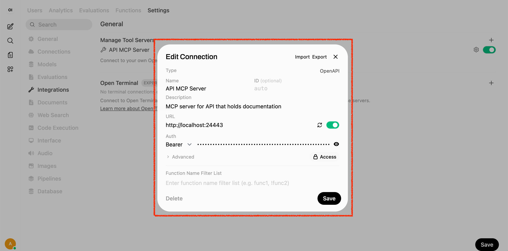
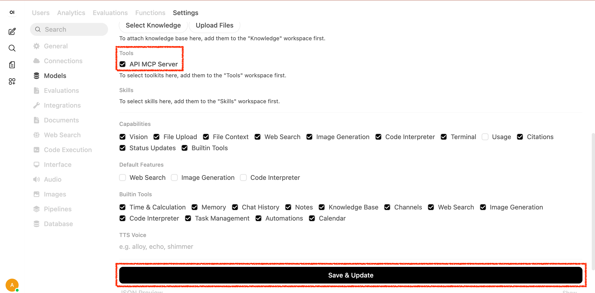
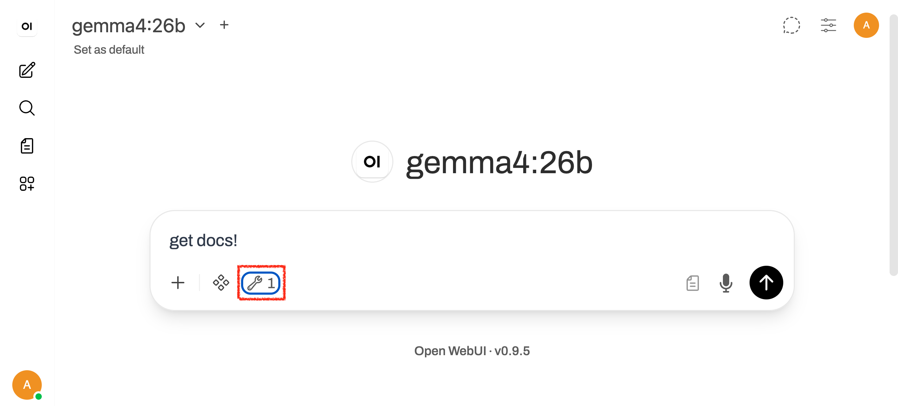
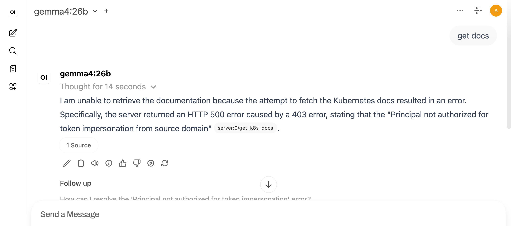
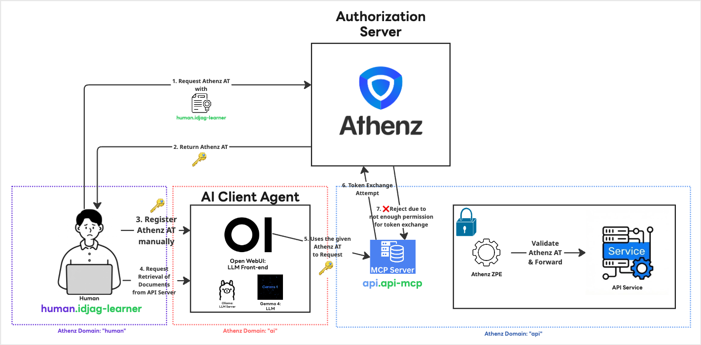

|                     Previous                     |       Current       |                   Next                   |
|:------------------------------------------------:|:-------------------:|:----------------------------------------:|
| [MCP Server for API](./09-mcp-server-for-api.md) | **AI Client Agent** | [Token Exchange](./11-token-exchange.md) |

# AI Client Agent

In this tutorial, we will install the AI Client Agent for the first time and talk to the API server through it.

<!-- TOC depthFrom:2 depthTo:2 -->

- [Install Ollama](#install-ollama)
- [Install Gemma 4 with Ollama](#install-gemma-4-with-ollama)
- [Install Open WebUI](#install-open-webui)
- [Open Open WebUI](#open-open-webui)
- [Register MCP Server as a Tool Server in Open WebUI](#register-mcp-server-as-a-tool-server-in-open-webui)
- [Verify](#verify)
- [What's happened?](#whats-happened)

<!-- /TOC -->

## Install Ollama

> [!NOTE]
> Ollama is installed locally

Ollama is one of the easiest ways to install an open LLM locally and interact with it.

Simply run the following command:

```sh
curl -fsSL https://ollama.com/install.sh | sh
```

```sh
# Starting Ollama...
# >>> Downloading Ollama for macOS...
# ######################################################################## 100.0%
# >>> Installing Ollama to /Applications...
# >>> Adding 'ollama' command to PATH (may require password)...
# Password:
# >>> Starting Ollama...
# >>> Install complete. You can now run 'ollama'.
```

> [!NOTE]
> For the SSOT install method, visit: https://ollama.com/

## Install Gemma 4 with Ollama

> [!NOTE]
> Learn about the specs for the Gemma 4 model [here](https://ai.google.dev/gemma/docs/core?_gl=1*57y72w*_up*MQ..*_ga*MTM5MjUyNzM5NC4xNzc4NDU1OTc0*_ga_P1DBVKWT6V*czE3Nzg0NTU5NzQkbzEkZzAkdDE3Nzg0NTU5NzQkajYwJGwwJGgxMjMzODIwOTA0#gemma-4-inference-memory-requirements) 

In this tutorial, we will use Gemma 4's `gemma4:e4b` as our AI model:

```sh
ollama pull gemma4:e4b
```

## Install Open WebUI

Instead of using Ollama's native UI, we will use Open WebUI for a more feature-rich experience. Open WebUI requires a specific Python version and some system dependencies. At the time of writing, the official documentation states that Open WebUI runs on Python 3.11 or lower.


### Create namespace for webui

First, create the `ai` namespace:

```sh
kubectl create ns ai
```

### Deploy Open WebUI in K8s

> [!NOTE]
> Open WebUI is smart enough to find the ollama running in your local machine, despite Open WebUI is runnning on K8s

Deploy Open WebUI:

> [!NOTE]
> If you are using kind, pre-loading the image can speed things up significantly:
>
> ```sh
> docker pull ghcr.io/open-webui/open-webui:main
> kind load docker-image ghcr.io/open-webui/open-webui:main
> ```

```sh
kubectl create deploy open-webui -n ai \
  --image=ghcr.io/open-webui/open-webui:main
```

Expose the deployment:

```sh
kubectl expose deploy open-webui -n ai --port 8080 --name open-webui
```

### Deploy pvc for the Open WebUI

First, create a very simple `pvc`:

```sh
cat <<EOF | kubectl apply -f -
apiVersion: v1
kind: PersistentVolumeClaim
metadata:
  name: open-webui-data-pvc
  namespace: ai
spec:
  accessModes: [ "ReadWriteOnce" ]
  resources:
    requests:
      storage: 1Gi
EOF
```

Mount the volume we just created:

```sh
kubectl patch deploy open-webui -n ai --patch "$(cat <<'EOF'
spec:
  template:
    spec:
      containers:
        - name: open-webui
          volumeMounts:
            - name: open-webui-data
              mountPath: /app/backend/data
      volumes:
        - name: open-webui-data
          persistentVolumeClaim:
            claimName: open-webui-data-pvc
EOF
)"
```

## Open Open WebUI

> [!NOTE]
> It may take 3–5 minutes for Open WebUI to be fully available due to its size (1~2 gbs)
>
> You may also see errors like `Error from server (NotFound): namespaces "idp" not found` or `unable to forward port because pod is not running` in the port-forward terminal — these are expected at this stage and can be ignored.

Open up the url (make sure you are running `keep-k8s-port-forward.sh`):

```sh
_open_webui_port=54443
open http://localhost:$_open_webui_port
```

You will be prompted to create an admin account as the first user. You can simply use:

- `admin@admin.com`
- `admin`

However, the credentials are up to you.


## Register MCP Server as a Tool Server in Open WebUI

Get Access Token again:

```sh
_scope="api:role.docs-getter"
_root_user_at=$(./my_tools/fetch-access-token.sh \
  "./athenz_dist/certs/athenz_admin.cert.pem" \
  "./athenz_dist/keys/athenz_admin.private.pem" \
  "${_scope}" \
  "./keys/api_docs-getter.jwt")

cat "./keys/api_docs-getter.jwt"
```

Go to `User Icon` > `Admin Panel` > `Settings` > `Integrations` > `Manage Tool Servers` > `+ Icon` to register the MCP server as a tool server.

- Name: `API MCP Server`
- Description: `MCP server for API that holds documentation`
- URL: `http://mcp.api:8081`
- Auth type: `Bearer`
- API Key: `<YOUR_ACCESS_TOKEN_THAT_YOU'VE_FETCHED`
- Access: Change to `Public`



Before we ask the AI Agent, let's quickly add the tool as the default tool server, so that you do not have to manually add the tool every time.

Go to `User Icon` > `Admin Panel` > `Settings` > `Models`,

Select the edit (Pencil) Icon.

Select `Access` > `Private` then change to `Public` (auotmatic save):


Then in `tools` section, select the tool that we just created as the following:




## Verify

Follow the steps below to verify the setup.

> [!NOTE]
> Make sure that the tool we just created is selected
> 

Finally, ask the AI Agent the following (It is expected to fail):

```
get docs!
```



## What's happened?



We were able to successfully install the AI Client Agent, using:

- Open WebUI as an LLM Front-end (for human interaction)
- Ollama as a Local LLM Provider
- Gemma 4's `gemma4:26b` as an LLM model

We manually passed the Access Token, which has permission to access the API server. However, it fails due to the default behavior of the MCP, which attempts to exchange the given Access Token into another token. This is an expected failure however. We will fix it in the next section.

Next: [Token Exchange](./11-token-exchange.md)
