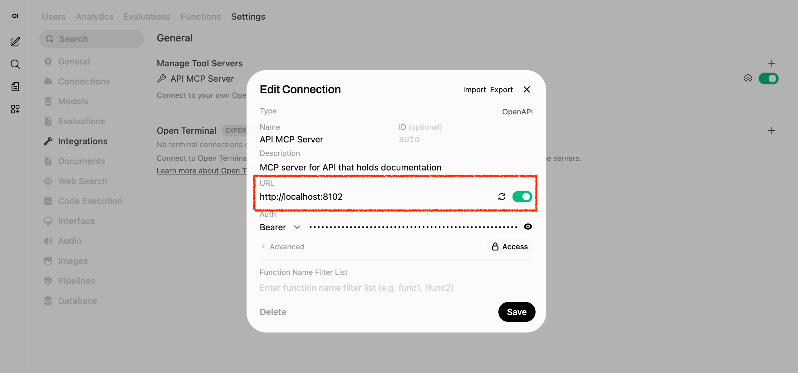
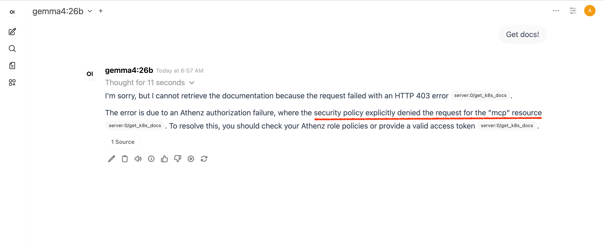
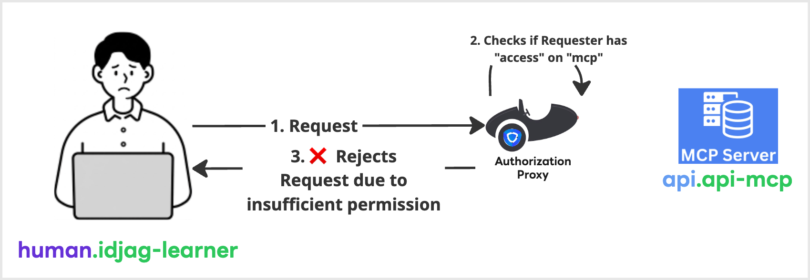
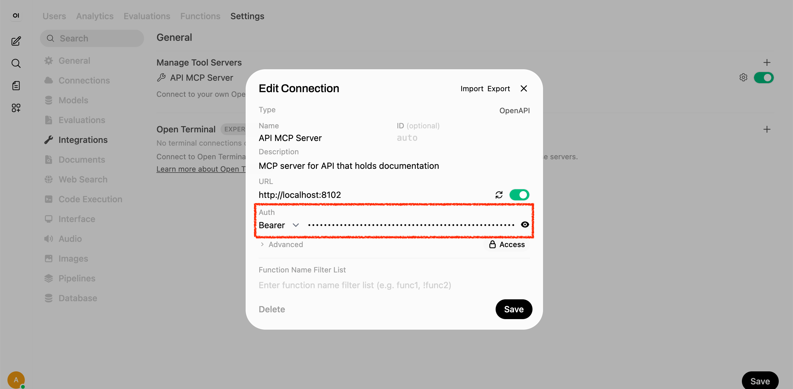
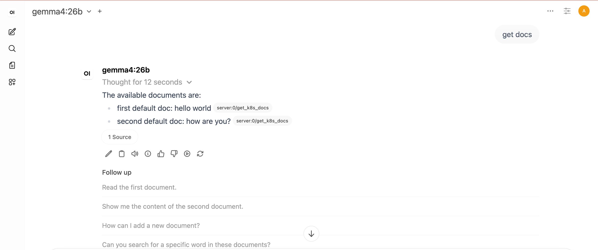
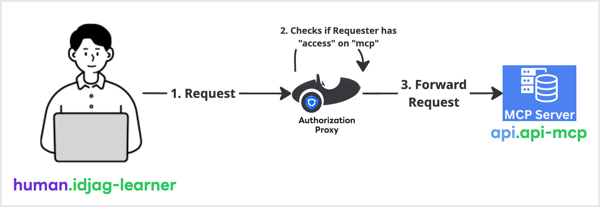
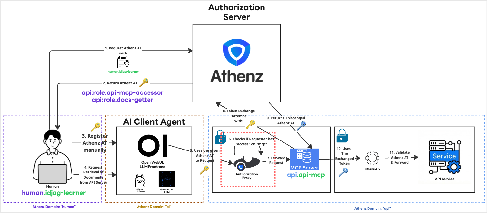

|                 Previous                 |        Current         |                      Next                      |
|:----------------------------------------:|:----------------------:|:----------------------------------------------:|
| [Token Exchange](./09-token-exchange.md) | **Protect MCP Server** | [Identity Provider](./11-identity-provider.md) |

# Protect MCP Server

In this tutorial, we will secure the MCP server using an Authorization Server (Athenz), just as we did with the API Server.

## Run Authorization Proxy for API MCP

The cloned API project includes an authorization proxy server for the API MCP. To start the server, execute the following command:

```bash
export _authorization_proxy_port=8102
export _authorization_proxy_target_port=8101

make -C api_server mcp-proxy-local \
  PROXY_PORT=$_authorization_proxy_port \
  TARGET_PORT=$_authorization_proxy_target_port \
  PROXY_AT_REQUIRED=true
```

## Update the MCP Target Port to Proxy

Navigate to `User Icon` > `Admin Panel` > `Settings` > `Integrations`, and click the configuration icon for the API MCP Server.

Change the MCP Server's target URL to `http://localhost:8102` so that traffic routes through the new Authorization Proxy.



## Verify

Follow the steps below to verify the setup.

Now, let's test if the new authorization proxy forwards our request to the original MCP Server. (Spoiler: This request is expected to fail)

```
get docs!
```

It will fail with an error similar to the following:



This happens because the Authorization Proxy server we just configured requires the `access` action on the `api:mcp` resource, which we haven't granted yet. This permission check is illustrated in the architecture diagram below:



## Fix Insufficient Permission

To authorize access to the authorization server, our identity service (`human.idjag-learner`) must have the following permissions:

- resource: `mcp` on domain `api`
- action: `access`

Since we haven't prepared any roles or policies yet, let's create an explicit role named `mcp-accessor` and attach an access policy for the `mcp` resource.

```sh
./my_tools/create-role.sh "api" "mcp-accessor"
```

Next, attach the policy to the role:

```sh
./my_tools/add-policy.sh "api" "mcp-accessor" "access" "mcp"
```

Finally, add you `human.idjag-learner` principal to the role:

```sh
./my_tools/add-role-member.sh "api" "mcp-accessor" "human.idjag-learner"
```

## Fetch a New Access Token for the New Role

Now, let's generate a new Access Token containing both scopes (space-separated values):

- `api:role.mcp-accessor`: to access the MCP Authorization Server
- `api:role.docs-getter`: to access `get /docs` endpoint

```sh
_scope="api:role.mcp-accessor api:role.docs-getter"
_my_access_token=$(./my_tools/fetch-access-token.sh \
  "./keys/idjag-learner.crt" \
  "./keys/idjag-learner.key" \
  "${_scope}" \
  "./keys/api_mcp-accessor_api_docs-getter.jwt")

cat "./keys/api_mcp-accessor_api_docs-getter.jwt"
```

Note that the scope now includes both roles. This is because we need an Access Token that passes both authorization layer:

- Able to call `GET /api/docs` (Or `get` on `api:docs`)
- Able to access MCP Server (Or `access` on `api:mcp`)

Check your access token with `scp` including both scopes:

```json
"scp": [
  "docs-getter",
  "mcp-accessor"
],
...
```

## Attach the Access Token & Configure the New Authorization Server

Navigate to `User Icon` > `Admin Panel` > `Settings` > `Integrations`, and click the configure icon for the API MCP Server.

Make the following change:

1. Attach the access token exactly as we did previously.
2. Set the MCP Authorization Server URL to `http://localhost:8102`.



## Verify

Follow the steps below to verify the setup.

Now, test the AI Agent with the exact same prompt that failed previously:

```
get docs!
```

And we successfully get the docs from the API MCP Server!



The permission check is illustrated in the architecture diagram below:



## Review Summary of Changes

First, we deployed the Authorization Proxy Server (indicated by the red dotted box), which checks for `access` to the `api:mcp` resource. To grant this access, we created a new `mcp-accessor` role under the `api` domain and attached a policy matching the authorization server's requirements. As a result, the MCP server can only be accessed by an authenticated user holding an access token with the `mcp-accessor` scope—a key application of the Principle of Least Privilege.



## What's next?

Up until now, we have been logging into the AI Client Agent using an admin account. In an enterprise environment, individual employees are assigned separate accounts to maintain control and security over the AI Client Agent—sharing the admin account is out of the question. In the next tutorial, we will deploy [Keycloak](https://www.keycloak.org/) as an Identity Provider (IdP) for our AI Client Agent, enabling users to sign in with non-admin (standard) accounts.

Next: [Identity Provider](./11-identity-provider.md)
