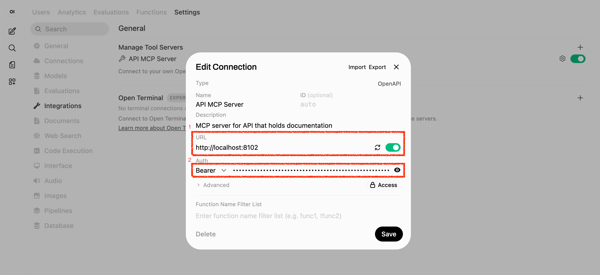
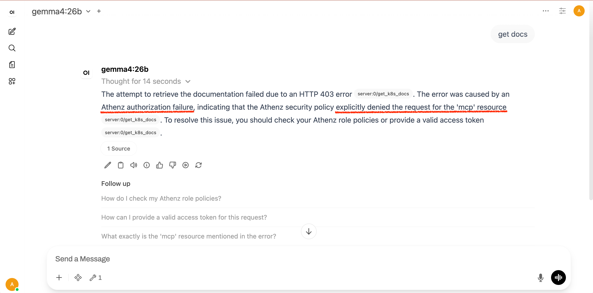

|                 Previous                 |        Current         |                                  Next                                  |
|:----------------------------------------:|:----------------------:|:----------------------------------------------------------------------:|
| [Token Exchange](./09-token-exchange.md) | **Protect MCP Server** | [Keycloak as Identity Provider](./11-keycloak-as-identity-provider.md) |

# Protect MCP Server

🟡 TODO: AI Rephrase

In this tutorial, we will protect the MCP server with Athenz Access Token, just like we did with the API Server.

## Run Authorization Proxy for API MCP

The cloned API project does include the authorization proxy server for the API MCP. To run the server, you can execute the following command:

```bash
export _authorization_proxy_port=8102
export _authorization_proxy_target_port=8101

make -C oss_sample_java_api_server mcp-proxy-local \
  PROXY_PORT=$_authorization_proxy_port \
  TARGET_PORT=$_authorization_proxy_target_port \
  PROXY_AT_REQUIRED=true
```

## Change the MCP Target Port to Proxy

To get authorized to `access` the authrozation server, our identtiy service `human.idjag-learner` is required to have the following permission:

- resource: `mcp` on domain `api`
- action: `access`

And since we do not have any roles or policies prepared, let's create an explicit role `mcp-accessor` and attach a policy `access` on `mcp` resource.


```sh
./create-role.sh "api" "mcp-accessor"
```

Attach a policy to the role:

```sh
./add-policy.sh "api" "mcp-accessor" "access" "mcp"
```

Finally add the member:

```sh
./add-role-member.sh "api" "mcp-accessor" "human.idjag-learner"
```

## Fetch New Access Token against the new Role

Let's create a new Access Token with both scope (space separated values):

- `api:role.mcp-accessor`: to access the MCP Authorization Server
- `api:role.docs-getter`: to access `get /docs` endpoint

```sh
_scope="api:role.mcp-accessor api:role.docs-getter"
_my_access_token=$(./fetch-access-token.sh \
  "./keys/idjag-learner.crt" \
  "./keys/idjag-learner.key" \
  "${_scope}" \
  "./keys/api_mcp-accessor_api_docs-getter.jwt")

cat "./keys/api_mcp-accessor_api_docs-getter.jwt"
```

Note that the scope now includes both roles:

```json
"scp": [
  "docs-getter",
  "mcp-accessor"
],
// ...
```

## Attach Acccess Token & Set new Authorization Server as Tool Server

Navigate to `User Icon` > `Admin Panel` > `Settings` > `Integrations`, and click the configure icon for the API MCP Server.

Make the following change:

1. Attach the access token exactly as we did previously.
2. Set the MCP Authorization Server URL to `http://localhost:8102`.



## Verification

Now, ask the AI Agent the exact same prompt that failed last time:

```
get docs!
```


## What happens if no permission against the MCP?

This is what happens when you do not have permission to access the MCP:



## What's done?

We first deployed the Authorization Proxy Server in red dotted box which requires `acccess` on `api:mcp`. To pass the access, we have created a new role `mcp-accessor` under the domain `api`. And attach a policy that matches the MCP Authrozation Server requirefnent, so that the MCP server can be accessed only by the authenticated user with the access token that contains the `mcp-accessor` scope, which is important in the Principal of Least Privilege.


## What's next?

So far we have logged in as admin account to the AI Client Agent. In enterprise, we obviosusly assign separate account for each employee of the enterprise. To manipulate this & able to control users of the AI Client agent, we do noot of course share the admin account. In next tutorial we will deploy Keycloak as Identity provider for our AI Client Agent & able to sign in as non-admin (normal) user.

Next: [Keyclaok as Identity Provider](./11-keycloak-as-identity-provider.md)
