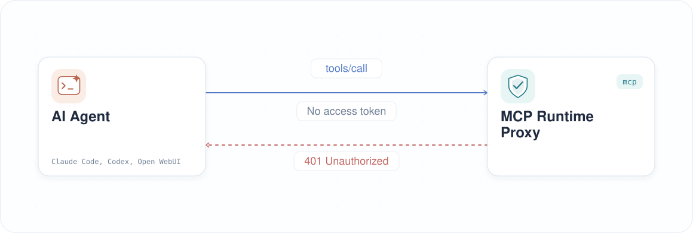

| Previous | Current | Next |
|:---:|:---:|:---:|
| [AI Agent](./09-ai-agent.md) | **Protect MCP Server** | [Token Exchange](./11-token-exchange.md) |

# Protect MCP Server

The document request worked in chapters 08–09 using an API token. Add MCP Runtime Proxy, require a token addressed to MCP, and observe two separate failures: rejected MCP access, then denied downstream token exchange.

<!-- TOC depthFrom:2 depthTo:2 -->

- [Create the MCP Service Identity](#create-the-mcp-service-identity)
- [Create a Kubernetes Secret](#create-a-kubernetes-secret)
- [Deploy MCP Runtime Proxy](#deploy-mcp-runtime-proxy)
- [Verify MCP Access Is Rejected](#verify-mcp-access-is-rejected)
- [Grant the Learner MCP Access](#grant-the-learner-mcp-access)
- [Verify Token Exchange Is Denied](#verify-token-exchange-is-denied)
- [Understand the Result](#understand-the-result)
- [Next Steps](#next-steps)

<!-- /TOC -->


## Create the MCP Service Identity

MCP Runtime Proxy needs a service identity to authenticate downstream token exchange requests to ZTS. The MCP application itself will not mount the private key. Create the service `idthw-api-mcp` under the Athenz top-level domain (TLD) `mcp`. Its principal is `mcp.idthw-api-mcp`; the API keeps the `api` domain. Athenz domains and Kubernetes namespaces are independent, even when both are named `mcp`.

Run the following:

```sh
./tools/athenz/create-tld.sh "mcp"
./tools/athenz/create-private-key.sh "./keys/api-mcp"
./tools/athenz/create-service.sh "mcp" "idthw-api-mcp" "./keys/api-mcp.public.key"
./tools/athenz/enable-cert-provider.sh "mcp" "idthw-api-mcp"
./tools/athenz/fetch-cert.sh "mcp" "idthw-api-mcp" "./keys/api-mcp.key" "v1"
```

```sh
#   ·  Generating RSA key pair for: ./keys/api-mcp...
#   ✔  Keys generated: ./keys/api-mcp.key, ./keys/api-mcp.public.key
#   ·  Registering Service: mcp.idthw-api-mcp...
#   ✔  Service registered: mcp.idthw-api-mcp
#   ·  Enabling ZTS Certificate Provider for mcp.idthw-api-mcp...
# [Template(s) successfully applied to domain]
#   ✔  ZTS Certificate Provider enabled for mcp.idthw-api-mcp
#   ·  Fetching X.509 Certificate for mcp.idthw-api-mcp...
#   ✔  Certificate saved to: ./keys/api-mcp.crt
```

<a id="create-k8s-secret"></a>

## Create a Kubernetes Secret

Create the secret in the `mcp` namespace so the MCP deployment can mount it:

```sh
kubectl -n mcp create secret generic api-mcp-cert \
  --from-file=api-mcp.crt=./keys/api-mcp.crt \
  --from-file=api-mcp.key=./keys/api-mcp.key \
  --from-file=ca.crt=./athenz_dist/certs/ca.cert.pem
```

```sh
# secret/api-mcp-cert created
```

## Deploy MCP Runtime Proxy

Switch MCP to `token-file` mode and bind it to loopback inside the pod. Only Runtime Proxy will listen on the pod's network interface. Mount the service identity only in the proxy, and share an in-memory token directory with the MCP container as read-only.

```sh
kubectl patch deploy mcp -n mcp --patch "$(cat <<'EOF'
spec:
  template:
    spec:
      securityContext:
        fsGroup: 1000
      containers:
        - name: idthw-demo-api-mcp
          env:
            - name: MCP_ACCESS_TOKEN_MODE
              value: "token-file"
            - name: HOST
              value: "127.0.0.1"
          volumeMounts:
            - name: access-tokens
              mountPath: /var/run/idthw-access-tokens
              readOnly: true
        - name: auth-proxy
          image: ghcr.io/mlajkim/mcp-runtime-proxy:latest
          imagePullPolicy: Always
          env:
            - name: MCP_TARGET_URL
              value: "http://127.0.0.1:8080"
            - name: ATHENZ_EXPECTED_AUDIENCE
              value: "mcp"
            - name: ATHENZ_REQUIRED_SCOPE
              value: "mcp:role.mcp-accessor"
            - name: MCP_PUBLIC_OPENAPI_ENABLED
              value: "true"
            - name: ATHENZ_TOKEN_FILE_EXCHANGE_ENABLED
              value: "true"
            - name: ATHENZ_TOKEN_EXCHANGE_CERT_PATH
              value: "/var/run/athenz/api-mcp.crt"
            - name: ATHENZ_TOKEN_EXCHANGE_KEY_PATH
              value: "/var/run/athenz/api-mcp.key"
            - name: MCP_TOOL_SCOPES
              value: '{"get_k8s_docs":"api:role.docs-getter","post_k8s_doc":"api:role.docs-poster","delete_k8s_doc":"api:role.docs-deleter"}'
          ports:
            - containerPort: 8082
          readinessProbe:
            httpGet:
              path: /readyz
              port: 8082
          livenessProbe:
            httpGet:
              path: /healthz
              port: 8082
          volumeMounts:
            - name: mcp-identity
              mountPath: /var/run/athenz
              readOnly: true
            - name: access-tokens
              mountPath: /var/run/idthw-access-tokens
      volumes:
        - name: mcp-identity
          secret:
            secretName: api-mcp-cert
        - name: access-tokens
          emptyDir:
            medium: Memory
EOF
)"
kubectl rollout status deploy/mcp -n mcp
kubectl patch svc mcp -n mcp --patch '{"spec":{"ports":[{"port":8081,"targetPort":8082}]}}'
```

```sh
# deployment.apps/mcp patched
# deployment "mcp" successfully rolled out
# service/mcp patched
```

The Service remains on `8081`, now targeting Runtime Proxy on `8082`. Restart `./tools/keep-k8s-port-forward.sh` after this change so the local connection targets the proxy.

The proxy trusts ZTS using `ca.crt` from the same Secret. It validates signature, expiry, audience `mcp`, and `mcp:role.mcp-accessor`. `MCP_TOOL_SCOPES` selects the downstream scope from the called tool; the verified token must also grant that scope.

Initialization and tool discovery remain public, so the readiness probe succeeds even while protected calls are denied.

## Verify MCP Access Is Rejected

Repeat a tool call without a token:

```sh
_mcp_port=$(./tools/port.sh mcp)
curl -sS -w '\nHTTP %{http_code}\n' "http://localhost:${_mcp_port}/mcp" \
  -H 'Content-Type: application/json' \
  -d '{"jsonrpc":"2.0","id":1,"method":"tools/call","params":{"name":"get_k8s_docs","arguments":{}}}'
# {"error":"missing_access_token","message":"Pass an Athenz access token as Authorization: Bearer <token>."}
# HTTP 401
```

The AI client from chapter 09 also fails when you ask it for documents again: its existing token has audience `api`, while the proxy requires `mcp`. A fresh API-only token would still fail with `401 Unauthorized`.



## Grant the Learner MCP Access

Create the MCP accessor role and add the learner:

```sh
./tools/athenz/create-role.sh "mcp" "mcp-accessor"
./tools/athenz/add-role-member.sh "mcp" "mcp-accessor" "human.idjag-learner"
```

Request both MCP and API scopes, explicitly selecting the MCP audience:

```sh
_scope="mcp:role.mcp-accessor api:role.docs-getter"
_my_access_token=$(./tools/athenz/fetch-access-token.sh \
  "./keys/idjag-learner.crt" \
  "./keys/idjag-learner.key" \
  "${_scope}" \
  "./keys/idjag-learner.jwt" \
  --audience mcp)
```

The relevant claims are:

```json
{
  "aud": "mcp",
  "scp": ["mcp-accessor", "api:role.docs-getter"]
}
```

The MCP role permits tool execution. The API role permits the later exchange into document access; the API still rejects this MCP-audience token directly.

## Verify Token Exchange Is Denied

Send the new token:

```sh
curl -sS -w '\nHTTP %{http_code}\n' "http://localhost:${_mcp_port}/mcp" \
  -H 'Content-Type: application/json' \
  -H "Authorization: Bearer ${_my_access_token}" \
  -d '{"jsonrpc":"2.0","id":2,"method":"tools/call","params":{"name":"get_k8s_docs","arguments":{}}}'
# {"error":"downstream_token_exchange_denied","message":"Athenz denied the downstream token exchange."}
# HTTP 403
```

This time MCP access passes. Runtime Proxy authenticates as `mcp.idthw-api-mcp` and attempts to exchange the incoming token for `aud=api` with `api:role.docs-getter`. Athenz rejects that exchange because the service has not been granted exchange permission.

```sh
kubectl logs deploy/mcp -n mcp -c auth-proxy
# Look for "access token verified", then "downstream token exchange failed" with status=403.
```


## Understand the Result

The pod is ready and discovery works. The protected document request is deliberately denied before reaching the MCP application or API. User role membership and the service's exchange permissions are separate checks.

## Next Steps

Grant the service exchange permissions and repeat the same request.

Next: [Token Exchange](./11-token-exchange.md)
