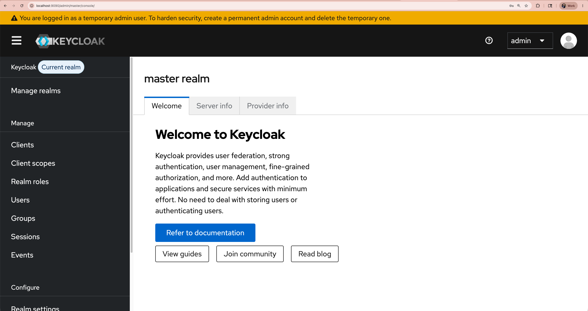
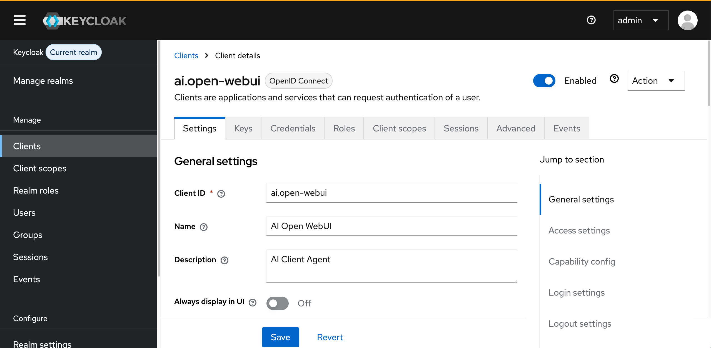
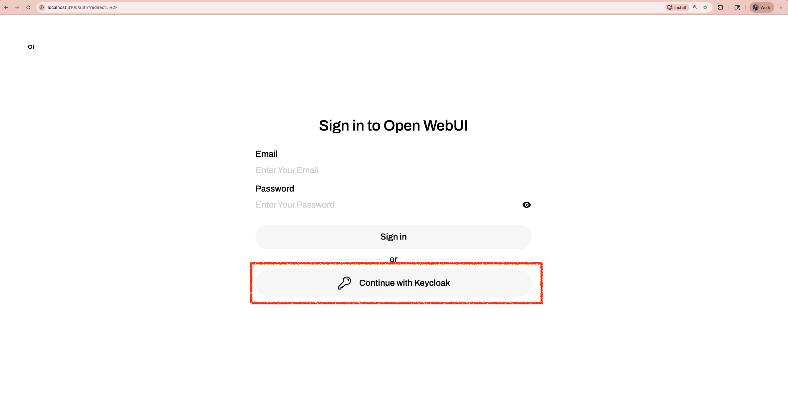
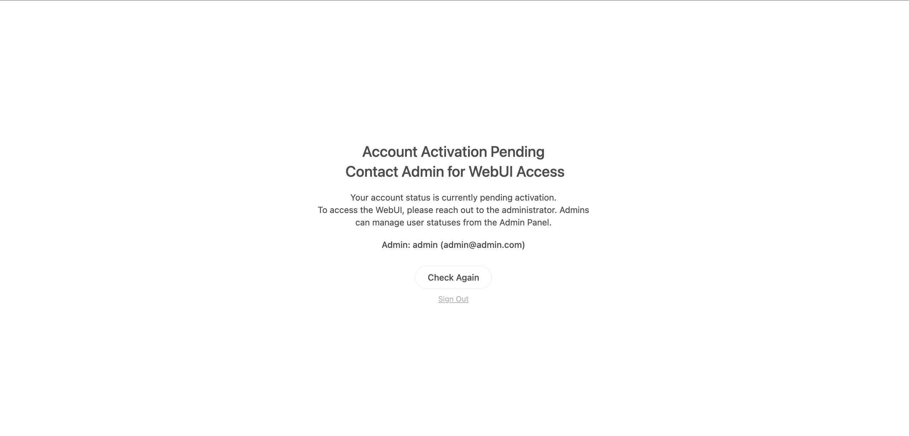
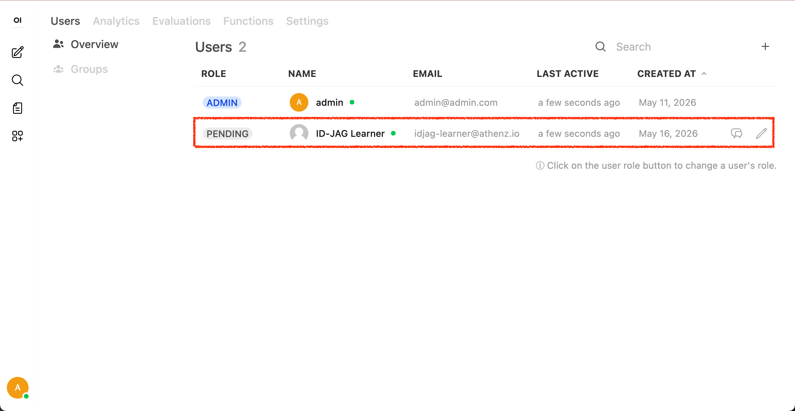
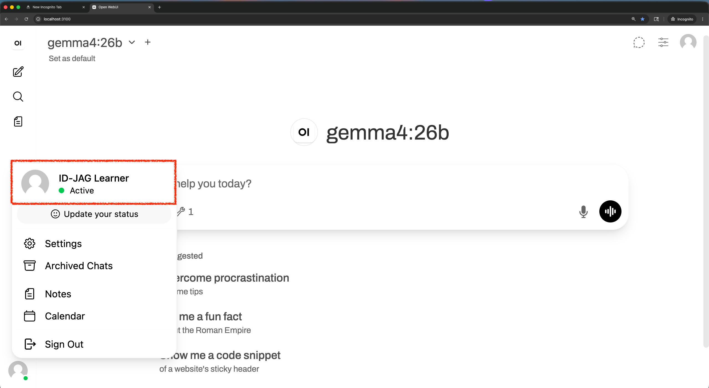
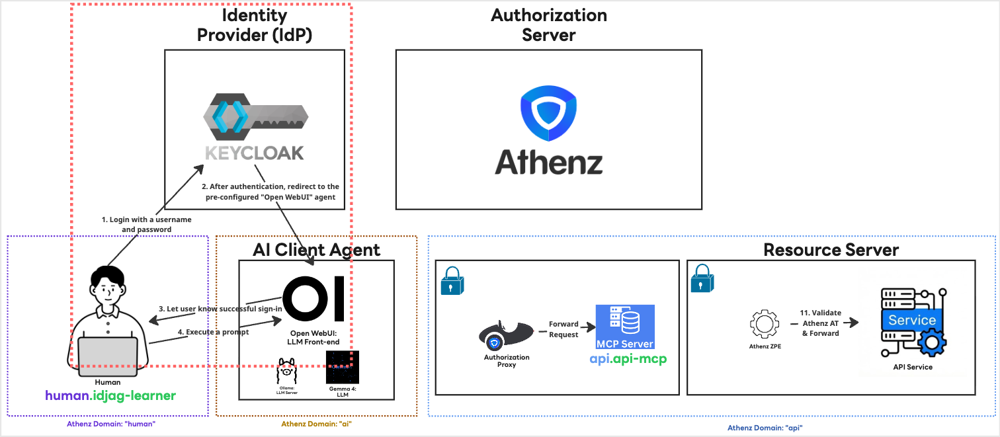

|                     Previous                     |        Current        |                              Next                              |
|:------------------------------------------------:|:---------------------:|:--------------------------------------------------------------:|
| [Protect MCP Server](./10-protect-mcp-server.md) | **Identity Provider** | [Trusted Identity Provider](./12-trusted-identity-provider.md) |

# Identity Provider

In this tutorial, we will configure [Keycloak](https://www.keycloak.org/) as an Identity Provider (IdP) for our AI Client Agent, enabling users to sign in with non-admin (standard) accounts.

## Run Keycloak locally

We will run the Keycloak server using a local directory as its data store:

```sh
_keycloak_running_port=9090

docker run -p ${_keycloak_running_port}:8080 \
  -e KEYCLOAK_ADMIN=admin \
  -e KEYCLOAK_ADMIN_PASSWORD=admin \
  -v ./keycloak_data:/opt/keycloak/data \
  quay.io/keycloak/keycloak:latest start-dev
```

Next, open your browser and log in using admin for both the username `admin` and password `admin`:

```sh
_keycloak_running_port=9090
open http://localhost:${_keycloak_running_port}
```



## Setup Client

In Keycloak, a `Client` represents an application that requests authentication on behalf of a user, in this case, our AI Client Agent. Since the service identity name of the AI client will be `ai.open-webui`, we will use that as the client name.

> [!NOTE]
> We use the default `master` realm for this tutorial.

Go to `http://localhost:9090/admin/master/console/#/master/clients/add-client` and configure the following:

- Client type: `OpenID Connect`
- Client ID: `ai.open-webui`
- Name: `AI Open WebUI`
- Description: `AI Client Agent`

Click **Next**, then set:

- Client authentication: `ON`

Click **Next**, then set:

- Valid redirect URIs: `http://localhost:3100/oauth/oidc/callback`

Click **Save**.

You should see a confirmation screen similar to this:



## Setup User

Let's create a human user account to represent you.

Go to `http://localhost:9090/admin/master/console/#/master/users/add-user` and fill in the following:

- Username: `idjag-learner`
- Email: `idjag-learner@athenz.io`
- First Name: `ID-JAG`
- Last Name: `Learner`

Click **Create**.

Next, navigate to the **Credentials** tab and click **Set password**, then configure the following:

- Password: `password` (It is only for test purpose)
- Temporary: `off`

Click **Save**.

## Create Open WebUI Runner Script with Keycloak Settings

We will create a quick script to run the Open WebUI client with Keycloak configured.

```sh
cat > ./my_tools/run-open-webui-keycloak.sh <<'EOF'
#!/usr/bin/env bash
set -euo pipefail

CLIENT_ID="${1:-}"
CLIENT_SECRET="${2:-}"
PORT="${3:-3100}"

if [[ -z "${CLIENT_ID}" ]]; then
  echo "Error: Keyclaok CLIENT_ID is not set."
  exit 1
fi

if [[ -z "${CLIENT_SECRET}" ]]; then
  echo "Error: Keyclaok CLIENT_SECRET is not set."
  exit 1
fi

mkdir -p data
export DATA_DIR="$(pwd)/data"
export OLLAMA_BASE_URL="${OLLAMA_BASE_URL:-http://localhost:11434}"

# keycloak settings:
export ENABLE_OAUTH_SIGNUP="true"
export OAUTH_CLIENT_ID="${CLIENT_ID}"
export OAUTH_CLIENT_SECRET="${CLIENT_SECRET}"
export OPENID_PROVIDER_URL="http://localhost:9090/realms/master/.well-known/openid-configuration"
export OAUTH_PROVIDER_NAME="Keycloak"
export OAUTH_SCOPES="openid email profile"
export OPENID_REDIRECT_URI="http://localhost:${PORT}/oauth/oidc/callback"

if [[ ! -x venv/bin/python ]]; then
  python3 -m venv venv
fi

source venv/bin/activate

if ! python -m pip show open-webui >/dev/null 2>&1; then
  python -m pip install open-webui \
    --trusted-host pypi.org \
    --trusted-host files.pythonhosted.org \
    --trusted-host edge.artifactory.corp.yahoo.co.jp
fi

exec open-webui serve --port "${PORT}"
EOF

chmod +x ./my_tools/run-open-webui-keycloak.sh
```

### Run Open WebUI with Keycloak

The script we just created requires the Keycloak Client ID and Client Secret.

In Keycloak, navigate to `Clients` > `ai.open-webui` > `credentials` > `Copy Client Secret` then store as `_kcs` or `_keycloak_client_secret`:

```sh
_kcs="<<THE_CLIENT_SECRET>>"
```

Now, run the application:

```sh
mkdir -p open_webui
_keycloak_client_id="ai.open-webui"
_open_webui_keycloak_port=3100
(
  cd open_webui
  ../my_tools/run-open-webui-keycloak.sh "$_keycloak_client_id" "$_kcs" "$_open_webui_keycloak_port"
)
```

> [!NOTE]
> You may shut down the open-webui running without Keycloak on port 3200, but optional.

## Sign in as `idjag-learner`

In this tutorial, when you login to Open WebUI with the non-admin account (i.e. `idjag-learner`), you will open a different browser or incognito mode.

If you are using Google Chrome:

```sh
_open_webui_keycloak_port=3100
open -na "Google Chrome" --args --incognito "http://localhost:${_open_webui_keycloak_port}"
```

Or Firefox:

```sh
_open_webui_keycloak_port=3100
open -na "Firefox" --args --private-window "http://localhost:${_open_webui_keycloak_port}"
```

> [!NOTE]
> The tutorial from now on will only present the Google Chrome

You will see a new login panel with a **Continue with Keycloak** button:



Click it, and you will be prompted to log in. Use the credentials we created.

Then you will be prompted to add member

- `Username`: `idjag-learner`
- `Password`: `password`



## Accept the account

Return to the browser where you are logged in as the `admin` user.

```sh
_open_webui_keycloak_port=3100
open http://localhost:${_open_webui_keycloak_port}
```

Navigate to `http://localhost:3100/admin/users/overview`



Click `Edit User` for the `idjag-learner`, then change `Pending` to `User`, and click **Save**.

## Return to the `idjag-learner` Browser

Switch back to the browser window for `idjag-learner` and refresh the page.

```sh
_open_webui_keycloak_port=3100
open -na "Google Chrome" --args --incognito "http://localhost:${_open_webui_keycloak_port}"
```

You should now be successfully logged into the interface.



## What's happened?

We have installed Keycloak (Red dotted box) locally and configured it as an identity provider for our AI Client Agent. This way, non-admin user can sign in with his/her own account:



## What's next?

We have let our AI Client agent to trust Keycloak as an IdP. But we have not yet configured Authorization Server to trust Keycloak as IdP. In the next tutorial, we will set up our Authorization Server to trust Keycloak.

Next: [Trusted Identity Provider](./12-trusted-identity-provider.md)
